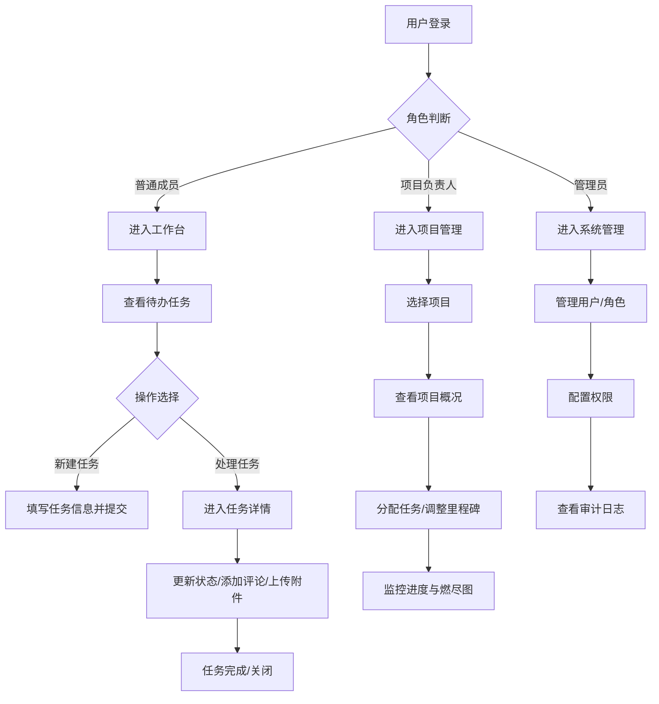

# 工作任务管理系统 产品需求文档（PRD）

## 1 版本信息

| 版本号 | 修订日期   | 修订人   | 审核人   | 修订内容                     |
|--------|------------|----------|----------|------------------------------|
| v1.0   | 2026-06-29 | 产品部   | 技术委员会 | 初始版本创建，覆盖核心功能     |
| v1.1   | 2026-07-15 | 产品部   | 技术委员会 | 增加任务看板与甘特图模块       |

---

## 2 文档说明

### 2.1 文档简介

本文档为“工作任务管理系统”的产品需求文档，旨在明确系统的功能范围、用户场景、交互细节及非功能性需求，为研发、测试、设计团队提供统一的需求基线。

### 2.2 文档读者

- 产品经理：需求定义与优先级管理
- UI/UX 设计师：界面与交互设计
- 开发工程师：技术方案与编码实现
- 测试工程师：测试用例编写与验收
- 项目干系人：了解产品范围与进度

### 2.3 专业术语

| 术语 | 说明 |
|------|------|
| 任务 | 最小工作单元，包含标题、描述、负责人、截止日期、状态、优先级等属性 |
| 看板 | 以状态列（待办、进行中、已完成）展示任务的看板视图 |
| 里程碑 | 项目关键节点，由一组任务组成，有固定截止日期 |
| 工作流 | 任务从创建到完成所经历的状态流转路径 |
| SLA | 服务等级协议，此处指任务响应/解决时限 |

---

## 3 产品简介

### 3.1 产品定位

工作任务管理系统是一款面向企业团队的项目协作工具，帮助团队高效管理日常任务、项目进度与人员负载，提升整体协作效率。

### 3.2 产品特色

- **灵活看板**：支持拖拽式任务状态变更，可视化项目进展
- **多维度筛选**：按负责人、优先级、截止日期、标签等快速过滤
- **实时通知**：任务分配、状态变更、评论@提醒实时推送
- **数据统计**：个人/团队任务完成率、逾期率、负载均衡可视化
- **移动适配**：响应式设计，支持移动端浏览器访问

### 3.3 用户分析

| 用户角色 | 特征 | 核心诉求 |
|----------|------|----------|
| 团队普通成员 | 日常执行任务，需清晰知道自己的待办事项 | 快速查看今日任务、更新进度、提交成果 |
| 项目负责人 | 管理多个项目，需要全局把控进度与风险 | 监控里程碑、分配任务、调整优先级、查看燃尽图 |
| 部门经理 | 关注团队整体效率与资源分配 | 统计报表、成员负载分析、审批关键任务 |
| 系统管理员 | 维护系统配置与用户权限 | 用户管理、权限配置、系统日志审计 |

---

## 4 产品架构

### 4.1 产品结构图（用户可见模块）

```
工作任务管理系统
├── 工作台（首页）
│   ├── 待办任务卡片（今日截止、逾期、进行中）
│   ├── 快捷操作（新建任务、快速筛选）
│   └── 通知提醒（未读消息数）
├── 任务管理
│   ├── 任务列表（表格视图）
│   │   ├── 筛选查询（状态、负责人、优先级、标签、时间范围）
│   │   ├── 数据表格（分页、排序、列显隐）
│   │   └── 批量操作（批量删除、批量指派、批量更新状态）
│   ├── 任务看板（看板视图）
│   │   ├── 状态列（待办、进行中、已完成、已关闭）
│   │   ├── 任务卡片（拖拽移动）
│   │   └── 列操作（添加任务、清空列）
│   └── 任务甘特图（规划视图）
│       ├── 时间轴（日/周/月切换）
│       ├── 任务条（拖拽调整起止时间）
│       └── 依赖连线（任务前置关系）
├── 项目管理
│   ├── 项目列表（我参与的、我创建的）
│   ├── 项目详情（成员、任务数、进度、里程碑）
│   └── 里程碑管理（创建、编辑、完成度）
├── 统计报表
│   ├── 个人统计（我的任务完成趋势、逾期率）
│   ├── 团队统计（人均任务数、完成率排行）
│   └── 项目统计（燃尽图、进度分布）
├── 系统管理（管理员）
│   ├── 用户管理（添加/禁用/重置密码）
│   ├── 角色权限（角色配置、权限分配）
│   └── 操作日志（登录、操作记录）
└── 个人设置
    ├── 基本信息（头像、姓名、邮箱）
    ├── 通知偏好（邮件/站内信/桌面通知）
    └── 密码修改

```

### 4.2 信息结构图（数据维度）

```
系统数据模型
├── 用户信息（User）
│   ├── 账号、姓名、邮箱、手机号、部门、角色、头像、状态（启用/禁用）
│   └── 最后登录时间、创建时间
├── 任务信息（Task）
│   ├── 标题、描述、状态（待办/进行中/已完成/已关闭）
│   ├── 优先级（P0紧急/P1高/P2中/P3低）
│   ├── 负责人（User）、创建人、参与人（多选）
│   ├── 计划开始时间、截止时间、实际完成时间
│   ├── 所属项目、所属里程碑
│   ├── 标签（多选）、附件（多文件）
│   └── 评论列表（时间、用户、内容）
├── 项目信息（Project）
│   ├── 名称、描述、开始/结束时间、状态（未开始/进行中/已结束）
│   ├── 负责人、团队成员（多选）
│   └── 任务列表、里程碑列表
├── 里程碑信息（Milestone）
│   ├── 名称、截止时间、完成度（0~100%）、所属项目
│   └── 关联任务列表
├── 操作日志（Log）
│   ├── 操作用户、操作类型（新增/编辑/删除/状态变更）
│   ├── 操作对象（任务/项目/用户等）、操作内容详情
│   └── 操作时间、IP地址
└── 通知信息（Notification）
    ├── 接收用户、标题、内容、是否已读
    ├── 跳转链接（任务/项目ID）
    └── 创建时间、触发类型（分配/评论/状态变更）

```

### 4.3 总体流程图（核心用户行为路径）



---

## 5 详细功能说明

### 5.1 功能列表（总览）

| 序号 | 模块 | 子模块 | 优先级 | 需求描述 | 备注 |
|------|------|--------|--------|----------|------|
| 1 | 任务管理 | 任务列表 - 筛选查询 | P0 | 支持按状态、负责人、优先级、标签、截止时间范围筛选任务 |  |
| 2 | 任务管理 | 任务列表 - 数据表格 | P0 | 分页展示任务字段，支持排序、列显隐，每行提供操作按钮 |  |
| 3 | 任务管理 | 任务列表 - 新建任务 | P0 | 弹出表单填写任务信息，必填项校验 |  |
| 4 | 任务管理 | 任务列表 - 编辑任务 | P0 | 双击行或点击编辑按钮打开弹窗，回显现有数据 |  |
| 5 | 任务管理 | 任务列表 - 删除任务 | P0 | 二次确认后删除，支持单条和批量删除 |  |
| 6 | 任务管理 | 任务看板 - 看板展示 | P1 | 以列展示各状态下的任务卡片，支持拖拽 |  |
| 7 | 任务管理 | 任务看板 - 卡片详情 | P1 | 点击卡片弹出快速详情窗口 |  |
| 8 | 任务管理 | 任务看板 - 列添加/清空 | P1 | 每列顶部可添加新任务，底部可清空本列 |  |
| 9 | 任务管理 | 甘特图 - 时间轴展示 | P2 | 横轴为时间，纵轴为任务，展示计划与实际进度 | 计划后期迭代 |
| 10 | 项目管理 | 项目列表与详情 | P0 | 展示项目卡片，点击进入详情页 |  |
| 11 | 项目管理 | 里程碑管理 | P1 | 在项目详情内创建/编辑里程碑，并关联任务 |  |
| 12 | 统计报表 | 个人统计 | P1 | 折线图展示任务完成趋势，饼图展示状态分布 |  |
| 13 | 统计报表 | 团队统计 | P2 | 成员任务负载排行，项目燃尽图 |  |
| 14 | 系统管理 | 用户管理 | P0 | 管理员增删改查用户，重置密码 |  |
| 15 | 系统管理 | 角色权限 | P1 | 角色（成员/负责人/管理员）权限配置 |  |
| 16 | 系统管理 | 操作日志 | P1 | 搜索、查看所有用户的操作记录 |  |

### 5.2 模块名称：任务列表（表格视图）

#### 5.2.1 功能说明

任务列表是系统的核心管理页面，以表格形式集中展示所有任务的关键字段，并提供筛选、排序、批量操作以及单任务的新建/编辑/删除/查看详情能力，满足用户对任务数据的批量浏览与快速处理需求。

#### 5.2.2 使用角色

所有登录用户（普通成员、项目负责人、管理员）。不同角色可见任务范围受数据权限控制（见5.2.6）。

#### 5.2.3 页面入口

左侧导航栏 > “任务管理” > “任务列表”菜单项。

#### 5.2.4 用例流程（典型场景）

1. 用户进入任务列表页，默认加载当前用户参与的所有未完成任务，按截止时间升序排列。
2. 用户通过顶部筛选区按状态、负责人、优先级等条件缩小范围。
3. 表格展示符合条件的任务列表，每行显示标题、状态、优先级、负责人、截止时间。
4. 用户可点击某行“编辑”按钮弹出编辑窗口修改信息；或点击“删除”按钮并二次确认删除任务。
5. 用户勾选多行任务，点击“批量操作”下拉菜单，执行批量删除或批量更新状态。
6. 用户点击“新建任务”按钮，弹出新建窗口填写信息后保存，列表自动刷新。

#### 5.2.5 子功能模块

##### 5.2.5.1 功能模块名称：筛选查询

###### 5.2.5.1.1 功能描述

提供多维度组合筛选条件，帮助用户快速定位目标任务。筛选条件包括：任务状态、负责人（用户选择器）、优先级、标签、创建时间范围、截止时间范围。所有条件均为非必填，可组合使用。

###### 5.2.5.1.2 页面要素

- **状态筛选**：下拉多选框，选项为“待办”、“进行中”、“已完成”、“已关闭”，默认不选（即全部）。
- **负责人筛选**：用户下拉选择器，支持搜索用户名，单选，默认不选。
- **优先级筛选**：下拉多选框，选项为“P0紧急”、“P1高”、“P2中”、“P3低”。
- **标签筛选**：下拉多选框，动态获取系统中已使用的标签列表，支持搜索。
- **时间范围筛选**：两个日期时间选择器，分别表示“创建开始”和“创建结束”，支持快捷选项（今天、本周、本月）。
- **截止时间范围**：同上，用于筛选截止日期在指定区间的任务。
- **搜索按钮**：点击后根据当前条件重新加载表格。
- **重置按钮**：将所有筛选条件重置为默认空值，并自动刷新表格。

###### 5.2.5.1.3 交互逻辑

- 任一筛选条件变更后，不自动触发查询，需用户点击“搜索”按钮。
- 点击“重置”后，所有下拉和输入框清空，表格立即加载全部数据（不带筛选）。
- 若某条件下无数据，表格展示空状态（带有提示文案“暂无匹配任务”）。
- 筛选条件被记住在当前会话中，但用户关闭页面后重新进入恢复为默认。

###### 5.2.5.1.4 业务规则

本规则定义筛选查询模块的数据交互约束。

| 规则项 | 规则说明 |
| :--- | :--- |
| **数据来源** | 筛选下拉选项（如状态、优先级、标签）均从后端字典接口 `/api/dict` 动态获取，确保与系统枚举同步。负责人列表来源于用户管理模块。 |
| **默认值规则** | 用户首次进入页面或点击“重置”后，所有筛选条件均为“全部/空”，展示当前用户有权限查看的全部任务。 |
| **组合查询逻辑** | 不同字段之间为“AND（且）”关系；同一字段内多选（如状态多选）为“OR（或）”关系。例如：状态=待办/进行中 AND 优先级=P0。 |
| **时间边界规则** | 日期范围包含起止日期的 00:00:00 至 23:59:59（左闭右闭）。 |
| **权限过滤** | 筛选结果集会自动叠加数据权限过滤（见 5.2.6），即使筛选条件未限制，后端也不会返回无权限的数据。 |

###### 5.2.5.1.5 前置/后置条件

- **前置**：用户已登录，且有任务列表查看权限。
- **后置**：表格区域刷新显示符合筛选条件的数据，分页重置到第一页。

###### 5.2.5.1.6 异常处理

- 网络超时：显示“加载失败，请重试”的提示，并显示重试按钮。
- 后端返回错误（如500）：显示错误码和提示语。
- 权限不足：跳转到403页面或显示无权限提示。

---

##### 5.2.5.2 功能模块名称：数据表格

###### 5.2.5.2.1 功能描述

以表格形式呈现任务列表，支持分页、排序、自定义显示列、行操作按钮（编辑、删除、查看详情），以及行选择进行批量操作。表格需清晰展示任务核心信息，并支持快速状态变更（如状态下拉切换）。

###### 5.2.5.2.2 页面要素

- **列定义**：
  - 选择框（复选框）
  - 任务ID（显示为超链接，点击跳转详情页）
  - 任务标题（文本）
  - 状态（下拉选择器，可快速切换）
  - 优先级（带颜色标签：P0红色、P1橙色、P2蓝色、P3灰色）
  - 负责人（显示用户姓名）
  - 截止时间（日期格式 yyyy-MM-dd HH:mm）
  - 标签（显示为彩色小圆点或文字标签）
  - 操作（“编辑”、“删除”、“详情”按钮）
- **分页器**：位于表格底部，显示总条数、当前页/总页数，每页条数可选（10/20/50/100）。
- **列显隐设置**：表格右上角“列设置”图标，点击弹出下拉列表，勾选控制显示哪些列。
- **批量操作栏**：位于表格上方，当至少选中一行时出现，包含“批量删除”、“批量更新状态”按钮。

###### 5.2.5.2.3 交互逻辑

- 点击列头可对当前列进行排序（升序/降序切换），支持多列排序（按点击顺序）。
- 状态列的下拉选择器变更后，立即发送请求更新该任务状态，成功则行内状态刷新并弹出轻提示“状态已更新”，失败则还原旧状态并提示错误。
- 行内“编辑”按钮：打开编辑弹窗（见5.2.5.3），修改后保存刷新列表。
- 行内“删除”按钮：弹出确认框，确认后调用删除接口，成功则移除该行。
- 行内“详情”按钮：跳转至任务详情页（新页面或侧滑层）。
- 点击任务ID超链接也跳转详情页。
- 复选框勾选：支持全选当前页，取消全选。
- 批量操作：选中多行后，点击“批量删除”弹出确认框（提示共删除N条），确认后批量删除；点击“批量更新状态”弹出选择状态窗口，选择后统一更新。

###### 5.2.5.2.4 业务规则

**（1）数据字段说明（表格列映射）**

| 字段名 | 显示名称 | 数据类型 | 是否必填 | 默认值 | 格式/约束 | 业务校验规则 |
| :--- | :--- | :--- | :--- | :--- | :--- | :--- |
| `taskId` | 任务编号 | String | 是 | 系统生成 | `TSK` + yyyyMMdd + 6位流水号（如 `TSK202606290001`） | 全局唯一，不可编辑，系统自动生成 |
| `title` | 任务标题 | String(100) | 是 | 无 | 最大 100 字符 | 同一项目下不可重名；禁止纯特殊字符 |
| `status` | 任务状态 | Enum(Integer) | 是 | 0 (待办) | 枚举值：0-待办，1-进行中，2-已完成，3-已关闭 | 必须遵循状态转换规则（见下文） |
| `priority` | 优先级 | Enum(Integer) | 是 | 2 (P2中) | 枚举值：0-P0紧急，1-P1高，2-P2中，3-P3低 | 无额外校验 |
| `assigneeId` | 负责人 | String (用户ID) | 是 | 当前登录用户ID | 必须为系统中已存在的有效用户 | 不能指派给自己（若业务需要可放开，此处约束为允许自己） |
| `participantIds` | 参与人 | Array[String] | 否 | 空数组 | 用户ID列表 | 必须均为系统中已存在的有效用户 |
| `projectId` | 所属项目 | String | 是 | 无 | 必须为系统中已存在的有效项目ID | 用户必须属于该项目成员（或为管理员） |
| `milestoneId` | 所属里程碑 | String | 否 | 空 | 必须为所选项目下的有效里程碑ID | 若填写，必须与 `projectId` 关联 |
| `planStartTime` | 计划开始时间 | DateTime | 否 | 空 | `yyyy-MM-dd HH:mm:ss` | 若填写，必须早于或等于 `deadline` |
| `deadline` | 截止时间 | DateTime | 是 | 无 | `yyyy-MM-dd HH:mm:ss` | 不能早于当前时间（创建时）；若填了计划开始，必须晚于计划开始 |
| `tags` | 标签 | Array[String] | 否 | 空数组 | 每个标签最大 20 字符 | 标签总数不超过 10 个 |
| `attachments` | 附件 | Array[Object] | 否 | 空数组 | 文件对象含 `name`/`url`/`size` | 单文件 < 20MB，总附件 < 100MB；扩展名限 `pdf,doc,docx,xls,xlsx,png,jpg,zip` |


**（2）相关约束条件**

- **唯一性约束**：`(projectId, title)` 联合唯一，即同一项目下不允许存在同名任务。
- **外键约束**：`assigneeId`、`participantIds`、`projectId`、`milestoneId` 必须关联到系统中有效且未被逻辑删除的主数据。
- **完整性约束**：`deadline` 必须 ≥ 当前系统日期（创建时）；若任务状态为“已完成”，必须填充 `actualEndTime`（实际完成时间，由系统自动记录）。


**（3）状态转换规则（核心工作流）**

| 当前状态 | 允许执行的操作（事件） | 目标状态 | 触发角色/条件 | 校验规则 |
| :--- | :--- | :--- | :--- | :--- |
| **待办 (0)** | 开始处理 | **进行中 (1)** | 负责人、项目负责人、管理员 | 无 |
| **待办 (0)** | 作废/关闭 | **已关闭 (3)** | 创建人、项目负责人、管理员 | 必须填写关闭原因（备注字段） |
| **进行中 (1)** | 标记完成 | **已完成 (2)** | 负责人、项目负责人、管理员 | 系统自动记录 `actualEndTime` 为当前时间 |
| **进行中 (1)** | 暂停/退回 | **待办 (0)** | 负责人、项目负责人、管理员 | 无 |
| **已完成 (2)** | 重新打开 | **进行中 (1)** | 负责人、项目负责人、管理员 | 清空 `actualEndTime` |
| **已完成 (2)** | 归档 | **已关闭 (3)** | 项目负责人、管理员 | 无 |
| **已关闭 (3)** | 不允许任何状态变更 | — | — | 按钮置灰/拖拽禁用 |

> **状态流转图示**：`待办` ⇄ `进行中` → `已完成` → `已关闭`（不可逆最后一步，且已关闭不可逆回）。


**（4）权限控制规则（表格操作维度）**

| 操作类型 | 普通成员（非负责人/创建者） | 任务负责人 | 项目负责人 | 系统管理员 |
| :--- | :--- | :--- | :--- | :--- |
| **查看列表/详情** | 仅可见自己参与或负责的任务 | 可见自己负责的任务 | 可见该项目下所有任务 | 可见全部任务 |
| **编辑字段**（标题/描述等） | 仅可编辑自己**参与**的任务的描述和附件 | 可编辑自己负责的任务全部字段 | 可编辑项目内全部任务 | 可编辑全部任务 |
| **状态流转** | 不可操作 | 可按状态图操作自己负责的任务 | 可按状态图操作项目内全部任务 | 可按状态图操作全部任务 |
| **删除任务** | 不可删除（按钮隐藏） | 可删除自己负责且状态为“待办”的任务 | 可删除项目内全部任务（除已关闭） | 可删除全部任务（含已关闭） |
| **变更负责人** | 不可操作 | 可变更自己负责的任务的负责人 | 可变更项目内全部任务的负责人 | 可变更全部任务的负责人 |


**（5）数据来源（去向）**

- **来源**：任务数据由用户通过“新建”表单录入；用户信息取自系统用户中心；项目/里程碑信息取自项目管理模块。
- **去向**：
  - 任务创建/更新后，同步写入 `t_task` 主表、`t_task_participant`（参与人关联表）、`t_task_tag`（标签关联表）。
  - 状态变更时，写入 `t_task_history` 操作历史表，并触发消息通知（站内信/邮件）发送给负责人和相关参与人。
  - 删除操作为逻辑删除（`is_deleted=1`），数据保留用于审计，不物理删除。


###### 5.2.5.2.5 前置/后置条件

- **前置**：已加载数据（或筛选查询后）。
- **后置**：执行排序、分页、列显隐后，表格重新渲染并保持当前筛选条件；执行编辑/删除后，列表刷新并保持分页位置（删除后若当前页无数据则自动上一页）。

###### 5.2.5.2.6 异常处理

- 排序请求失败：提示“排序失败”，保留原排序状态。
- 状态切换失败：回滚状态选择器至原值，提示错误信息。
- 批量操作部分失败：提示“成功更新N条，失败M条”，并列出失败原因。

---

##### 5.2.5.3 功能模块名称：新增/编辑弹窗

###### 5.2.5.3.1 功能描述

用于创建新任务或编辑已有任务信息的模态对话框。包含任务所有可编辑字段，并提供表单校验，确保数据完整性。新建时某些字段有默认值；编辑时回显现有数据。

###### 5.2.5.3.2 页面要素

- **弹窗标题**：“新建任务” 或 “编辑任务 #任务ID”。
- **表单字段**：
  - 任务标题（文本输入框，必填，最大长度100）
  - 描述（多行文本框，非必填，最大长度2000）
  - 状态（下拉选择，编辑时显示当前值；新建时默认“待办”）
  - 优先级（下拉选择，新建时默认“P2中”）
  - 负责人（用户选择器，单选，必填；新建时默认当前用户）
  - 参与人（用户选择器，多选，非必填）
  - 所属项目（下拉选择，必填，列表为当前用户有权限的项目）
  - 所属里程碑（下拉选择，依赖于所选项目，非必填）
  - 计划开始时间（日期时间选择器，非必填）
  - 截止时间（日期时间选择器，必填，且不能早于计划开始时间）
  - 标签（标签输入组件，支持输入新标签或选择已有标签，非必填）
  - 附件（文件上传组件，支持多文件，单个文件<20MB，总大小<100MB）
- **底部按钮**：“取消”和“确认”（确认按钮在新建/编辑场景下文案为“创建”/“保存”）。

###### 5.2.5.3.3 交互逻辑

- 打开弹窗时，对于编辑场景，所有字段自动回填；新建场景，默认值填充。
- 标题、负责人、所属项目、截止时间为必填，若未填，点击“确认”时在对应字段下方显示红色提示“请填写此项”，并阻止提交。
- 截止时间校验：若输入了计划开始时间，则截止时间必须晚于计划开始时间；否则提示“截止时间不能早于计划开始时间”。
- 所属项目变更时，所属里程碑下拉选项随之更新为该项目下的里程碑列表；若未选项目，里程碑下拉禁用。
- 附件上传：点击上传区域调用系统文件选择器，支持多选；上传中显示进度条，完成后显示文件名及删除按钮（可移除）。
- 点击“取消”或弹窗右上角关闭按钮，关闭弹窗，未保存的内容丢失（无二次确认）。
- 提交成功后，关闭弹窗，父级列表刷新数据。

###### 5.2.5.3.4 业务规则

**（1）表单字段详细校验规则**

| 字段名 | 是否必填 | 校验规则 | 错误提示 | 默认值 |
| :--- | :--- | :--- | :--- | :--- |
| `title` | 是 | 长度 1~100 字符；同一项目下唯一（编辑时排除自身） | “标题不能为空” / “该项目下已存在同名任务” | 无 |
| `description` | 否 | 最大 2000 字符 | “描述不能超过2000字” | 空字符串 |
| `status` | 是 | 新建时不可选“已完成”或“已关闭”；编辑时受状态流转表限制 | “新建任务状态不允许设为已完成” | 待办 |
| `priority` | 是 | 必须在枚举值内 | 无（下拉选择不会出错） | P2中 |
| `assigneeId` | 是 | 必须为启用状态的系统用户 | “请选择负责人” | 当前用户 |
| `projectId` | 是 | 必须为当前用户有权限查看的项目 | “请选择所属项目” | 无 |
| `deadline` | 是 | 格式正确；若填了 `planStartTime`，必须晚于它；不可早于当前日期（编辑时若任务已在进行中可放宽） | “截止时间不能早于计划开始时间” | 无 |
| `attachments` | 否 | 总大小 ≤ 100MB；单文件 ≤ 20MB；扩展名符合白名单 | “附件总大小超出限制（100MB）” | 空数组 |


**（2）前后端协同规则**

- **提交防重**：点击“确认”后按钮立即进入 `loading` 状态并禁用，防止用户重复点击导致数据重复提交。
- **后端二次校验**：即使前端已校验，后端需再次校验所有字段，包括权限校验（如用户是否对当前任务有编辑权），避免前端绕过。


**（3）编辑时的特殊约束**

- 若任务状态为“已完成”或“已关闭”，则 **不允许编辑** 标题、负责人、所属项目、截止时间（仅允许编辑描述、附件、标签、评论）。若强行修改，后端返回 403 并提示“已完结任务仅允许修改备注和附件”。


###### 5.2.5.3.5 前置/后置条件

- **前置**：用户有创建任务权限（所有人）或编辑权限（见5.2.6）。
- **后置**：任务创建或更新成功，数据库记录变更，并发送相关通知（如分配任务给负责人）。

###### 5.2.5.3.6 异常处理

- 提交时网络超时：显示“提交超时，请检查网络后重试”，保留弹窗及已填数据。
- 后端校验失败（如标题重复）：提示具体错误信息，保留弹窗。
- 附件上传失败：显示具体文件上传失败原因，允许用户重新上传或移除。

#### 5.2.6 数据权限

- **普通成员**：可见自己负责、参与或创建的任务；可编辑自己负责的任务（除状态外），可删除自己创建且状态为待办的任务。
- **项目负责人**：可见自己负责项目下的所有任务；可编辑/删除项目内所有任务。
- **管理员**：可见所有任务；拥有全部操作权限。
- 数据权限在列表接口和操作接口后端强制校验。

#### 5.2.7 接口定义（简略）

| 接口名称 | 方法 | 路径 | 说明 |
|----------|------|------|------|
| 查询任务列表 | GET | /api/tasks | 支持分页、排序、筛选条件 |
| 创建任务 | POST | /api/tasks | 提交任务表单 |
| 获取任务详情 | GET | /api/tasks/{id} | 返回单条任务完整信息 |
| 更新任务 | PUT | /api/tasks/{id} | 更新任务字段 |
| 删除任务 | DELETE | /api/tasks/{id} | 单条删除 |
| 批量删除任务 | DELETE | /api/tasks/batch | 传入ID数组 |
| 批量更新状态 | PUT | /api/tasks/batch/status | 传入ID数组和新状态 |
| 文件上传 | POST | /api/upload | 返回文件路径 |


---

### 5.3 模块名称：任务看板（看板视图）

#### 5.3.1 功能说明

以看板（Kanban）方式可视化展示任务状态，每个状态一列，任务卡片在列内纵向排列。用户可通过拖拽卡片跨列移动以变更状态，直观管理任务流转。

#### 5.3.2 使用角色

所有登录用户。

#### 5.3.3 页面入口

左侧导航栏 > “任务管理” > “任务看板”。

#### 5.3.4 用例流程

1. 用户进入看板，默认展示当前用户参与的所有任务，按状态分列（待办、进行中、已完成、已关闭）。
2. 用户可将卡片从“待办”拖拽到“进行中”，状态自动更新。
3. 点击卡片弹出快速详情弹窗，可查看和编辑部分字段。
4. 每列顶部有“添加任务”按钮，点击在当前列新建任务（状态预设为该列）。
5. 每列底部有“清空本列”按钮（仅管理员/项目负责人可见），清空需二次确认。

#### 5.3.5 子功能模块

##### 5.3.5.1 功能模块名称：看板列与卡片

###### 5.3.5.1.1 功能描述

展示四列固定状态列，每列包含列标题（含任务数量）、任务卡片列表、顶部添加按钮和底部清空按钮。

###### 5.3.5.1.2 页面要素

- **列容器**：水平排列，每列宽度约25%，背景浅灰色圆角卡片。
- **列标题**：显示状态名称及括号内任务数，如“待办 (3)”。
- **任务卡片**：显示任务标题、优先级标签（颜色小点）、负责人姓名缩写、截止日期（若逾期则红色高亮）。
- **卡片悬浮效果**：鼠标悬停卡片时，右上角显示“编辑”和“删除”图标。
- **拖拽手柄**：卡片左侧有拖拽图标（六个点），仅在可拖拽时显示。

###### 5.3.5.1.3 交互逻辑

- **拖拽移动**：用户按住卡片拖到另一列松开，即刻发起状态更新请求，成功则卡片移动到目标列底部，失败则弹窗提示并卡片回到原列。
- **点击卡片**：弹出侧滑抽屉（从右侧滑出），展示任务详情，可编辑标题、描述、截止时间等（同列表编辑）。
- **列内添加**：点击列顶部“+”按钮，打开新建弹窗，状态默认设为该列状态，新建成功后将卡片追加至该列底部。
- **清空列**：点击列底部“清空”按钮，弹出确认框（“确定要将本列所有任务移至‘已完成’吗？”），确认后本列所有任务状态批量更新为“已完成”（或移至下一列，具体可配置）。仅管理员和项目负责人可见该按钮。

###### 5.3.5.1.4 业务规则

- 任务状态流转限制：不能从“已完成”拖回“进行中”（除非配置允许）；从“已完成”拖到“已关闭”允许。
- 若用户没有该任务的编辑权限，则拖拽无效（卡片不可拖动），点击卡片只能查看，不可编辑。
- 卡片排序：在同一列内，按优先级（P0 > P1 > P2 > P3）和截止时间（近 > 远）排序，不支持手动排序。

###### 5.3.5.1.5 前置/后置条件

- 前置：用户已登录。
- 后置：拖拽或添加/清空操作后，任务数据更新，所有列的任务数量实时刷新。

###### 5.3.5.1.6 异常处理

- 拖拽网络失败：卡片弹回原列，并显示“状态更新失败，请重试”。
- 清空列时若部分任务更新失败：提示失败数量及原因，已成功的仍生效。

---

### 5.4 模块名称：统计报表

#### 5.4.1 功能说明

提供个人和团队维度的数据统计图表，辅助用户了解任务完成情况、负载分布和项目进度。包含个人任务趋势图、状态分布饼图、团队负载柱状图、项目燃尽图等。

#### 5.4.2 使用角色

所有登录用户可见个人统计；项目负责人可见其负责项目的统计；管理员可见全局团队统计。

#### 5.4.3 页面入口

左侧导航栏 > “统计报表”。

#### 5.4.4 子功能（简略）

##### 5.4.4.1 个人统计

- **任务完成趋势**：折线图，横轴为近30天日期，纵轴为完成任务数。
- **任务状态分布**：饼图，展示当前用户所有任务的状态占比。
- **逾期任务列表**：表格展示当前用户逾期未完成的任务。
- **加载条件**：默认加载当前用户数据，支持选择时间范围（近7天/30天/自定义）。

##### 5.4.4.2 团队统计（管理员/项目负责人）

- **成员负载**：柱状图，显示各成员当前进行中的任务数量。
- **项目燃尽图**：选择项目后，展示剩余任务数随时间变化的曲线，辅助预测完成日期。
- **完成率排行**：表格列出各成员任务完成率（已完成/总任务数）。

##### 5.4.4.3 交互与规则

- 图表使用ECharts实现，支持悬浮查看数值。
- 数据实时从后端查询，无缓存。
- 无数据时显示“暂无数据”占位图。

---

## 6 非功能性需求

### 6.1 安全需求

- **身份认证**：采用JWT令牌进行身份验证，令牌有效期24小时，支持刷新令牌。
- **密码安全**：密码存储使用bcrypt加密（盐值迭代10次）；密码复杂度要求：至少8位，包含数字和字母。
- **传输安全**：全站HTTPS，禁用HTTP。
- **XSS/CSRF防护**：输入输出转义，使用CSRF Token或SameSite Cookie策略。
- **数据权限**：所有数据接口必须进行权限校验，防止越权访问。
- **操作日志**：所有关键操作（登录、创建、删除、权限变更）记录日志，保留不少于180天。

### 6.2 性能需求

- **页面加载**：首屏加载时间 < 2秒（4G网络下）。
- **接口响应**：列表查询接口平均响应时间 < 500ms（1000条数据内），单条操作接口 < 200ms。
- **并发支持**：支持500个并发用户同时操作，系统资源占用不超过70%（CPU/内存）。
- **数据库优化**：任务表需对状态、负责人、截止时间建立索引；分页查询使用覆盖索引。
- **文件上传**：支持并发上传，单文件最大20MB，总附件大小不超过100MB/任务。

### 6.3 可用性与兼容性

- **浏览器兼容**：支持Chrome 80+、Firefox 75+、Edge 80+、Safari 13+。
- **响应式设计**：适配平板（768px~1024px）和桌面（>1024px），移动端（<768px）提供简化布局，但核心操作可用。
- **容错性**：网络断线时，页面显示离线提示，并自动重连；用户操作（如提交）有防重复提交机制（按钮loading状态）。
- **可访问性**：遵循WCAG 2.1 AA标准，提供键盘导航和屏幕阅读器支持。

### 6.4 可维护性与扩展性

- **代码规范**：前端使用Vue3 + TypeScript，后端使用Spring Boot + MyBatis-Plus。
- **API版本控制**：接口路径包含版本号（如 /api/v1/tasks），便于后续迭代。
- **日志分级**：区分info、warn、error，便于问题定位。
- **模块化设计**：任务、项目、统计、系统管理等模块解耦，支持独立升级。

### 6.5 数据备份与恢复

- **数据库**：每日凌晨2点全量备份，保留最近30天备份文件。
- **文件存储**：附件使用对象存储（OSS），开启跨区域冗余。
- **灾难恢复**：RPO <= 1小时，RTO <= 4小时。

---
**文档结束**
