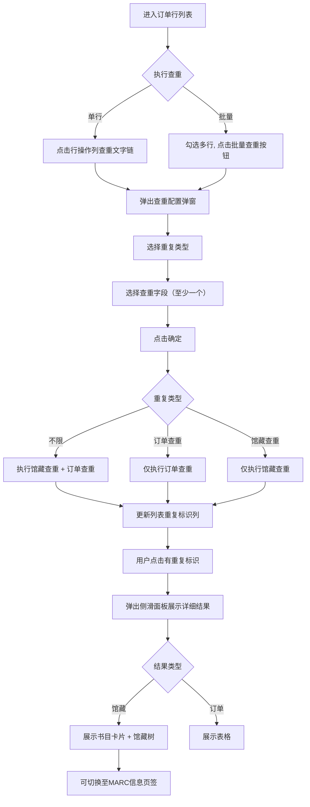

# 订单管理系统 产品需求文档（PRD）

## 1 版本信息

| 版本号 | 修订日期 | 修订人 | 审核人 | 修订内容 |
|--------|----------|--------|--------|----------|
| v1.0 | 2026-06-29 | yxw | yxw | 初始版本创建，覆盖非连续出版物订单行查重功能 |
| v1.1 | 2026-06-23 | yxw | yxw | 新增验收单管理「导入发货单」功能需求说明 |

---

## 2 文档说明

### 2.1 文档简介

本文档为“订单管理系统”的产品需求文档，旨在明确系统的功能范围、用户场景、交互细节及业务规则，为研发、测试、设计团队提供统一的需求基线。本期需求覆盖**非连续出版物订单行列表**中的**查重功能**，以及**验收单管理**中的**导入发货单**功能。

### 2.2 文档读者

- 产品经理：需求定义与优先级管理
- UI/UX 设计师：界面与交互设计
- 开发工程师：技术方案与编码实现
- 测试工程师：测试用例编写与验收
- 项目干系人：了解产品范围与进度

### 2.3 专业术语

| 术语 | 说明 |
|------|------|
| 订单行 | 订单下的明细条目，描述具体订购的资源（书目）及其数量、价格等信息 |
| 待发订 | 订单/订单行尚未向供应商发送订购请求的状态，该状态下允许进行查重操作 |
| 馆藏查重 | 检查当前订购资源是否已存在于本馆馆藏书目库中 |
| 订单查重 | 检查当前订购资源是否已存在于其他订单行（同一订户范围内）中 |
| 资源标识 | 用于唯一标识资源的编号，如图书的ISBN、视听资料的统一编号等 |
| 语种分类 | 中文/外文，用于决定查重字段的可选项 |
| 资源类型 | 纸质书/视听资料，用于决定查重字段的可选项 |
| 订户 | 图书馆采购单位，数据隔离的基本维度，用户仅能操作其关联订户下的订单 |
| 验收单 | 采访验收环节的业务单据，关联供应商、发货单号及待验收资源 |
| 发货单导入 | 将书商 Excel 发货清单上传并映射至系统标准字段，自动匹配订单行并完成收货/换货/退货处置 |
| 待收套数 | 发货单 Excel 中映射的标准字段，表示该书目本次发货的套数，必填且不参与订单行匹配 |

---

## 3 产品简介

### 3.1 产品定位

订单管理系统是一款面向图书馆采编人员的业务管理工具，支撑非连续出版物（图书、视听资料等）的订单创建、发订、催缺、撤订及查重等全流程管理。查重功能旨在帮助馆员在发订前识别重复采购，避免资源浪费与馆藏冗余。

### 3.2 产品特色

- **灵活查重**：支持批量查重与单行查重，适应不同工作场景
- **多维度匹配**：根据资源类型与语种动态提供查重字段，支持自定义组合（AND逻辑）
- **双通道检测**：同时覆盖馆藏书目与历史订单，全面防重
- **结果可视化**：馆藏重复以书目卡片+馆藏树展示，订单重复以表格展示，支持MARC信息联动查看
- **数据隔离**：严格基于订户维度进行权限控制，确保数据安全

### 3.3 用户分析

| 用户角色 | 特征 | 核心诉求 |
|----------|------|----------|
| 采访馆员 | 负责订单创建与发订前的质检工作 | 快速识别待发订订单中是否存在重复采购，及时处理 |
| 采编馆员 | 具备订单管理权限，可进行查重操作 | 批量处理订单行查重，提高工作效率 |
| 系统管理员 | 维护系统配置与用户权限 | 配置订户关联、字段字典等基础数据 |

---

## 4 产品架构

### 4.1 产品结构图（用户可见模块）

```
订单管理系统
└── 非连续出版物订单
    └── 订单行列表（页签）
        ├── 工具栏
        │   ├── 批量查重按钮
        │   ├── 生成催缺单
        │   ├── 撤订
        │   └── 导出订单行
        ├── 数据表格
        │   ├── 馆藏重复标识列
        │   ├── 订单重复标识列
        │   └── 操作列（单行查重文字链）
        └── 查重功能
            ├── 查重操作入口（批量查重按钮 / 单行查重文字链）
            ├── 查重配置弹窗（重复类型 + 查重字段）
            └── 查重结果展示
                ├── 列表标识列（有/无重复）
                ├── 馆藏重复结果（书目卡片 + 馆藏树 / MARC信息）
                └── 订单重复结果（表格）
```

### 4.2 信息结构图（数据维度）

```
查重相关数据模型
├── 订单行（OrderLine）
│   ├── 订单行号、所属订单号、资源类型、语种分类
│   ├── 资源标识（ISBN/统一编号等）、题名、作者、出版社、出版年
│   ├── 载体、限量编号、商品条码、目录号（视听资料特有）
│   ├── 行状态（待发订/已发订/处理中/已关闭/已撤订）
│   └── 套数、套内册数、馆址、发订时间
├── 馆藏书目（BibliographicRecord）
│   ├── 书目记录号、题名、ISBN、作者、出版社、出版年
│   ├── MARC字段（字段名、指示符、字段内容）
│   └── 馆藏树（机构→馆区→分馆→馆藏地，含复本数）
└── 查重配置（DuplicateCheckConfig）
    ├── 重复类型（不限/订单查重/馆藏查重）
    └── 查重字段列表（根据资源类型与语种动态）
```

### 4.3 总体流程图（核心用户行为路径）



---

## 5 详细功能说明

### 5.1 功能列表（总览）

| 序号 | 模块 | 子模块 | 优先级 | 需求描述 | 备注 |
|------|------|--------|--------|----------|------|
| 1 | 非连续出版物订单-订单行列表 | 工具栏-批量查重按钮 | P0 | 支持多选待发订订单行批量触发查重 | 需满足同资源类型、同语种条件 |
| 2 | 非连续出版物订单-订单行列表 | 操作列-单行查重文字链 | P0 | 仅待发订行可见，点击进入单行查重 | |
| 3 | 非连续出版物订单-订单行列表 | 查重配置弹窗-重复类型 | P0 | 单选：不限/订单查重/馆藏查重，默认不限 | |
| 4 | 非连续出版物订单-订单行列表 | 查重配置弹窗-查重字段 | P0 | 动态展示可选字段，支持全选/全不选，至少选一个 | 字段随资源类型与语种变化 |
| 5 | 非连续出版物订单-订单行列表 | 查重结果-列表标识列 | P0 | 展示“馆藏重复”“订单重复”两列 | |
| 6 | 非连续出版物订单-订单行列表 | 查重结果-馆藏重复侧滑面板 | P0 | 展示重复书目卡片、馆藏树，支持MARC信息页签 | |
| 7 | 非连续出版物订单-订单行列表 | 查重结果-订单重复侧滑面板 | P0 | 以表格展示重复订单行信息 | |
| 8 | 非连续出版物订单-订单行列表 | 查重结果-分页组件 | P1 | 结果列表支持分页，默认50条/页 | |
| 9 | 验收单管理 | 工具栏-导入发货单按钮 | P0 | 勾选一条未开始/进行中验收单后进入导入向导 | 与「新增验收单」相邻 |
| 10 | 验收单管理 | 导入发货单-上传与列名映射 | P0 | 上传 xls/xlsx，映射标准字段，支持映射模板 | 标准字段池随资源类型与语种切换 |
| 11 | 验收单管理 | 导入发货单-匹配预览 | P0 | 选择匹配字段、预览匹配结果并配置收货/换货/退货 | 向导页 `02_01_13_导入发货单.html` |
| 12 | 验收单管理 | 导入发货单-确认提交 | P0 | 汇总处置数据并提交写入验收单 | 失败支持重新提交 |

### 5.2 模块名称：非连续出版物订单-订单行列表

#### 5.2.1 功能说明

非连续出版物订单行列表页，支持展示订单行明细数据。本期需求说明覆盖**查重**功能：待发订状态的订单行可进行**馆藏查重**和**订单查重**，用于在发订前识别书目是否已在馆藏或其他订单中存在重复。

#### 5.2.2 使用角色

- 采访馆员
- 采编馆员（具备订单管理权限的用户）

#### 5.2.3 前置条件

- 用户已登录系统，且具备订单管理相关权限
- 已进入「非连续出版物订单」模块，并切换至「**订单行列表**」页签

#### 5.2.4 页面入口

- 左侧导航 → 订单管理 → 非连续出版物订单 → 切换至「订单行列表」页签
- 从订单列表点击订单号，可跳转至该订单下的订单行列表（带订单号筛选）

---

#### 5.2.5 子功能模块：查重功能

##### 5.2.5.1 功能模块名称：查重操作入口

###### 5.2.5.1.1 功能描述

提供批量查重与单行查重两种操作入口，触发后弹出查重配置弹窗（见 5.2.5.2）。

**批量查重按钮**

- 位置：订单行列表工具栏（与「生成催缺单」「撤订」「导出订单行」相邻）
- 默认状态：置灰不可用（`disabled`）
- 启用条件：同时满足以下条件时按钮高亮可点击：
  1. 至少勾选一条订单行
  2. 所勾选订单行均为**待发订**状态（所属订单状态为待发订时，其下所有订单行视为待发订）
  3. 所勾选订单行属于**相同资源类型**（从所属订单获取：纸质书 / 视听资料）
  4. 所勾选订单行属于**相同语种分类**（从所属订单获取：中文 / 外文）
- 点击后：弹出查重配置弹窗

**单个查重文字链**

- 位置：订单行列表操作列
- 显示条件：仅当该行可进行查重时显示（行状态为待发订，或所属订单状态为待发订）
- 非待发订行：不显示查重文字链
- 点击后：以当前行为查重对象，弹出查重配置弹窗

###### 5.2.5.1.2 业务状态

**订单行状态（是否可查重）**

| 状态 | 说明 | 是否可查重 |
|------|------|-----------|
| 待发订 | 订单/行尚未发订 | 是 |
| 已发订 | 已发订 | 否 |
| 处理中 | 处理中 | 否 |
| 已关闭 | 已关闭 | 否 |
| 已撤订 | 已撤订 | 否 |

**批量查重按钮状态**

| 状态 | 说明 |
|------|------|
| 不可用（置灰） | 未勾选行，或勾选行不满足待发订 / 同资源类型 / 同语种条件 |
| 可用（高亮） | 勾选行均满足批量查重全部启用条件 |

###### 5.2.5.1.3 业务规则

- 仅**待发订**订单行允许查重；所属订单状态为待发订时，其下所有订单行视为待发订
- 批量查重要求勾选行资源类型一致、语种分类（中文/外文）一致，语种从所属订单获取
- 单行查重不受批量勾选限制，但目标行须满足待发订条件

###### 5.2.5.1.4 前置/后置条件

- **前置**：用户已登录，且有订单行列表查看权限
- **后置**：查重配置弹窗打开

###### 5.2.5.1.5 异常处理

- 勾选非待发订行进行批量查重：按钮保持置灰；若通过其他方式触发，提示「仅支持行状态为待发订的订单行进行查重」
- 勾选不同资源类型或不同语种（中文/外文）混合：批量查重按钮置灰；若触发，提示「请勾选相同资源类型和语种（中文/外文）的待发订订单行进行查重」

---

##### 5.2.5.2 功能模块名称：查重配置弹窗

###### 5.2.5.2.1 功能描述

点击查重入口后弹出查重配置弹窗，用户选择重复类型与查重字段后执行查重。

###### 5.2.5.2.2 页面要素

- **显示样式**：居中模态弹窗，标题「查重」；底部按钮：「取消」「确定」；点击遮罩或右上角 × 关闭弹窗
- **重复类型**：单选，默认选中「**不限**」，可选值：
  - **不限**：同时执行馆藏查重和订单查重
  - **订单查重**：仅检查与其他订单行的重复
  - **馆藏查重**：仅检查与馆藏书目的重复
- **查重字段**：根据待查重订单行所属订单的**资源类型**和**语种**动态展示可选字段。顶部提供「**全部**」复选框，勾选/取消时联动全选/全不选所有字段项；各字段项变更时同步更新「全部」勾选状态。

| 资源类型 | 语种 | 可选查重字段 | 默认选中 |
|---------|------|-------------|---------|
| 纸质书 | 中文 | 全部、资源标识、题名、作者、出版社、出版年、语种 | 资源标识、题名 |
| 纸质书 | 外文 | 全部、资源标识、题名、作者、出版社、出版年、语种 | 资源标识、题名 |
| 视听资料 | 中文 | 全部、题名、载体、限量编号、出版社 | 题名、载体 |
| 视听资料 | 外文 | 全部、商品条码、目录号 | 商品条码、目录号 |

###### 5.2.5.2.3 交互逻辑

- 选择重复类型后立即更新，无额外动作
- 查重字段「全部」勾选时，所有字段复选框被选中；取消时全部取消；任一字段复选框状态变化时同步更新「全部」状态
- 至少选择一个查重字段；未选时点击「确定」阻止提交，并提示「请至少选择一个查重字段」
- 点击「确定」：按配置执行查重，关闭弹窗，刷新列表「馆藏重复」「订单重复」标识列
- 点击「取消」或关闭：不执行查重

###### 5.2.5.2.4 业务规则

- 所选字段采用 **AND（且）** 逻辑：所有已选字段的值均非空且相等时，判定为重复
- **资源标识**比对时忽略大小写及连字符（`-`）
- 其他字段比对时忽略大小写

###### 5.2.5.2.5 前置/后置条件

- **前置**：用户已通过操作入口进入弹窗
- **后置**：执行查重并更新列表，或取消关闭弹窗

###### 5.2.5.2.6 异常处理

- 未选择任何查重字段：阻止提交，提示「请至少选择一个查重字段」

---

##### 5.2.5.3 功能模块名称：查重结果展示

###### 5.2.5.3.1 功能描述

查重完成后，在订单行列表展示重复标识；用户可点击「有」查看详细查重结果。

**列表重复标识列**

列表包含两列：**馆藏重复**、**订单重复**。

| 状态 | 显示 |
|------|------|
| 未查重 | 空白 |
| 无重复 | 「无」 |
| 有重复 | 蓝色文字链「有」，点击打开查重结果侧滑面板 |

###### 5.2.5.3.2 页面要素

**查重结果侧滑面板**

- 从页面右侧滑出，宽度约页面 75%（最小 520px，最大 960px）
- 标题：「馆藏重复查重结果」或「订单重复查重结果」
- 摘要区显示：当前订单行号、查重字段（本次使用的字段）、重复记录数
  - 馆藏重复：额外显示总复本数（全部重复书目馆藏复本数之和）
  - 订单重复：额外显示总套数（全部重复订单行套数之和）

**馆藏查重结果**

内容区顶部提供「**书目**」「**MARC信息**」两个页签，默认展示「书目」页签。

*书目页签*

- 以**书目卡片**形式展示重复书目；卡片头部展示题名，以及书目记录号、ISBN、作者、出版社、出版年
- 卡片头部可点击展开/收起；展开后展示**四层馆藏树**：机构 → 馆区 → 分馆 → 馆藏地
- 馆藏地节点以蓝色圆角标签展示复本数，如「1本」「2本」
- 默认展开当前页第一条书目卡片
- 操作列「查看」：切换至「MARC信息」页签，展示**当前书目**的 MARC 详细信息（不跳转外部页面）

*MARC信息页签*

- 顶部显示书目记录号标签，如「书目记录号【BIB2024002001】」
- 下方表格展示 MARC 字段详情，列：字段名、指示符、字段内容（展示格式与书目查询页 `01_01_18_书目查询.html` 详细信息侧滑面板一致）
- 直接点击「MARC信息」页签：默认展示查重结果**第一条书目**的 MARC 信息
- 在书目页签点击某条「查看」：切换至本页签并展示该书目 MARC 信息

**订单查重结果**

- 以表格形式展示，字段：订单行号、馆址、正题名、资源标识、作者、套内册数、套数、行状态、发订时间
- 操作列暂隐藏（后续版本开放「查看」跳转订单行详情）

**交互与分页**

- 结果列表支持分页，默认 5 条/页，可选 5 / 10 / 20 / 50 条/页
- 分页控件：上一页、页码、下一页、每页条数选择
- 无重复记录时，内容区显示「暂无查重结果」
- 点击遮罩或关闭按钮关闭侧滑面板

###### 5.2.5.3.3 交互逻辑

- 标识为「有」时方可点击打开结果面板；「无」或空白不响应点击
- 点击“有”链接，打开对应类型（馆藏/订单）的侧滑面板
- 馆藏结果中，卡片展开/收起独立控制；点击「查看」切换至MARC页签
- MARC页签默认展示第一条书目信息
- 分页切换时保持当前页签状态

###### 5.2.5.3.4 业务规则

- **订单查重**比对范围：当前登录馆员**关联订户**下的全部订单行（不含当前行自身）
- **馆藏查重**比对范围：馆藏书目库
- 重复标识按本次查重配置的重复类型分别更新（选择「不限」时同时更新两列）
- 重复标识为「有」时方可打开结果面板

###### 5.2.5.3.5 前置/后置条件

- **前置**：已执行查重操作，列表标识列已更新
- **后置**：侧滑面板展示详细查重结果

###### 5.2.5.3.6 异常处理

- 重复标识为「无」或未查重时，不响应「有」链接点击
- 结果为空时显示「暂无查重结果」，分页显示第 1/1 页
- 若点击「有」但后端数据异常（如重复记录已删除），提示「查重结果数据不存在」

---

#### 5.2.6 数据权限

- 查重与查重结果均受订户数据隔离约束
- 仅比对当前用户所属订户可见范围内的订单行与馆藏数据

---

### 5.3 模块名称：验收单管理

#### 5.3.1 功能说明

验收单管理模块支持验收单的检索、新增、编辑、申请结算及列表导出。本期新增**导入发货单**功能：用户在列表中选定一条可验收的验收单后，进入五步导入向导，上传书商 Excel 发货清单，完成列名映射、匹配字段选择、匹配预览与确认提交，实现半自动批量验收。

#### 5.3.2 使用角色

- 采访馆员
- 采编馆员（具备验收单管理权限的用户）

#### 5.3.3 前置条件

- 用户已登录系统，且具备验收单管理相关权限
- 已进入「验收单管理」模块
- 导入发货单时，目标验收单状态须为**未开始**或**进行中**

#### 5.3.4 页面入口

- 左侧导航 → 采访验收 → 验收单管理
- 导入发货单向导页：`02_01_13_导入发货单.html`（由本页工具栏「导入发货单」进入）

---

#### 5.3.5 子功能模块：导入发货单功能

通过书商 Excel 实现半自动批量验收，整体流程为：**上传文件 → 列名映射 → 选择匹配字段 → 匹配预览 → 确认提交**。

##### 5.3.5.1 功能模块名称：导入发货单入口

###### 5.3.5.1.1 功能描述

在验收单管理列表工具栏提供「**导入发货单**」按钮，作为导入向导的唯一入口。

###### 5.3.5.1.2 页面要素

- **位置**：工具栏，与「新增验收单」「申请结算」「导出列表」相邻
- **默认状态**：置灰不可用（`disabled`），`title` 提示「请先在列表中勾选一条未开始或进行中的验收单」
- **启用样式**：蓝色描边可点击按钮
- **禁用样式**：灰色边框、灰色文字、`cursor-not-allowed`、`opacity-60`

###### 5.3.5.1.3 交互逻辑

- 列表行勾选变化时，实时同步按钮启用状态
- 全选/取消全选时同步按钮状态
- 点击按钮：
  1. 校验已勾选**恰好一条**验收单，且状态为**未开始**或**进行中**
  2. 校验失败：`alert('请先在列表中勾选一条未开始或进行中的验收单')`
  3. 校验成功：将验收单上下文写入 `sessionStorage.deliveryImportContext`，跳转至 `02_01_13_导入发货单.html`
- 若存在 TabManager，以 Tab 方式打开「导入发货单」页（`reload: true`）；否则 `location.href` 跳转

###### 5.3.5.1.4 业务规则

**按钮启用条件（须同时满足）**

| 条件 | 说明 |
|------|------|
| 勾选数量 | 恰好勾选 **1** 条验收单 |
| 验收单状态 | 状态为 **未开始**（`notStarted`）或 **进行中**（`inProgress`） |

**写入 sessionStorage 的验收单上下文字段**

| 字段 | 说明 |
|------|------|
| id | 验收单号 |
| name | 验收单名称 |
| type | 资源类型（纸质书 / 视听资料） |
| lang | 语种 |
| method | 采选方式 |
| supplier | 供应商 |
| shipNo | 发货单号 |
| remarkText | 验收备注 |
| status | 验收单状态 |

###### 5.3.5.1.5 异常处理

- 未勾选或勾选多条：按钮保持置灰；强行触发时弹出上述 alert
- 勾选已结束验收单：按钮置灰，不可进入导入流程

---

##### 5.3.5.2 功能模块名称：上传文件与列名映射

###### 5.3.5.2.1 功能描述

导入向导第一步上传书商 Excel；第二步将 Excel 列映射到系统标准字段，并支持映射模板的保存与复用。

###### 5.3.5.2.2 页面要素

**第一步：上传文件**

- 必填项，支持 `.xls`、`.xlsx`
- 上传后展示文件名，可移除重选
- 格式不符时提示「请上传 xls/xlsx 格式文件」

**第二步：列名映射**

- 顶部说明：「将文件列映射到系统标准字段（**待收套数** 必填）」
- 展示当前标准字段池：`资源类型 / 语种分类（具体语种）`
- **映射模板**：下拉选择、保存模板、删除模板（`localStorage`，`delivery-import-template-store.js`）
- 映射表：Excel 列名 → 标准字段下拉（含「不映射」）

**标准字段池（随验收单资源类型 + 语种动态切换）**

| 资源类型 | 语种分类 | Profile Key | 说明 |
|---------|---------|-------------|------|
| 纸质书 | 中文 | book_zh | 含 ISBN、正题名、套内册数、出版社等 |
| 纸质书 | 外文 | book_foreign | 含 ISBN、题名、责任者、中图分类号等 |
| 视听资料 | 中文 | av_zh | 含 ISBN、ISRC、题名、载体、限量编号等 |
| 视听资料 | 外文 | av_foreign | 含商品条码、目录号、ISRC、载体等 |

- **待收套数**（`receiveQty`）：四类字段池均为**必填**映射项，且**不参与**第三步匹配字段勾选
- 系统内置常见列名自动映射（如「ISBN」「书名」「总套数」等）

###### 5.3.5.2.3 交互逻辑

- 未上传文件时不可进入第二步
- 第二步须完成「待收套数」映射方可进入第三步
- 映射模板按「资源类型 + 语种 + 供应商」维度存储与匹配

###### 5.3.5.2.4 业务规则

- 语种「中文」与「外文」判定：`lang === '中文'` 为中文，其余视为外文
- 标准字段池由 `getActiveStandardFields()` 根据验收单上下文返回

---

##### 5.3.5.3 功能模块名称：选择匹配字段与匹配预览

###### 5.3.5.3.1 功能描述

第三步从已映射且可匹配的标准字段中勾选匹配字段；第四步预览 Excel 行与订单行的匹配结果，配置收货/换货/退货处置。

###### 5.3.5.3.2 页面要素

**第三步：选择匹配字段**

- 仅展示第二步已映射、且 `matchable !== false` 的字段
- 默认勾选：ISBN + 题名（若字段池中存在）
- 至少勾选 **1** 个匹配字段

**第四步：匹配预览**

- 进入本步时展示匹配中 loading（固定 **8 秒**，`PREVIEW_MATCHING_DURATION_MS = 8000`），完成后渲染预览表
- 主表列：序号、状态、**第二步已映射的标准字段列**、操作
- 状态标签：

| 状态 | 显示 | 说明 |
|------|------|------|
| 匹配失败 | 红色「匹配失败」 | 未命中任何订单行 |
| 匹配成功 | 绿色「匹配成功」 | 发货待收套数 = 命中订单行待收合计 |
| 部分收货 | 琥珀色「部分收货」 | 发货待收套数 < 待收合计 |
| 超收 | 红色「超收」 | 发货待收套数 > 待收合计 |

- 展开子表：订单行号、馆址、已映射字段值、处置（收货 / 换货 / 退货数量及原因）
- 操作列：**选择订单行**（匹配失败时必选）、**删除**
- 底部：**上一步**、**取消**、**下一步**（无批量确认收货/换货/退货、无下载解析结果）

**选择订单行弹窗**

- 列表字段对齐非连续出版物订单行列表（不含馆藏重复、订单重复列）
- 检索：左侧字段下拉（默认订单号）+ 右侧模糊查询

###### 5.3.5.3.3 交互逻辑

- 匹配逻辑：仅比对**第三步所选字段**，字段值精确相等（无软差异/模糊匹配）
- 部分收货时，按订单行**发订时间由远到近**分配待收套数
- 点击「下一步」执行 `validatePreviewStep()` 校验，失败以 `alert` 逐条提示

###### 5.3.5.3.4 业务规则

**第四步「下一步」校验规则**

- 无预览记录：「没有可提交的发货记录」
- 匹配失败且未选订单行：「第 N 行：匹配失败，请选择订单行或删除该行」
- 处置数量非有效非负整数：「第 N 行 xxx：请输入有效套数」
- 换货数量 > 0 但未选原因：「请填写换货原因」
- 退货数量 > 0 但未选原因：「请填写退货原因」
- 单行处置合计 > 该行待收套数：「处置套数合计不能大于待收套数」
- 发货行处置合计 > 发货待收套数：「处置套数合计不能大于发货待收套数（X）」

**换货/退货原因选项**

选项值来源于"设置-退换撤订原因参数"

###### 5.3.5.3.5 异常处理

- 匹配进行中（loading）：阻止重复提交第四步
- 选择订单行弹窗未选行确认：提示「请至少选择一条订单行」

---

##### 5.3.5.4 功能模块名称：确认提交

###### 5.3.5.4.1 功能描述

第五步展示收货/换货/退货汇总，用户确认后提交写入当前验收单。

###### 5.3.5.4.2 页面要素

- 汇总区：收货 X 行 Y 套、换货 X 行 Y 套、退货 X 行 Y 套
- 说明：「确认后将写入当前验收单」
- 提交前底部：**上一步**、**取消**、**确认**
- 提交成功后隐藏「上一步」，返回验收单管理列表
- 提交失败：提示「提交失败，请重新提交或者联系管理员」，提供**取消**与**重新提交**

###### 5.3.5.4.3 交互逻辑

- 面包屑「验收单管理 / 导入发货单」，点击「验收单管理」返回列表（支持 TabManager）
- 向导页侧边栏高亮归属验收单管理（路由 `02_01_13` → 验收单管理）

###### 5.3.5.4.4 前置/后置条件

- **前置**：已通过第四步校验并进入第五步
- **后置**：成功则验收单收货数据更新并返回列表；失败可重新提交

---

## 6 非功能性需求

### 6.1 安全需求

- **身份认证**：采用JWT令牌进行身份验证，令牌有效期24小时，支持刷新令牌
- **传输安全**：全站HTTPS，禁用HTTP
- **数据权限**：所有查重接口必须验证用户登录态及订户数据权限，防止越权访问其他订户的数据
- **操作日志**：查重行为需记录日志（谁、何时、对哪些订单行、查重类型、结果概要），保留不少于180天

### 6.2 性能需求

- **批量查重**：最多50行，响应时间 < 3秒
- **单行查重**：响应时间 < 1秒
- **侧滑面板加载**：结果列表（分页）响应时间 < 500ms
- **数据库优化**：馆藏书目库需对ISBN、题名等字段建立索引，确保查询效率

### 6.3 可用性与兼容性

- **浏览器兼容**：支持Chrome 80+、Firefox 75+、Edge 80+、Safari 13+
- **分辨率适配**：弹窗与侧滑面板适配1024px以上分辨率
- **容错性**：操作失败时提供清晰、具体的错误提示，并支持重试；网络断线时显示离线提示

### 6.4 可维护性与扩展性

- **配置化**：查重字段配置应支持后台字典管理，便于后续增加新的字段或调整默认值
- **可扩展**：资源类型与语种的组合逻辑应抽象为可配置规则，便于扩展新类型
- **日志分级**：区分info、warn、error，便于问题定位

### 6.5 数据备份与恢复

- **数据库**：每日凌晨2点全量备份，保留最近30天备份文件
- **查重结果**：作为订单行属性存储，纳入每日数据库备份
- **灾难恢复**：RPO <= 1小时，RTO <= 4小时

---
**文档结束**