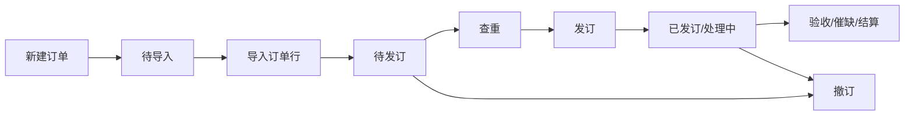

# 图书馆采选订单管理系统 产品需求文档（PRD）

## 1 版本信息

| 版本号 | 修订日期   | 修订人 | 审核人 | 修订内容 |
|--------|------------|--------|--------|----------|
| v2.0   | 2026-07-01 | 产品部 | —      | Vue SPA 迁移后重新初始化；首期覆盖非连续出版物订单模块 |
| v2.1   | 2026-07-02 | 产品部 | —      | 新增订单行详情页 PRD（5.4）；同步订单行列表操作列变更 |
| v2.2   | 2026-07-03 | 产品部 | —      | 订单行列表新增实际关联书目记录号浮动弹窗（5.3.5.10）；订单行详情单件 Tab 改为「单件（N）」 |
| v2.3   | 2026-07-03 | 产品部 | —      | PRD 字段名补充中文对照，业务规则改为文字描述 |
| v2.4   | 2026-07-03 | 产品部 | —      | 同步馆藏/订单查重结果面板 PRD（5.3.5.6）：顶部下拉面板、书目表格字段、滚动与分页规则 |
| v2.5   | 2026-07-03 | 产品部 | —      | 订单行列表与订单查重结果分页调整为默认 50 条/页，可选 50/100/200 |
| v2.6   | 2026-07-06 | 产品部 | —      | 馆藏查重 MARC 信息页签按语种过滤展示字段（5.3.5.6） |

---

## 2 文档说明

### 2.1 文档简介

本文档为「图书馆采选订单管理系统」的产品需求文档。前端已迁移为 Vue 3 SPA（路由 `#/orders`），本文档以 **Vue 实现代码为第一事实源**，描述非连续出版物订单模块的功能范围、交互细节及业务规则。

**对应前端路径**：`html/src/modules/order/`  
**页面路由**：`#/orders`（订单列表 / 订单行列表页签）、`#/orders/line/:lineNo`（订单行详情）

### 2.2 文档读者

- 产品经理：需求定义与优先级管理
- UI/UX 设计师：界面与交互设计
- 开发工程师：技术方案与编码实现
- 测试工程师：测试用例编写与验收
- 项目干系人：了解产品范围与进度

### 2.3 专业术语

| 术语 | 说明 |
|------|------|
| 非连续出版物 | 纸质书、视听资料等一次性采选资源（区别于连续出版物） |
| 订单 | 一次采选业务单，包含订单头信息及多条订单行 |
| 订单行 | 订单内的单条书目/音像采选记录 |
| 待发订 | 订单/行尚未向供应商发订，可进行查重、发订等操作 |
| 馆藏查重 | 比对馆藏书目库是否存在重复 |
| 订单查重 | 比对当前订户可见范围内其他订单行是否存在重复 |
| 催缺单 | 已发订但未完全收货时向供应商催促缺货的单据 |
| 资源标识 | 用于唯一标识资源的编号，如图书的ISBN、视听资料的统一编号等 |
| 语种分类 | 中文/外文，用于决定查重字段的可选项 |
| 资源类型 | 纸质书/视听资料，用于决定查重字段的可选项 |
| 订户 | 图书馆采购单位，数据隔离的基本维度，用户仅能操作其关联订户下的订单 |
| 验收单 | 采访验收环节的业务单据，关联供应商、发货单号及待验收资源 |
| 发货单导入 | 将书商 Excel 发货清单上传并映射至系统标准字段，自动匹配订单行并完成收货/换货/退货处置 |
| 待收套数 | 发货单 Excel 中映射的标准字段，表示该书目本次发货的套数，必填且不参与订单行匹配 |
| 书目记录号 | 订单行关联的编目书目主记录号（`bibRecordNo`） |
| 实际关联书目记录号 | 编目系统拆分/合并书目后回传订单系统的记录号（`actualBibRecordNos`，数组，可多值）；一般仅多卷书存在；为空时单件/MARC 查询回退书目记录号 |

---

## 3 产品简介

### 3.1 产品定位

面向图书馆采访、采编业务的 TOB 采选订单管理系统，支持订单全生命周期管理、书目查重、验收结算等。

### 3.2 产品特色

- 订单与订单行双视图管理，状态驱动操作按钮
- 发订前馆藏/订单双维度查重
- 与验收、催缺、结算模块联动

### 3.3 用户分析

| 用户角色 | 核心诉求 |
|----------|----------|
| 采访馆员 | 创建订单、发订、查重、撤订 |
| 采编馆员 | 维护订单行书目信息、查看查重结果 |
| 系统管理员 | 配置馆址、撤订原因、导入模板等 |

---

## 4 产品架构

### 4.1 产品结构图（用户可见模块）

```
图书馆采选订单管理系统
├── 订单管理 (#/orders)
│   ├── 订单列表（页签）
│   └── 订单行列表（页签）
├── 订单行详情 (#/orders/line/:lineNo)
│   ├── 书目信息（可折叠）
│   └── 业务 Tab：相关订单行 / 验收记录 / 结算记录 / 单件（N）/ MARC信息
├── 书目查询 (#/bib-query)          ← 本期 PRD 未展开
├── 采访验收 (#/acceptance)         ← 本期 PRD 未展开
└── …
```

### 4.2 信息结构图

```
订单 (Order)
├── 订单号、订户、馆址、资源类型、语种、供应商、预算、状态…
└── 订单行 (OrderLine) []
    ├── 书目信息（题名、ISBN、作者、出版社…）
    ├── bibRecordNo（书目记录号）
    ├── actualBibRecordNos[]（实际关联书目记录号，可选，多值）
    ├── 行状态、验收状态、结算状态
    └── 查重结果（holdingDuplicate / orderDuplicate）
```

### 4.3 总体流程图



---

## 5 详细功能说明

### 5.1 功能列表（总览）

| 序号 | 模块 | 子模块 | 优先级 | 需求描述 |
|------|------|--------|--------|----------|
| 1 | 非连续出版物订单 | 订单列表-筛选查询 | P0 | 多条件检索、展开/收起 |
| 2 | 非连续出版物订单 | 订单列表-数据表格 | P0 | 分页、行操作、跳转订单行 |
| 3 | 非连续出版物订单 | 新建/编辑订单 | P0 | 表单校验、状态约束 |
| 4 | 非连续出版物订单 | 发订 | P0 | 待发订→已发订，同步订单行 |
| 5 | 非连续出版物订单 | 导入订单 | P0 | 三步向导：上传→解析→入库 |
| 6 | 非连续出版物订单 | 撤订/删除 | P0 | 原因选择、状态联动 |
| 7 | 非连续出版物订单 | 订单行列表-筛选 | P0 | 组合条件 AND/OR |
| 8 | 非连续出版物订单 | 订单行列表-查重 | P0 | 馆藏+订单查重、结果顶部下拉面板 |
| 8a | 非连续出版物订单 | 订单行列表-实际关联书目记录号 | P0 | 「实」标记浮层 + 书目详情浮动弹窗 |
| 9 | 非连续出版物订单 | 生成催缺单 | P1 | 按订单分组、跳转催缺模块 |
| 10 | 非连续出版物订单 | 编辑订单行 | P1 | 书目字段维护 |
| 11 | 订单行详情 | 书目信息 | P0 | 可折叠书目字段展示 |
| 12 | 订单行详情 | 相关订单行 | P0 | 同书目匹配、订户范围过滤 |
| 13 | 订单行详情 | 验收记录 | P0 | 按种验收汇总 |
| 14 | 订单行详情 | 结算记录 | P1 | 已结算行展示结算明细 |
| 15 | 订单行详情 | 单件（N） | P0 | Tab 展示单件总数；按实际关联书目记录号查编目单件 |
| 16 | 订单行详情 | MARC信息 | P0 | 书目记录号下拉 + MARC 表格 |

---

### 5.2 模块名称：非连续出版物订单-订单列表

**路由**：`#/orders`（默认页签「订单列表」）  
**实现文件**：`OrderManageView.vue`、`OrderListPanel.vue`、`OrderModals.vue`

#### 5.2.1 功能说明

以表格集中展示订单头信息，提供检索、新建、发订、导入、撤订、删除、导出等能力。

#### 5.2.2 使用角色

采访馆员、采编馆员（具备订单管理权限）

#### 5.2.3 页面入口

左侧导航 → 订单管理 → 非连续出版物订单（默认进入订单列表页签）

#### 5.2.4 用例流程

1. 用户进入订单列表，默认加载全部订单，分页 10 条/页。
2. 通过检索区缩小范围，点击「检索」刷新表格。
3. 点击「新建订单」填写头信息后创建待导入订单。
4. 待导入订单通过「导入订单」写入订单行后变为待发订。
5. 待发订订单可「发订」；已发订订单可编辑、撤订、导出。

#### 5.2.5 子功能模块

##### 5.2.5.1 功能模块名称：筛选查询

###### 5.2.5.1.1 功能描述

多维度组合检索，默认显示订单号、采选方式、供应商；展开后显示发订人、订单状态、结算状态、订户、语种、发订时间范围、预算名称、资源类型、馆址。

###### 5.2.5.1.2 页面要素

- 检索/重置按钮位于检索区右侧
- 展开/收起切换额外检索项
- 订单状态：全部、待导入、待发订、已发订、处理中、已撤订、已完成

###### 5.2.5.1.3 交互逻辑

- 条件变更不自动检索，需点击「检索」
- 「重置」清空条件并恢复全量数据
- 检索后分页重置第 1 页

###### 5.2.5.1.4 业务规则

| 规则项 | 说明 |
|--------|------|
| 组合逻辑 | 字段间 AND；文本字段模糊包含 |
| 发订时间 | 左闭右闭日期区间 |
| 馆址 | 下拉来自系统馆址配置 |

###### 5.2.5.1.5 前置/后置条件

- 前置：已登录，有订单查看权限
- 后置：表格刷新为筛选结果

###### 5.2.5.1.6 异常处理

- 无匹配数据：空表格

---

##### 5.2.5.2 功能模块名称：数据表格与行操作

###### 5.2.5.2.1 功能描述

分页表格展示订单，支持行勾选、订单号跳转订单行列表、按状态显示操作按钮。

###### 5.2.5.2.2 页面要素

- 复选框列、20+ 业务列、固定操作列
- 订单状态彩色文字（待导入紫、待发订橙、已发订绿等）

###### 5.2.5.2.3 交互逻辑

- 点击订单号 → 切换「订单行列表」页签并带入 orderId 筛选
- 勾选行后工具栏「撤订」可用

###### 5.2.5.2.4 业务规则

| 订单状态 | 操作 |
|----------|------|
| 待发订 | 发订、删除 |
| 待导入 | 导入订单 |
| 已发订 | 编辑、导出订单、撤订 |
| 处理中 | 导出订单 |
| 已撤订 | 导出订单、删除 |

---

##### 5.2.5.3 功能模块名称：新建订单弹窗

###### 5.2.5.3.1 功能描述

填写订户、资源类型、采选方式、预算、语种、供应商、馆址（必填）及折扣（选填），创建状态为「待导入」的订单。

###### 5.2.5.3.4 业务规则

- 订单号自动生成：`PG001B{yyyyMMdd}{3位流水}`
- 必填校验失败：字段下红色提示 + alert

---

##### 5.2.5.4 功能模块名称：编辑订单弹窗

###### 5.2.5.4.1 功能描述

已发订订单可修改预算名称、供应商、发订备注。

---

##### 5.2.5.5 功能模块名称：发订

###### 5.2.5.5.1 功能描述

待发订订单点击「发订」，填写发订备注（可空）后，订单及下属待发订行变为已发订。

###### 5.2.5.5.4 业务规则

- 仅 pending 状态可发订
- 记录 issueTime、issuer、issueRemark

---

##### 5.2.5.6 功能模块名称：导入订单

###### 5.2.5.6.1 功能描述

三步向导：① 选模板+上传 xls/xlsx → ② 查看解析结果 → ③ 入库。

###### 5.2.5.6.4 业务规则

- 模板按订单资源类型/语种/供应商过滤
- 解析存在失败行时不可进入入库
- 入库成功：订单 → 待发订，写入订单行

---

##### 5.2.5.7 功能模块名称：撤订与删除

###### 5.2.5.7.1 功能描述

单行/批量撤订需选择撤订原因；删除仅允许待发订或已撤订订单。

###### 5.2.5.7.4 业务规则

- 撤订原因来自「退换撤订原因参数」配置
- 订单撤订联动其下所有订单行

---

##### 5.2.5.8 功能模块名称：批量导出

###### 5.2.5.8.1 功能描述

「批量导出」下拉：导出配置（字段勾选）、导出订单（原型演示）。

#### 5.2.6 数据权限

订单列表受订户数据隔离约束，用户仅可见所属订户数据。

#### 5.2.7 接口定义

无（当前为前端 Mock 原型）

---

### 5.3 模块名称：非连续出版物订单-订单行列表

**路由**：`#/orders?tab=order-line`  
**实现文件**：`OrderLineListPanel.vue`、`OrderLineSearchPanel.vue`、`ActualBibRecordNoMarker.vue`、`CatalogRecordFloatingWindow.vue`、`DedupConfigModal.vue`、`DedupResultDrawer.vue`

#### 5.3.1 功能说明

展示订单行明细，支持查重、催缺、编辑、撤订；订单行号可跳转详情。

#### 5.3.2 使用角色

采访馆员、采编馆员

#### 5.3.3 页面入口

- 订单管理 → 切换「订单行列表」页签
- 订单列表点击订单号（带 orderId 筛选）

#### 5.3.4 用例流程

1. 检索目标订单行。
2. 待发订行执行查重，查看馆藏/订单重复标识。
3. 已发订未收完货的行可生成催缺单。
4. 点击订单行号进入详情页。
5. 存在实际关联书目记录号时，悬停「实」标记可点击记录号，打开书目详情浮动弹窗查看 MARC / 单件。

#### 5.3.5 子功能模块

##### 5.3.5.1 功能模块名称：筛选查询

支持订单号、订单行号、行状态及展开后的组合条件（资源标识/正题名/作者/出版社 + 且/或）、载体、验收状态、结算状态、是否催缺、书目记录号。

##### 5.3.5.2 功能模块名称：数据表格与行操作

25+ 列含馆藏重复、订单重复；操作：查重、编辑、撤订（订单行号列可点击跳转详情页）。

**书目记录号列**

- 展示**书目记录号**（`bibRecordNo`）
- 若订单行存在**实际关联书目记录号**（`actualBibRecordNos`，可多值），在书目记录号旁显示「**实**」标记（浅蓝小徽章）
- 悬停「实」：浮层标题「实际关联书目记录号」，逐条列出全部实际关联记录号（详见 5.3.5.10）
- 无实际关联书目记录号时不显示「实」标记

**分页**

- 默认 **50** 条/页，可选 **50 / 100 / 200** 条/页
- 底部显示总条数、页码切换与每页条数选择
- 检索后分页重置为第 1 页

##### 5.3.5.3 功能模块名称：生成催缺单

**启用条件**：勾选行均为已发订/处理中，且验收状态非收货完成/已退货。按订单号分组生成，更新「是否催缺」，成功后可跳转催缺模块。

##### 5.3.5.4 功能模块名称：查重操作入口

###### 5.3.5.4.1 功能描述

提供批量查重与单行查重两种操作入口，触发后弹出查重配置弹窗（见 5.3.5.5）。

**批量查重按钮**

- 位置：订单行列表工具栏（与「生成催缺单」「撤订」「导出订单行」相邻）
- 默认状态：置灰不可用（`disabled`）
- 启用条件：同时满足以下条件时按钮高亮可点击：
  1. 至少勾选一条订单行
  2. 所勾选订单行均为**待发订**状态（所属订单状态为待发订时，其下所有订单行视为待发订）
  3. 所勾选订单行属于**相同资源类型**（从所属订单获取：纸质书 / 视听资料）
  4. 所勾选订单行属于**相同语种分类**（从所属订单获取：中文 / 外文）
- 点击后：弹出查重配置弹窗

**单个查重文字链**

- 位置：订单行列表操作列
- 显示条件：仅当该行可进行查重时显示（行状态为待发订，或所属订单状态为待发订）
- 非待发订行：不显示查重文字链
- 点击后：以当前行为查重对象，弹出查重配置弹窗

###### 5.3.5.4.2 业务状态

**订单行状态（是否可查重）**

| 状态 | 说明 | 是否可查重 |
|------|------|-----------|
| 待发订 | 订单/行尚未发订 | 是 |
| 已发订 | 已发订 | 否 |
| 处理中 | 处理中 | 否 |
| 已关闭 | 已关闭 | 否 |
| 已撤订 | 已撤订 | 否 |

**批量查重按钮状态**

| 状态 | 说明 |
|------|------|
| 不可用（置灰） | 未勾选行，或勾选行不满足待发订 / 同资源类型 / 同语种条件 |
| 可用（高亮） | 勾选行均满足批量查重全部启用条件 |

###### 5.3.5.4.3 业务规则

- 仅**待发订**订单行允许查重；所属订单状态为待发订时，其下所有订单行视为待发订
- 批量查重要求勾选行资源类型一致、语种分类（中文/外文）一致，语种从所属订单获取
- 单行查重不受批量勾选限制，但目标行须满足待发订条件

###### 5.3.5.4.4 前置/后置条件

- **前置**：用户已登录，且有订单行列表查看权限
- **后置**：查重配置弹窗打开

###### 5.3.5.4.5 异常处理

- 勾选非待发订行进行批量查重：按钮保持置灰；若通过其他方式触发，提示「仅支持行状态为待发订的订单行进行查重」
- 勾选不同资源类型或不同语种（中文/外文）混合：批量查重按钮置灰；若触发，提示「请勾选相同资源类型和语种（中文/外文）的待发订订单行进行查重」

---

##### 5.3.5.5 功能模块名称：查重配置弹窗

###### 5.3.5.5.1 功能描述

点击查重入口后弹出查重配置弹窗，用户选择重复类型与查重字段后执行查重。

###### 5.3.5.5.2 页面要素

- **显示样式**：居中模态弹窗，标题「查重」；底部按钮：「取消」「确定」；点击遮罩或右上角 × 关闭弹窗
- **重复类型**：单选，默认选中「**不限**」，可选值：
  - **不限**：同时执行馆藏查重和订单查重
  - **订单查重**：仅检查与其他订单行的重复
  - **馆藏查重**：仅检查与馆藏书目的重复
- **查重字段**：根据待查重订单行所属订单的**资源类型**和**语种**动态展示可选字段。顶部提供「**全部**」复选框，勾选/取消时联动全选/全不选所有字段项；各字段项变更时同步更新「全部」勾选状态。

| 资源类型 | 语种 | 可选查重字段 | 默认选中 |
|---------|------|-------------|---------|
| 纸质书 | 中文 | 全部、资源标识、题名、作者、出版社、出版年、语种 | 资源标识、题名 |
| 纸质书 | 外文 | 全部、资源标识、题名、作者、出版社、出版年、语种 | 资源标识、题名 |
| 视听资料 | 中文 | 全部、题名、载体、限量编号、出版社 | 题名、载体 |
| 视听资料 | 外文 | 全部、商品条码、目录号 | 商品条码、目录号 |

###### 5.3.5.5.3 交互逻辑

- 选择重复类型后立即更新，无额外动作
- 查重字段「全部」勾选时，所有字段复选框被选中；取消时全部取消；任一字段复选框状态变化时同步更新「全部」状态
- 至少选择一个查重字段；未选时点击「确定」阻止提交，并提示「请至少选择一个查重字段」
- 点击「确定」：按配置执行查重，关闭弹窗，刷新列表「馆藏重复」「订单重复」标识列
- 点击「取消」或关闭：不执行查重

###### 5.3.5.5.4 业务规则

- 所选字段采用 **AND（且）** 逻辑：所有已选字段的值均非空且相等时，判定为重复
- **资源标识**比对时忽略大小写及连字符（`-`）
- 其他字段比对时忽略大小写

###### 5.3.5.5.5 前置/后置条件

- **前置**：用户已通过操作入口进入弹窗
- **后置**：执行查重并更新列表，或取消关闭弹窗

###### 5.3.5.5.6 异常处理

- 未选择任何查重字段：阻止提交，提示「请至少选择一个查重字段」

---

##### 5.3.5.6 功能模块名称：查重结果展示

###### 5.3.5.6.1 功能描述

查重完成后，在订单行列表展示重复标识；用户可点击「有」查看详细查重结果。

**列表重复标识列**

列表包含两列：**馆藏重复**、**订单重复**。

| 状态 | 显示 |
|------|------|
| 未查重 | 空白 |
| 无重复 | 「无」 |
| 有重复 | 蓝色文字链「有」，点击打开查重结果面板 |

###### 5.3.5.6.2 页面要素

**查重结果面板（顶部下拉）**

- 从页面**顶部向下滑出**，全宽展示，最大高度为视口高度的 85%
- 面板结构自上而下：**标题栏** → **摘要信息区** → **结果内容区（可滚动）** → **分页栏**
- 标题：馆藏查重时显示「**馆藏查重结果**」；订单查重时显示「**订单查重结果**」
- 摘要区固定显示：
  - 订单行号
  - 查重字段（本次查重使用的字段中文名，顿号分隔）
  - 重复记录数
- 结果数据较多时，中间结果内容区出现**垂直滚动条**；标题栏、摘要区、底部分页栏固定不滚动
- 点击遮罩或右上角 × 关闭面板

**馆藏查重结果**

内容区顶部提供「**书目**」「**MARC信息**」两个页签，默认展示「书目」页签。

*书目页签*

- 以**表格**形式展示重复书目，每条书目占一行；表头与数据列一一对应
- 表格首列为展开/收起图标列（无表头文字）；末列为**操作**列
- 书目展示字段根据**当前查重订单行所属订单的资源类型与语种**动态切换，规则如下：

| 资源类型 | 语种 | 展示字段 |
|---------|------|---------|
| 纸质书 | 中文 | 书目记录号、正题名、ISBN、作者、出版社、出版年、版本 |
| 纸质书 | 外文 | 书目记录号、题名、ISBN、责任者、出版社、出版日期、语种 |
| 视听资料 | 中文 | 书目记录号、题名、载体、ISBN/ISRC、出版社、版本/格式、著者 |
| 视听资料 | 外文 | 书目记录号、ISRC、题名、载体、商品条码、目录号、出版方 |

- 字段为空时单元格显示「—」；长文本截断展示，悬浮可查看完整内容
- 列较多时表格支持**横向滚动**；纵向滚动时表头吸顶固定
- 点击展开图标可展开/收起当前书目行；展开后在下方整行展示**四层馆藏树**：机构 → 馆区 → 分馆 → 馆藏地
- 馆藏树分支节点（机构/馆区/分馆）支持展开/收起；馆藏地（叶子节点）以蓝色圆角标签展示复本数，如「1本」「2本」
- 默认展开当前页**第一条**书目的馆藏树
- 操作列「**查看**」：切换至「MARC信息」页签，展示**当前书目**的 MARC 详细信息（不跳转外部页面）

*MARC信息页签*

- 表格展示 MARC 字段详情，列：**字段名**、**指示符**（表头不换行）、**字段内容**
- 展示字段根据**当前查重订单行所属订单的语种**动态过滤，规则如下：

| 语种 | 展示 MARC 字段 |
|------|---------------|
| 中文 | 010、2XX、3XX、6XX、7XX |
| 外文 | 020、1XX、2XX、3XX、093 |

- 其中 `2XX` 等表示该百位段内全部三位数 tag（如 2XX = 200–299）；不在规则范围内的字段不展示
- 过滤后无可用字段时，展示「暂无MARC信息」
- 直接点击「MARC信息」页签：默认展示查重结果**第一条书目**的 MARC 信息
- 在书目页签点击某条「查看」：切换至本页签并展示该书目 MARC 信息

**订单查重结果**

- 以表格形式展示，字段：**订单行号**、**馆址**、**正题名**、**作者**、**出版社**、**出版时间**、**定价**、**币种**、**套内册数**、**套数**、**行状态**、**发订时间**
- 列较多时表格支持**横向滚动**；纵向滚动时表头吸顶固定
- 暂无操作列（后续版本可开放「查看」跳转订单行详情）

**交互与分页**

- 结果列表支持分页；分页控件：上一页、页码（第 X/Y 页）、下一页、每页条数选择；底部左侧显示「共 N 条记录」
- **馆藏查重结果**：默认 **5** 条/页，可选 **5 / 10 / 20 / 50** 条/页
- **订单查重结果**：默认 **50** 条/页，可选 **50 / 100 / 200** 条/页
- 打开面板时按查重类型重置为第 1 页及对应默认每页条数
- 无重复记录时，内容区显示「暂无查重结果」

###### 5.3.5.6.3 交互逻辑

- 标识为「有」时方可点击打开结果面板；「无」或空白不响应点击
- 点击「有」链接，打开对应类型（馆藏/订单）的查重结果面板
- 馆藏结果中，书目行展开/收起独立控制；馆藏树各层级节点亦可独立展开/收起
- 点击「查看」切换至 MARC 页签并展示对应书目 MARC 信息
- MARC 页签默认展示第一条书目信息
- 分页切换时保持当前页签状态；打开面板时重置为第 1 页、书目页签，并默认展开第一条书目馆藏树（馆藏查重每页条数重置为 5，订单查重重置为 50）

###### 5.3.5.6.4 业务规则

- **订单查重**比对范围：当前登录馆员**关联订户**下的全部订单行（不含当前行自身）
- **馆藏查重**比对范围：馆藏书目库
- 重复标识按本次查重配置的重复类型分别更新（选择「不限」时同时更新两列）
- 重复标识为「有」时方可打开结果面板
- 馆藏书目表格字段取自查重触发订单行的资源类型与语种，与查重配置弹窗中的资源类型/语种规则一致
- MARC 信息页签展示字段取自查重触发订单行的语种，按上表过滤 MARC tag

###### 5.3.5.6.5 前置/后置条件

- **前置**：已执行查重操作，列表标识列已更新
- **后置**：查重结果面板展示详细查重结果

###### 5.3.5.6.6 异常处理

- 重复标识为「无」或未查重时，不响应「有」链接点击
- 结果为空时显示「暂无查重结果」，分页显示第 1/1 页
- 若点击「有」但后端数据异常（如重复记录已删除），提示「查重结果数据不存在」
- 书目展开后若无馆藏分布数据，展示「暂无馆藏分布」
- MARC 页签无可用书目或过滤后无字段时，展示「暂无MARC信息」

---

##### 5.3.5.7 功能模块名称：编辑订单行

弹窗编辑 ISBN、题名、出版社、定价、币种、正文语种、载体、套数等字段。

##### 5.3.5.8 功能模块名称：撤订

单行/批量撤订，选择原因后行状态 → 已撤订。

##### 5.3.5.9 功能模块名称：批量导出

导出配置 / 导出清单（原型演示）。

##### 5.3.5.10 功能模块名称：实际关联书目记录号与书目详情浮动弹窗

###### 5.3.5.10.1 功能描述

当订单行存在编目拆分/合并后的**实际关联书目记录号**（`actualBibRecordNos`）时，在列表「书目记录号」列通过「实」标记提供快捷入口：悬停浮层内点击某条记录号，以**无遮罩可拖拽浮动弹窗**展示该记录号对应的 **MARC信息** 与 **单件（N）**，支持多窗并排对比。

###### 5.3.5.10.2 页面要素

**「实」标记悬停浮层**

| 要素 | 规则 |
|------|------|
| 显示条件 | 订单行**实际关联书目记录号**（`actualBibRecordNos`）至少有一条 |
| 标题 | 「实际关联书目记录号」 |
| 记录号列表 | 每条为蓝色可点击链接 |
| 收起 | 鼠标离开浮层约 0.12 秒后收起；点击记录号后不立即关闭，便于连续打开多个弹窗 |

**书目详情浮动弹窗**

| 要素 | 规则 |
|------|------|
| 默认尺寸 | 宽 1024px × 高 520px |
| 最小尺寸 | 宽 480px × 高 320px |
| 遮罩 | 无遮罩；列表背景仍可操作 |
| 标题栏 | 展示当前书目记录号、来源订单行号（`orderLineNo`）、正题名（`title`）；标题栏可拖拽移动；右侧 × 关闭 |
| Tab 顺序 | **MARC信息**（默认）→ **单件（N）** |
| 单件 Tab 命名 | N = 当前记录号在编目系统中的单件条数（表格一行计 1 条） |
| 调整尺寸 | 四边及四角共 8 个拖拽热区，可调整宽度与高度 |

###### 5.3.5.10.3 交互逻辑

1. 悬停「实」→ 展示浮层 → 点击某条实际关联书目记录号 → 打开对应浮动弹窗，默认展示 MARC 页签。
2. 重复点击**同一**记录号：不新建弹窗，将已有弹窗置于最前并短暂高亮边框。
3. 同时最多打开 **3** 个不同记录号的弹窗；尝试打开第 4 个时，提示「最多同时打开 3 个书目详情弹窗，请先关闭部分弹窗」，且不新建弹窗。
4. 每新开一个弹窗，初始位置在上一窗基础上向右、向下各错开 32 像素，避免完全重叠。
5. 拖动标题栏可移动弹窗；拖动四边或四角可调整宽高；点击弹窗任意区域可将该窗置于最前。
6. 用户切换离开「订单行列表」页签时，自动关闭并清空全部浮动弹窗。

###### 5.3.5.10.4 业务规则

- **弹窗粒度**：一次只展示一条实际关联书目记录号对应的编目数据，不与同订单行其他记录号合并。
- **MARC 数据来源**：按当前浮动弹窗所点记录号，结合来源订单行的书目信息，向编目系统查询 MARC 著录字段；展示规则与订单行详情页「MARC信息」页签一致。
- **单件数据来源**：按当前浮动弹窗所点记录号，向编目系统查询该记录号下的全部馆藏单件；表格列与订单行详情页「单件（N）」页签一致（序号、条码号、索书号、所属馆、所属馆藏地、所在馆藏地、借阅类型、卷册描述、登到日期）。
- **单件 Tab 计数**：N 取当前记录号查得的单件行数；编目无单件时显示「单件（0）」。
- **使用范围**：本入口**仅在订单行列表**提供；订单行无实际关联书目记录号时，不显示「实」标记，亦不提供本弹窗入口。
- **已移除能力**：浮层内不再提供「复制全部」记录号。

###### 5.3.5.10.5 前置/后置条件

- **前置**：订单行存在至少一条实际关联书目记录号（`actualBibRecordNos`）；用户已登录且具备订单行列表查看权限。
- **后置**：浮动弹窗展示编目 MARC / 单件；用户关闭弹窗或离开订单行列表页签后，弹窗销毁。

###### 5.3.5.10.6 异常处理

- 编目系统对该记录号无 MARC：MARC 页签居中展示「暂无 MARC 信息」。
- 编目系统对该记录号无单件：单件页签表格为空，Tab 文案为「单件（0）」。
- 已有 3 个弹窗时再打开新记录号：弹出提示，拒绝新建。

---

#### 5.3.6 数据权限

查重比对范围限定在当前订户可见的订单行与馆藏数据。

#### 5.3.7 接口定义

无（当前为前端 Mock 原型）

---

### 5.4 模块名称：订单行详情

**路由**：`#/orders/line/:lineNo`  
**实现文件**：`OrderLineDetailView.vue`、`OrderLineBibInfo.vue`、`order-line-detail.js`

#### 5.4.1 功能说明

展示单条订单行的书目信息与关联业务数据。页面自上而下为：**书目信息区**（可折叠）+ **业务 Tab 区**（5 个页签）。用于馆员查看同书目其他订户的采选情况、验收/结算进度、编目单件及 MARC 著录。

#### 5.4.2 使用角色

采访馆员、采编馆员（具备订单查看权限）

#### 5.4.3 页面入口

- 订单行列表点击**订单行号**（蓝色链接）
- 路由直接访问 `#/orders/line/{orderLineNo}`

#### 5.4.4 用例流程

1. 用户从订单行列表进入详情，顶部展示书目信息（默认展开）。
2. 默认 Tab「相关订单行」展示同书目匹配的订单行（含当前行），订单行号为普通文本不可跳转。
3. 切换「验收记录」查看该行的验收汇总。
4. 若结算状态为已结算，在「结算记录」查看结算明细。
5. 切换「单件（N）」：N 为当前订单行全部单件条数；系统优先按**实际关联书目记录号**（`actualBibRecordNos`）逐条向编目系统查询单件并合并展示；若无实际关联，则按**书目记录号**（`bibRecordNo`）查询。
6. 切换「MARC信息」：下拉选择书目记录号（默认第一项），展示对应 MARC 字段表。

#### 5.4.5 子功能模块

##### 5.4.5.1 功能模块名称：书目信息

###### 5.4.5.1.1 功能描述

可折叠卡片展示当前订单行书目元数据。左侧封面占位（100×140px），右侧三列网格展示字段；字段集合与顺序由**资源类型 + 语种**决定，全部字段均展示（值为空时显示空白）。

###### 5.4.5.1.2 页面要素

- 折叠栏：「书目信息」+「收起/展开」
- 封面：有**封面图地址**（`coverUrl`）显示图片，否则默认 SVG 占位
- 封面下展示资源类型、语种
- 书目字段三列网格；长文本字段（一般性附注、图书简介、备注、书评、作者简介、目次信息、馆藏信息等）占 3 列宽

###### 5.4.5.1.3 交互逻辑

- 点击标题栏切换展开/收起，默认展开

###### 5.4.5.1.4 业务规则

**纸质书 · 中文**（顺序固定）

正题名、ISBN、副题名、分卷号、分卷名、分类号、出版社、作者、出版年、定价、版本、丛编、主题词、读者对象、装帧形式、尺寸、正文语种、卷数、出版地、一般性附注、图书简介、备注

**纸质书 · 外文**

ISBN、学科大类、学科细分、中图分类号、中译名、题名、副题名、责任者、丛编、出版社、装帧形式、出版日期、版次、页数、币种、价格、主题词、读者对象、尺寸、语种、简介、精简装ISBN对照、馆藏信息、审读级别、获奖信息、目次信息、分卷号、分卷名、作者简介、书评、备注

**视听资料 · 中文**

ISBN、ISRC、题名、载体、出版社、版本/格式、著者、币种、码洋、彩胶颜色、限量编号、厂牌、系列名称、是否签名、是否老唱片、获奖信息、北京出版社、分类、盘号、老唱片品牌、剧种、年代、备注

**视听资料 · 外文**

ISRC、题名、载体、商品条码、目录号、外文原文题名、出版方、码洋、币种、备注、厂牌

> 语种取自所属订单的**语种**字段（`language`，中文 / 外文）。

###### 5.4.5.1.5 前置/后置条件

- 前置：路由参数 `lineNo` 有效，或加载演示上下文
- 后置：无写操作

###### 5.4.5.1.6 异常处理

- 订单行不存在：使用演示数据上下文展示（原型行为）

---

##### 5.4.5.2 功能模块名称：业务 Tab 页签

###### 5.4.5.2.1 功能描述

Tab 顺序固定：**相关订单行**（默认）、**验收记录**、**结算记录**、**单件（N）**、**MARC信息**。

其中 **单件（N）** 的 N 表示当前订单行合并展示的单件总行数（表格一行单件计 1 条）；编目无单件时页签显示 **单件（0）**；订单行或编目数据变化时，N 随列表条数自动刷新。

###### 5.4.5.2.3 交互逻辑

- 点击 Tab 切换内容区，当前 Tab 底部蓝色高亮
- 各 Tab 内分页状态独立

---

##### 5.4.5.3 功能模块名称：相关订单行

###### 5.4.5.3.1 功能描述

展示书目匹配的其他订单行，**包含当前行**；范围限定当前馆员关联订户可查看的订单。

###### 5.4.5.3.2 页面要素

表格列：序号、订户、订单行号、采购方式、预算名称、供应商、折扣、发订人、发订时间

###### 5.4.5.3.3 交互逻辑

- **订单行号不可点击**，普通文本展示
- 分页：默认 50 条/页，可选 10 / 20 / 50
- 发订人、发订时间为空显示空白

###### 5.4.5.3.4 业务规则

**书目匹配规则**

| 资源类型 | 语种 | 匹配条件 |
|---------|------|----------|
| 纸质书 | — | 资源标识（ISBN）且正题名相同 |
| 视听资料 | 中文 | 正题名且载体相同 |
| 视听资料 | 外文 | 商品条码且目录号相同 |

- 订户范围：系统**可查看订户范围**配置（`viewableSubscribers`）内的订户
- 按发订时间倒序，含序号从 1 递增

###### 5.4.5.3.6 异常处理

- 无匹配：空表格

---

##### 5.4.5.4 功能模块名称：验收记录

###### 5.4.5.4.1 功能描述

展示当前订单行验收汇总（按种）。从验收模块按订单行号匹配；**无匹配时表格展示「暂无数据」**，不使用订单行字段构造。

###### 5.4.5.4.2 页面要素

列：序号、订单行号、ISBN/ISRC、正题名、作者、定价、币种、发/收/换/退套数、最近一次验收时间、最近一次验收人

###### 5.4.5.4.4 业务规则

- 数据全部来源于验收模块匹配记录
- 无匹配：表格展示「暂无数据」

---

##### 5.4.5.5 功能模块名称：结算记录

###### 5.4.5.5.1 功能描述

展示当前订单行结算明细。从结算模块按**订单行号**（`orderLineNo`）匹配；**无匹配时表格展示「暂无数据」**，不使用订单行字段推算。

###### 5.4.5.5.2 页面要素

复用结算模块 `SETTLEMENT_LIST_COLUMNS` 列定义。

###### 5.4.5.5.4 业务规则

- 系统在结算模块已结算数据中，按订单行号精确查找当前行的结算记录
- 无匹配：表格展示「暂无数据」

---

##### 5.4.5.6 功能模块名称：单件（N）

###### 5.4.5.6.1 功能描述

按**实际关联书目记录号**从编目系统查询单件并汇总展示，展示编目系统返回的全部单件记录。页签文案为 **单件（N）**，N 为合并后的单件总行数。

###### 5.4.5.6.2 页面要素

- **Tab 标签**：文案为「单件（N）」；N 等于下方单件表格的总行数，数据变化时自动更新
- **表格列**：序号（01 格式）、条码号、索书号、所属馆、所属馆藏地、所在馆藏地、借阅类型、卷册描述、登到日期

###### 5.4.5.6.4 业务规则

**单件查询逻辑**

1. 若订单行存在**实际关联书目记录号**（`actualBibRecordNos`），则逐条记录号向编目系统查询单件，将各次结果合并为一张表格展示（一般用于多卷书拆分后的各卷记录）。
2. 若不存在实际关联书目记录号，则使用**书目记录号**（`bibRecordNo`）作为唯一查询条件，向编目系统获取单件列表。
3. 合并后的总行数即为页签 N；例如合并后 10 行，页签显示「单件（10）」。

**展示规则**

- **所在馆藏地**、**卷册描述**为空时，单元格留空，不显示占位符。
- 表格分页：默认每页 10 条，可选 10 / 20 / 50 条。

**Tab 计数 N**

- N 始终与当前表格中的单件总行数一致；切换至其他 Tab 再返回、或切换查看其他订单行后，按最新查询结果重新计算 N。

###### 5.4.5.6.6 异常处理

- 编目无单件数据：空表格

---

##### 5.4.5.7 功能模块名称：MARC信息

###### 5.4.5.7.1 功能描述

按实际关联书目记录号（为空则书目记录号）从编目系统查询 MARC。列表上方提供**书目记录号下拉框**，默认第一项。

###### 5.4.5.7.2 页面要素

- 下拉框标签「书目记录号」，选项为可查询的记录号列表
- MARC 表格：字段名、指示符、字段内容；最大高度 480px 滚动

###### 5.4.5.7.3 交互逻辑

- 切换下拉即时刷新 MARC 表格
- 切换订单行时下拉重置为第一项
- 无记录号或无 MARC：展示「暂无 MARC 信息」

###### 5.4.5.7.4 业务规则

**下拉框选项如何确定**

- 若订单行存在**实际关联书目记录号**（`actualBibRecordNos`），下拉框列出其全部有效记录号，供用户切换查看各卷的 MARC。
- 若不存在实际关联书目记录号，但**书目记录号**（`bibRecordNo`）有值，则下拉框仅含书目记录号一项。
- 每次进入详情页或切换查看的订单行发生变化时，下拉框默认选中列表中的**第一项**，并据此刷新 MARC 表格。

**MARC 展示**

- 展示格式与书目查询页 MARC 详情一致（如 010、200、210 等 CNMARC 字段）。

#### 5.4.6 数据权限

- 相关订单行受系统**可查看订户范围**（`viewableSubscribers`）约束，仅展示馆员有权查看的订户数据
- 单件与 MARC 数据均来自编目系统，按书目记录号或实际关联书目记录号查询

#### 5.4.7 接口定义

| 接口名称 | 方法 | 路径 | 说明 |
|----------|------|------|------|
| 获取订单行详情 | GET | /api/order-lines/{lineNo} | 订单行 + 书目字段 |
| 相关订单行 | GET | /api/order-lines/{lineNo}/related | 书目匹配、订户过滤 |
| 编目单件 | GET | /api/catalog/items | 参数：bibRecordNo（实际关联或书目记录号） |
| 编目 MARC | GET | /api/catalog/marc | 参数：bibRecordNo |

当前原型为前端 Mock。

---

## 6 非功能性需求

### 6.1 安全需求

- 订户级数据隔离
- 输入 XSS 防护（Vue 模板转义）

### 6.2 性能需求

- 列表分页加载，首屏 < 2s（本地 Mock）

### 6.3 可用性与兼容性

- Chrome 80+、Edge 80+；Hash 路由 `#/app.html#/orders`
- PRD 说明面板：右上角固定按钮，600px 宽右侧抽屉

### 6.4 可维护性与扩展性

- 模块位于 `html/src/modules/order/`
- PRD 面板数据：
  - 订单管理页：`html/src/prd/order-manage-prd-data.js`，编号 5.2.5.x / 5.3.5.x
  - 订单行详情页：`html/src/prd/order-line-detail-prd-data.js`，编号 5.4.5.x

### 6.5 数据备份与恢复

无（前端原型阶段）

---

**文档结束**

**更新日期**：2026-07-02
