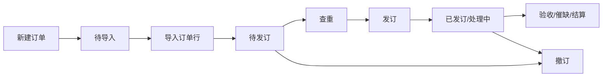

# 图书馆采选订单管理系统 产品需求文档（PRD）

## 1 版本信息

| 版本号 | 修订日期   | 修订人 | 审核人 | 修订内容 |
|--------|------------|--------|--------|----------|
| v2.83  | 2026-08-24 | 产品部 | —      | 完善逐条收货处置弹窗 PRD：优先对换货记录收货的拆分、写回与异常（5.8.5.4） |
| v2.82  | 2026-08-24 | 产品部 | —      | 逐条收货：已换货时支持「优先对换货记录收货」拆分冲销（5.8.5.4） |
| v2.81  | 2026-08-24 | 产品部 | —      | 订户去掉独立配置；新增/编辑合并业务与查重范围（灰线分隔）；去掉分馆排序与数据归属（5.9、5.3.5.5） |
| v2.80  | 2026-08-24 | 产品部 | —      | 查重结果未关联馆藏地：双空挂一级根节点；有馆无地挂所属馆下四级叶子（5.3.5.6） |
| v2.79  | 2026-08-24 | 产品部 | —      | 查重结果单件页签：暂不做树/单件可配排序；馆藏树一级默认「首都图书馆」置顶（5.3.5.6、5.9.5.4） |
| v2.78  | 2026-08-21 | 产品部 | —      | 馆藏树排序：所属馆为三级锚点；一/二级按子孙最优优先序上浮，不跨父搬迁（5.3.5.6） |
| v2.77  | 2026-08-21 | 产品部 | —      | 查重结果单件页签：馆藏树一级节点与单件列表均按所属馆优先序排序（5.3.5.6） |
| v2.76  | 2026-08-21 | 产品部 | —      | 澄清查重范围仅用于馆藏查重；订单查重按关联订户；所属馆排序影响结果单件展示（5.3.5.5、5.3.5.6、5.9） |
| v2.75  | 2026-08-21 | 产品部 | —      | 对照前端同步查重 PRD（5.3.5.4–5.3.5.6）：订户配置合并范围、优先所属馆排序、自动关联细则、空态分页与异常文案 |
| v2.74  | 2026-08-21 | 产品部 | —      | 新增订户管理 PRD（5.9）：基本信息与配置拆分、查重范围与所属馆排序、单件所属馆必填；同步查重弹窗入口文案（5.3.5.5） |
| v2.0   | 2026-07-01 | 产品部 | —      | Vue SPA 迁移后重新初始化；首期覆盖非连续出版物订单模块 |
| v2.1   | 2026-07-02 | 产品部 | —      | 新增订单行详情页 PRD（5.4）；同步订单行列表操作列变更 |
| v2.2   | 2026-07-03 | 产品部 | —      | 订单行列表新增实际关联书目记录号浮动弹窗（5.3.5.10）；订单行详情单件 Tab 改为「单件（N）」 |
| v2.3   | 2026-07-03 | 产品部 | —      | PRD 字段名补充中文对照，业务规则改为文字描述 |
| v2.4   | 2026-07-03 | 产品部 | —      | 同步馆藏/订单查重结果面板 PRD（5.3.5.6）：顶部下拉面板、书目表格字段、滚动与分页规则 |
| v2.5   | 2026-07-03 | 产品部 | —      | 订单行列表与订单查重结果分页调整为默认 50 条/页，可选 50/100/200 |
| v2.6   | 2026-07-06 | 产品部 | —      | 馆藏查重 MARC 信息页签按语种过滤展示字段（5.3.5.6） |
| v2.7   | 2026-07-07 | 产品部 | —      | 查重配置弹窗加载态与防抖（5.3.5.5）；查重结果面板摘要一行展示、页签布局优化（5.3.5.6） |
| v2.8   | 2026-07-07 | 产品部 | —      | 书目查询关联订单行页签 PRD（5.5）：关联订单行列表、新建订单、加入订单 |
| v2.9   | 2026-07-07 | 产品部 | —      | 5.5 节按 PRD 书写规范修订：字段「中文（英文）」、规则自然语言表述 |
| v2.10  | 2026-07-07 | 产品部 | —      | 新建/加入订单弹窗字段输入校验：折扣、定价、套数、备注 |
| v2.11  | 2026-07-07 | 产品部 | —      | 加入订单：套数支持 ≥0 整数；套内册数须为正整数 |
| v2.12  | 2026-07-07 | 产品部 | —      | 订单行列表新增馆藏/订单重复筛选（5.3.5.1）；馆藏查重书目页签新增关联/取消关联（5.3.5.6） |
| v2.13  | 2026-07-07 | 产品部 | —      | 馆藏查重复本数为 0 的业务规则与总复本数展示（5.3.5.6）；未关联馆藏节点（5.3.5.6） |
| v2.14  | 2026-07-07 | 产品部 | —      | 查重结果展示（5.3.5.6）：馆藏查重有单件/无单件规则、单件数量列首列展示 |
| v2.15  | 2026-07-08 | 产品部 | —      | 订单行列表「实」标记显示规则（5.3.5.10）：仅当实际关联书目记录号与书目记录号存在差异时展示 |
| v2.16  | 2026-07-08 | 产品部 | —      | 订单列表/订单行列表新增列展示配置（5.2.5.9、5.3.5.11）：显隐、拖拽排序、列首/列尾固定 |
| v2.17  | 2026-07-13 | 产品部 | —      | 关联订单行页签：切换时校验当前登录馆员关联订户；按可查看订户范围过滤列表（5.5.5.1） |
| v2.18  | 2026-07-13 | 产品部 | —      | 关联订单行数据范围：优先按实际关联书目记录号匹配，否则按书目记录号（5.5.5.1） |
| v2.19  | 2026-07-13 | 产品部 | —      | 新建订单弹窗：订户/资源类型/预算名称按馆员关联订户限制可选范围（5.5.5.2） |
| v2.20  | 2026-07-13 | 产品部 | —      | 加入订单弹窗：候选订单列表按馆员可查看订户范围过滤（5.5.5.3） |
| v2.21  | 2026-07-13 | 产品部 | —      | 加入订单候选过滤：仅按待发订状态、语种匹配与可查看订户范围（5.5.5.3） |
| v2.22  | 2026-07-13 | 产品部 | —      | 加入订单候选：无法映射语种时默认展示可查看订户范围内待发订订单（5.5.5.3） |
| v2.23  | 2026-07-13 | 产品部 | —      | 书目查询 PRD：订户数据范围统一为馆员关联订户，去掉系统可查看订户范围描述（5.5） |
| v2.24  | 2026-07-13 | 产品部 | —      | 新建订单：资源类型不再 MARC 预填；语种按 CNMARC/非 CNMARC 映射（5.5.5.2） |
| v2.25  | 2026-07-13 | 产品部 | —      | 书目查询新建订单：采选方式下拉去掉征订目录（5.5.5.2） |
| v2.26  | 2026-07-13 | 产品部 | —      | 书目查询：点击新建/加入订单按钮时校验馆员关联订户（5.5.5.1） |
| v2.27  | 2026-07-14 | 产品部 | —      | 加入订单：币种下拉取自货币信息使用中的货币代码（5.5.5.3） |
| v2.28  | 2026-07-14 | 产品部 | —      | 关联订单行列表：排除行状态为已撤订的订单行（5.5.5.1） |
| v2.29  | 2026-07-14 | 产品部 | —      | 馆藏查重返回后：订单行书目记录号为空则自动关联结果第一条（5.3.5.6） |
| v2.29  | 2026-07-14 | 产品部 | —      | 加入订单检索：采选方式去掉征订目录；订单号改为精确匹配（5.5.5.3） |
| v2.30  | 2026-07-14 | 产品部 | —      | 补充完善加入订单弹窗 PRD（5.5.5.3）：候选范围、检索、币种、校验与缓存 |
| v2.31  | 2026-07-14 | 产品部 | —      | 批量查重勾选上限 50 条（5.3.5.4） |
| v2.32  | 2026-07-14 | 产品部 | —      | 查重功能 PRD 对照前端同步（5.3.5.4–5.3.5.6）：批量上限 50、自动关联书目、馆藏分页默认 5、视听查重字段 |
| v2.33  | 2026-07-14 | 产品部 | —      | 订单行详情业务 Tab：相关订单行/验收记录/结算记录/单件均展示记录数（N）（5.4.5.2） |
| v2.34  | 2026-07-23 | 产品部 | —      | 馆藏查重结果新增「单件」页签与操作列「单件」入口（5.3.5.6） |
| v2.35  | 2026-07-23 | 产品部 | —      | 查重结果摘要区增加可折叠订单行书目明细（按资源类型/语种）（5.3.5.6） |
| v2.36  | 2026-07-23 | 产品部 | —      | 查重配置弹窗新增查重范围（使用中分馆复选 + 关键字联想）（5.3.5.5） |
| v2.37  | 2026-07-23 | 产品部 | —      | 新增验收单详情 PRD（5.6）：头信息、按种/按册、导出配置（分资源类型与页签）、收货册数/件数计算 |
| v2.38  | 2026-07-28 | 产品部 | —      | 查重范围改为系统预设分馆编码前缀通配符复选（5.3.5.5） |
| v2.39  | 2026-07-28 | 产品部 | —      | 对照前端同步查重范围预设清单（ST* 置顶）与结果面板「展开/收起」文案（5.3.5.5、5.3.5.6） |
| v2.40  | 2026-07-28 | 产品部 | —      | 同步订单行「生成催缺单」细则（5.3.5.3）；新增订单行「更换供应商」（5.3.5.12） |
| v2.41  | 2026-07-29 | 产品部 | —      | 生成催缺单：催缺套数=发订−收货−退货−换货（5.3.5.3） |
| v2.42  | 2026-07-31 | 产品部 | —      | 催缺套数改为发订−收货−退货（不含换货）（5.3.5.3） |
| v2.42  | 2026-07-29 | 产品部 | —      | 书目查询新建订单：增加必填订单名称（orderName）（5.5.5.2） |
| v2.43  | 2026-07-29 | 产品部 | —      | 加入订单候选列表：订单号后新增订单名称列（5.5.5.3） |
| v2.44  | 2026-07-29 | 产品部 | —      | 新增验收单管理 PRD（5.7）：列表、新增/编辑、预验收、批验收、申请结算、导出 |
| v2.45  | 2026-07-29 | 产品部 | —      | 新增逐条收货 PRD（5.8）：检索列表、合并处置弹窗（收/换/退页签）、待收公式与条码预览 |
| v2.46  | 2026-07-29 | 产品部 | —      | 预验收入口改为须勾选一条未开始/进行中验收单（5.7.5.4） |
| v2.47  | 2026-07-29 | 产品部 | —      | 预验收/批验收字段映射按验收单资源类型仅展示纸质书或视听字段（5.7.5.4、5.7.5.5） |
| v2.48  | 2026-07-29 | 产品部 | —      | 预验收/批验收校验订单行须与验收单资源类型、语种、采选方式、供应商一致（5.7.5.4、5.7.5.5） |
| v2.49  | 2026-07-29 | 产品部 | —      | 查重配置确定时校验已选字段在待查重订单行上不可为空（5.3.5.5） |
| v2.50  | 2026-07-30 | 产品部 | —      | 查重范围仅在重复类型为「不限」或「馆藏查重」时显示（5.3.5.5） |
| v2.51  | 2026-07-30 | 产品部 | —      | 查重配置隐藏语种、限量编号字段（5.3.5.5） |
| v2.52  | 2026-07-30 | 产品部 | —      | 视听资料查重字段按语种区分并默认全选（5.3.5.5） |
| v2.53  | 2026-07-31 | 产品部 | —      | 馆藏查重 MARC 页签左右分栏；去掉摘要区订单行展开/收起（5.3.5.6） |
| v2.54  | 2026-07-31 | 产品部 | —      | 查重结果面板增高；MARC/单件页签扩大内容区（5.3.5.6） |
| v2.55  | 2026-08-05 | 产品部 | —      | 订单行检索：定价区间；行状态/供应商/预算改为多选（5.3.5.1） |
| v2.56  | 2026-08-06 | 产品部 | —      | 同步订单行「更换供应商」：行内部分迁出 + 工具栏批量；默认订单名 max+1；原因必选（5.3.5.12） |
| v2.57  | 2026-08-06 | 产品部 | —      | 查重范围改为所属分馆/所属馆藏地输入选择（四级馆藏地）（5.3.5.5） |
| v2.58  | 2026-08-06 | 产品部 | —      | 查重范围所属分馆/馆藏地改为可搜索多选；标签区超高滚动；提交 branchCodes/collectionCodes（5.3.5.5） |
| v2.59  | 2026-08-06 | 产品部 | —      | 查重范围：未选分馆时馆藏地展示全部选项；已选分馆时仅展示下级馆藏地（5.3.5.5） |
| v2.60  | 2026-08-06 | 产品部 | —      | 查重结果合并为统一面板；书目单选；单件页签左树右表；订单页签（5.3.5.6） |
| v2.61  | 2026-08-06 | 产品部 | —      | 预验收：表头行点选、四套字段池、草稿落库与逐条收货带入；移除批验收入口（5.7.5.4、5.7.5.5、5.8） |
| v2.62  | 2026-08-07 | 产品部 | —      | 逐条收货处置弹窗：去页签纵向合并、一次确定、合计≤待收、成功即关、备注统一（5.8） |
| v2.63  | 2026-08-07 | 产品部 | —      | 逐条收货收货备注统一最多 500 字（纸质/视听）（5.8.5.4） |
| v2.64  | 2026-08-07 | 产品部 | —      | 预验收四步入库与字段映射交互修订；逐条收货「已带入预验收数据」标签（5.7.5.4、5.8.5.4） |
| v2.68  | 2026-08-17 | 产品部 | —      | 查重结果单件树：「未关联馆藏」改名为「未关联馆藏地」，挂在首都图书馆下（5.3.5.6） |
| v2.67  | 2026-08-17 | 产品部 | —      | 查重结果单件页签：登到时间前增加单件价格（5.3.5.6） |
| v2.66  | 2026-08-17 | 产品部 | —      | 查重结果书目页签：题名后增加副题名、分卷号、分卷名（5.3.5.6） |
| v2.65  | 2026-08-07 | 产品部 | —      | 预验收 PRD 按四步分节详细说明（5.7.5.4） |
| v2.69  | 2026-08-18 | 产品部 | —      | 加入订单检索：订单号改为订单名称模糊查询（5.5.5.3） |
| v2.70  | 2026-08-19 | 产品部 | —      | 预验收：超收计成功旁注与失败导出、校验「i」浮窗全文、表头行号保存必填、系统字段居中（5.7.5.4） |
| v2.73  | 2026-08-20 | 产品部 | —      | 订户权限配置拆分；查重范围改取订户配置合并；查重弹窗去范围（5.3.5.5、订户） |
| v2.72  | 2026-08-20 | 产品部 | —      | 查重结果 MARC 页签：不做语种过滤，接口返回字段原样展示（5.3.5.6） |
| v2.71  | 2026-08-20 | 产品部 | —      | 同步订单行「更换供应商」：新建订单/加入订单双模式、可搜下拉候选、备注追加源行（5.3.5.12） |

---

## 2 文档说明

### 2.1 文档简介

本文档为「图书馆采选订单管理系统」的产品需求文档。前端已迁移为 Vue 3 SPA（路由 `#/orders`），本文档以 **Vue 实现代码为第一事实源**，描述非连续出版物订单模块的功能范围、交互细节及业务规则。

**对应前端路径**：`html/src/modules/order/`、`html/src/modules/acceptance/`  
**页面路由**：`#/orders`（订单列表 / 订单行列表页签）、`#/orders/line/:lineNo`（订单行详情）、`#/bib-query`（书目查询）、`#/acceptance`（验收单管理）、`#/receive`（逐条收货）

### 2.2 文档读者

- 产品经理：需求定义与优先级管理
- UI/UX 设计师：界面与交互设计
- 开发工程师：技术方案与编码实现
- 测试工程师：测试用例编写与验收
- 项目干系人：了解产品范围与进度

### 2.3 专业术语

| 术语 | 说明 |
|------|------|
| 非连续出版物 | 纸质书、视听资料等一次性采选资源（区别于连续出版物） |
| 订单 | 一次采选业务单，包含订单头信息及多条订单行 |
| 订单行 | 订单内的单条书目/音像采选记录 |
| 待发订 | 订单/行尚未向供应商发订，可进行查重、发订等操作 |
| 馆藏查重 | 比对馆藏书目库是否存在重复 |
| 订单查重 | 比对当前订户可见范围内其他订单行是否存在重复 |
| 催缺单 | 已发订但未完全收货时向供应商催促缺货的单据 |
| 资源标识 | 用于唯一标识资源的编号，如图书的ISBN、视听资料的统一编号等 |
| 语种分类 | 中文/外文，用于决定查重字段的可选项 |
| 资源类型 | 纸质书/视听资料，用于决定查重字段的可选项 |
| 订户 | 图书馆采购单位，数据隔离的基本维度，用户仅能操作其关联订户下的订单 |
| 验收单 | 采访验收环节的业务单据，关联供应商、发货单号及待验收资源 |
| 发货单导入 | 将书商 Excel 发货清单上传并映射至系统标准字段，自动匹配订单行并完成收货/换货/退货处置 |
| 待收套数 | 发货单 Excel 中映射的标准字段，表示该书目本次发货的套数，必填且不参与订单行匹配 |
| 书目记录号 | 订单行关联的编目书目主记录号（`bibRecordNo`） |
| 实际关联书目记录号 | 编目系统拆分/合并书目后回传订单系统的记录号（`actualBibRecordNos`，数组，可多值）；一般仅多卷书存在；为空时单件/MARC 查询回退书目记录号 |

---

## 3 产品简介

### 3.1 产品定位

面向图书馆采访、采编业务的 TOB 采选订单管理系统，支持订单全生命周期管理、书目查重、验收结算等。

### 3.2 产品特色

- 订单与订单行双视图管理，状态驱动操作按钮
- 发订前馆藏/订单双维度查重
- 与验收、催缺、结算模块联动

### 3.3 用户分析

| 用户角色 | 核心诉求 |
|----------|----------|
| 采访馆员 | 创建订单、发订、查重、撤订 |
| 采编馆员 | 维护订单行书目信息、查看查重结果 |
| 系统管理员 | 配置馆址、撤订原因、导入模板等 |

---

## 4 产品架构

### 4.1 产品结构图（用户可见模块）

```
图书馆采选订单管理系统
├── 订单管理 (#/orders)
│   ├── 订单列表（页签）
│   └── 订单行列表（页签）
├── 订单行详情 (#/orders/line/:lineNo)
│   ├── 书目信息（可折叠）
│   └── 业务 Tab：相关订单行（N）/ 验收记录（N）/ 结算记录（N）/ 单件（N）/ MARC信息
├── 书目查询 (#/bib-query)
│   ├── 书目列表（检索 / 表格 / 列设置）
│   └── 单件区页签：实体单件 / 编目数据查看 / 关联订单行
│       └── 关联订单行：列表 + 新建订单 + 加入订单
├── 采访验收
│   ├── 验收单管理 (#/acceptance)
│   ├── 验收单详情 (#/acceptance/detail/:acceptanceId)
│   │   ├── 验收单头信息（含总种数/总册数/总码洋/总实洋）
│   │   ├── 按种 / 按册页签
│   │   ├── 筛选 + 明细表 + 撤销操作（按种·进行中）
│   │   └── 导出明细 / 导出配置（按种与按册独立；按当前资源类型）
│   └── 逐条收货 (#/receive)
│       ├── 当前工作验收单头信息
│       ├── 订单行检索 + 列表
│       └── 逐条收货/换货/退货处置弹窗（纵向合并 · 一次确定）
├── 订户管理 (#/subscribers)
│   ├── 订户列表（筛选 / 表格 / 行操作）
│   ├── 新增/编辑（业务字段 + 查重范围）
│   └── 查看详情（只读页签）
└── …
```

### 4.2 信息结构图

```
订单 (Order)
├── 订单号、订户、馆址、资源类型、语种、供应商、预算、状态…
└── 订单行 (OrderLine) []
    ├── 书目信息（题名、ISBN、作者、出版社…）
    ├── bibRecordNo（书目记录号）
    ├── actualBibRecordNos[]（实际关联书目记录号，可选，多值）
    ├── 行状态、验收状态、结算状态
    └── 查重结果（holdingDuplicate / orderDuplicate）
```

### 4.3 总体流程图



---

## 5 详细功能说明

### 5.1 功能列表（总览）

| 序号 | 模块 | 子模块 | 优先级 | 需求描述 |
|------|------|--------|--------|----------|
| 1 | 非连续出版物订单 | 订单列表-筛选查询 | P0 | 多条件检索、展开/收起 |
| 2 | 非连续出版物订单 | 订单列表-数据表格 | P0 | 分页、行操作、跳转订单行 |
| 2a | 非连续出版物订单 | 订单列表-列展示配置 | P1 | 列显隐、拖拽排序、列首/列尾固定 |
| 3 | 非连续出版物订单 | 新建/编辑订单 | P0 | 表单校验、状态约束 |
| 4 | 非连续出版物订单 | 发订 | P0 | 待发订→已发订，同步订单行 |
| 5 | 非连续出版物订单 | 导入订单 | P0 | 三步向导：上传→解析→点下一步自动入库 |
| 6 | 非连续出版物订单 | 撤订/删除 | P0 | 原因选择、状态联动 |
| 7 | 非连续出版物订单 | 订单行列表-筛选 | P0 | 组合条件 AND/OR |
| 8 | 非连续出版物订单 | 订单行列表-查重 | P0 | 馆藏查重按订户查重范围；订单查重按关联订户；结果单件页签暂不做可配排序，馆藏树一级默认首都图书馆置顶 |
| 8a | 非连续出版物订单 | 订单行列表-实际关联书目记录号 | P0 | 「实」标记浮层 + 书目详情浮动弹窗 |
| 8b | 非连续出版物订单 | 订单行列表-列展示配置 | P1 | 列显隐、拖拽排序、列首/列尾固定 |
| 9 | 非连续出版物订单 | 生成催缺单 | P1 | 按订单分组、更新是否催缺、跳转催缺模块 |
| 9a | 非连续出版物订单 | 订单行更换供应商 | P1 | 行内按套数迁出 / 工具栏按勾选行全量可迁出；支持新建待发订订单或加入已有待发订订单 |
| 10 | 非连续出版物订单 | 编辑订单行 | P1 | 书目字段维护 |
| 11 | 订单行详情 | 书目信息 | P0 | 可折叠书目字段展示 |
| 12 | 订单行详情 | 相关订单行（N） | P0 | 同书目匹配、订户范围过滤；Tab 展示记录总数 |
| 13 | 订单行详情 | 验收记录（N） | P0 | 按种验收汇总；Tab 展示记录总数 |
| 14 | 订单行详情 | 结算记录（N） | P1 | 已结算行展示结算明细；Tab 展示记录总数 |
| 15 | 订单行详情 | 单件（N） | P0 | Tab 展示单件总数；按实际关联书目记录号查编目单件 |
| 16 | 订单行详情 | MARC信息 | P0 | 书目记录号下拉 + MARC 表格 |
| 17 | 书目查询 | 关联订单行列表 | P0 | 订户校验、按书目/实际关联书目记录号与馆员关联订户展示（排除已撤订）、发收换退撤统计、排序 |
| 18 | 书目查询 | 新建订单弹窗 | P0 | 馆员关联订户范围限制、供应商/预算/折扣联动、多馆址建单 |
| 19 | 书目查询 | 加入订单弹窗 | P0 | 馆员关联订户校验、待发订候选过滤、订单名称模糊查询、币种取自货币信息、三区结构多选与馆址套数 |
| 20 | 采访验收 | 验收单详情-头信息 | P0 | 验收单属性与总种数/总册数/总码洋/总实洋 |
| 21 | 采访验收 | 验收单详情-按种/按册 | P0 | 双页签切换明细与导出配置 |
| 22 | 采访验收 | 验收单详情-导出配置 | P0 | 按种/按册独立；仅当前资源类型；收货册数/件数计算规则 |
| 23 | 采访验收 | 验收单详情-撤销操作 | P0 | 进行中按种：撤销收货/换货/退货 |
| 24 | 采访验收 | 验收单管理-筛选与列表 | P0 | 多条件检索、设为验收单、按状态行操作、跳转详情 |
| 25 | 采访验收 | 验收单管理-新增/编辑 | P0 | 表单校验、进行中锁定核心字段、当前工作验收单 |
| 26 | 采访验收 | 验收单管理-预验收 | P0 | 四步：上传→映射→解析→入库；是否校验；通过行写草稿；不直接收货 |
| 27 | 采访验收 | 验收单管理-批验收 | — | 已移除；统一走预验收 + 逐条收货确认 |
| 28 | 采访验收 | 验收单管理-申请结算/导出 | P1 | 批量申请结算；导出配置与导出清单 |
| 29 | 采访验收 | 逐条收货-头信息与检索列表 | P0 | 当前工作验收单、检索、选行打开处置 |
| 30 | 采访验收 | 逐条收货-收/换/退处置弹窗 | P0 | 纵向合并一次确定；有草稿带入并显示「已带入预验收数据」；已换货时可「优先对换货记录收货」；确认后清草稿 |
| 31 | 订户管理 | 订户列表-筛选与表格 | P0 | 多条件检索、创建日期排序、行操作、查看馆员 |
| 32 | 订户管理 | 新增/编辑订户 | P0 | 完整表单：业务字段 + 灰线分隔查重范围；无独立配置、无分馆排序、无数据归属 |
| 33 | 订户管理 | — | — | （原「配置弹窗」已合并至新增/编辑） |
| 34 | 订户管理 | 查看/启停/删除 | P0 | 详情只读页签（无数据归属）；停用/启用/删除确认 |

---

### 5.2 模块名称：非连续出版物订单-订单列表

**路由**：`#/orders`（默认页签「订单列表」）  
**实现文件**：`OrderManageView.vue`、`OrderListPanel.vue`、`OrderModals.vue`

#### 5.2.1 功能说明

以表格集中展示订单头信息，提供检索、新建、发订、导入、撤订、删除、导出等能力。

#### 5.2.2 使用角色

采访馆员、采编馆员（具备订单管理权限）

#### 5.2.3 页面入口

左侧导航 → 订单管理 → 非连续出版物订单（默认进入订单列表页签）

#### 5.2.4 用例流程

1. 用户进入订单列表，默认加载全部订单，分页 10 条/页。
2. 通过检索区缩小范围，点击「检索」刷新表格。
3. 点击「新建订单」填写头信息后创建待导入订单。
4. 待导入订单通过「导入订单」写入订单行后变为待发订。
5. 待发订订单可「发订」；已发订订单可编辑、撤订、导出。

#### 5.2.5 子功能模块

##### 5.2.5.1 功能模块名称：筛选查询

###### 5.2.5.1.1 功能描述

多维度组合检索，默认显示订单号、采选方式、供应商；展开后显示发订人、订单状态、结算状态、订户、语种、发订时间范围、预算名称、资源类型、馆址。

###### 5.2.5.1.2 页面要素

- 检索/重置按钮位于检索区右侧
- 展开/收起切换额外检索项
- 订单状态：全部、待导入、待发订、已发订、处理中、已撤订、已完成

###### 5.2.5.1.3 交互逻辑

- 条件变更不自动检索，需点击「检索」
- 「重置」清空条件并恢复全量数据
- 检索后分页重置第 1 页

###### 5.2.5.1.4 业务规则

| 规则项 | 说明 |
|--------|------|
| 组合逻辑 | 字段间 AND；文本字段模糊包含 |
| 发订时间 | 左闭右闭日期区间 |
| 馆址 | 下拉来自系统馆址配置 |

###### 5.2.5.1.5 前置/后置条件

- 前置：已登录，有订单查看权限
- 后置：表格刷新为筛选结果

###### 5.2.5.1.6 异常处理

- 无匹配数据：空表格

---

##### 5.2.5.2 功能模块名称：数据表格与行操作

###### 5.2.5.2.1 功能描述

分页表格展示订单，支持行勾选、订单号跳转订单行列表、按状态显示操作按钮。

###### 5.2.5.2.2 页面要素

- 复选框列（始终固定在列首最左侧）、序号及 20+ 业务列、操作列
- 默认列首固定：序号、订户、馆址、订单号；默认列尾固定：操作
- 列较多时表格支持**横向滚动**；纵向滚动时表头吸顶；横向滚动时列首/列尾固定列保持可见且不透出底层字段（详见 5.2.5.9）
- 订单状态彩色文字（待导入紫、待发订橙、已发订绿等）

###### 5.2.5.2.3 交互逻辑

- 点击订单号 → 切换「订单行列表」页签并带入订单号（orderId）筛选
- 勾选行后工具栏「撤订」可用
- 工具栏右侧齿轮按钮可打开「列展示」配置面板（详见 5.2.5.9）

###### 5.2.5.2.4 业务规则

| 订单状态 | 操作 |
|----------|------|
| 待发订 | 发订、删除 |
| 待导入 | 导入订单 |
| 已发订 | 编辑、导出订单、撤订 |
| 处理中 | 导出订单 |
| 已撤订 | 导出订单、删除 |

---

##### 5.2.5.3 功能模块名称：新建订单弹窗

###### 5.2.5.3.1 功能描述

填写订户、资源类型、采选方式、预算、语种、供应商、馆址（必填）及折扣（选填），创建状态为「待导入」的订单。

###### 5.2.5.3.4 业务规则

- 订单号自动生成：`PG001B{yyyyMMdd}{3位流水}`
- 必填校验失败：字段下红色提示 + alert

---

##### 5.2.5.4 功能模块名称：编辑订单弹窗

###### 5.2.5.4.1 功能描述

已发订订单可修改预算名称、供应商、发订备注。

---

##### 5.2.5.5 功能模块名称：发订

###### 5.2.5.5.1 功能描述

待发订订单点击「发订」，填写发订备注（可空）后，订单及下属待发订行变为已发订。

###### 5.2.5.5.4 业务规则

- 仅 pending 状态可发订
- 记录 issueTime、issuer、issueRemark

---

##### 5.2.5.6 功能模块名称：导入订单

###### 5.2.5.6.1 功能描述

三步向导：① 选模板+上传 xls/xlsx → ② 查看解析结果并点「下一步」→ ③ 自动入库并展示结果。

###### 5.2.5.6.4 业务规则

- 模板按订单资源类型/语种/供应商过滤
- 解析存在失败行时「下一步」置灰，不可入库
- 第 2 步点「下一步」后直接进入第 3 步并自动入库，无需再点「入库」
- 入库成功：订单 → 待发订，写入订单行

---

##### 5.2.5.7 功能模块名称：撤订与删除

###### 5.2.5.7.1 功能描述

单行/批量撤订需选择撤订原因；删除仅允许待发订或已撤订订单。

###### 5.2.5.7.4 业务规则

- 撤订原因来自「退换撤订原因参数」配置
- 订单撤订联动其下所有订单行

---

##### 5.2.5.8 功能模块名称：批量导出

###### 5.2.5.8.1 功能描述

「批量导出」下拉：导出配置（字段勾选）、导出订单（原型演示）。

---

##### 5.2.5.9 功能模块名称：列展示配置

###### 5.2.5.9.1 功能描述

工具栏右侧提供「列展示」配置入口，支持自定义表格列的显示/隐藏、同组内拖拽排序，以及固定在列首或列尾；配置保存后即时生效，并在下次进入页面时恢复。

###### 5.2.5.9.2 页面要素

- **入口**：工具栏最右侧齿轮图标按钮，悬浮提示「列展示」
- **面板**：点击后在按钮下方弹出浮层（宽约 320px），分三区自上而下展示：
  1. **固定在列首**（有列时显示）
  2. **不固定**
  3. **固定在列尾**（有列时显示）
- **面板顶栏**：左侧「列展示」全选复选框；右侧「重置」文字按钮
- **列项行**：拖拽手柄、列名复选框、列中文名称；鼠标悬停时右侧显示固定操作图标

###### 5.2.5.9.3 交互逻辑

- 点击齿轮图标：打开/关闭列展示面板；点击面板外区域关闭
- **全选/取消全选**：顶栏复选框控制全部业务列显隐；部分选中时复选框为半选态
- **单列显隐**：勾选复选框显示该列，取消勾选隐藏该列
- **拖拽排序**：在同一分区内（列首固定 / 不固定 / 列尾固定）拖动列项调整顺序；不可跨分区拖动
- **固定操作**（悬停列项时显示，随当前固定状态变化）：
  - 当前**不固定**：可「固定在列首」或「固定在列尾」
  - 当前**固定在列首**：可「固定在列尾」或「不固定」
  - 当前**固定在列尾**：可「固定在列首」或「不固定」
- **重置**：恢复系统默认列顺序、默认固定位置及全部列可见
- 变更后立即刷新表格列布局

###### 5.2.5.9.4 业务规则

**默认列顺序与固定位置**

| 固定位置 | 默认列 |
|----------|--------|
| 列首固定 | 序号、订户、馆址、订单号 |
| 不固定 | 采选方式、资源类型、语种、供应商、订单时间、发订人、发订时间、发订册数、发订种数、预算名称、码洋、折扣、实洋、发订备注、订单状态、结算状态 |
| 列尾固定 | 操作 |

**其他规则**

- 复选框列不参与列展示配置，**始终显示**且**始终固定在列首最左侧**
- 若用户将全部业务列取消显示，表格仅保留复选框列（及空数据提示）
- 用户配置持久化至浏览器本地；重置后恢复上表默认值
- 横向滚动时：列首固定列按实际列宽依次贴左排列，列尾固定列贴右排列；表头与表体同步固定，背景不透明，避免非固定列内容透出
- 纵向滚动时表头保持吸顶

###### 5.2.5.9.5 前置/后置条件

- **前置**：用户已进入订单列表页签
- **后置**：表格按最新列配置渲染；配置写入本地存储

###### 5.2.5.9.6 异常处理

- 本地存储数据损坏或与当前版本列定义不兼容时，自动回退为默认列配置
- 新增系统列时：若本地无该列记录，追加至默认位置并可见

#### 5.2.6 数据权限

订单列表受订户数据隔离约束，用户仅可见所属订户数据。

#### 5.2.7 接口定义

无（当前为前端 Mock 原型）

---

### 5.3 模块名称：非连续出版物订单-订单行列表

**路由**：`#/orders?tab=order-line`  
**实现文件**：`OrderLineListPanel.vue`、`OrderLineSearchPanel.vue`、`OrderLineChangeSupplierModal.vue`、`BatchChangeSupplierModal.vue`、`ActualBibRecordNoMarker.vue`、`CatalogRecordFloatingWindow.vue`、`DedupConfigModal.vue`、`DedupResultDrawer.vue`

#### 5.3.1 功能说明

展示订单行明细，支持查重、生成催缺单、更换供应商、编辑、撤订；订单行号可跳转详情。

#### 5.3.2 使用角色

采访馆员、采编馆员

#### 5.3.3 页面入口

- 订单管理 → 切换「订单行列表」页签
- 订单列表点击订单号（带 orderId 筛选）

#### 5.3.4 用例流程

1. 检索目标订单行。
2. 对待发订行执行查重（批量最多 50 条，或单行查重）：查看馆藏重复（holdingDuplicate）/ 订单重复（orderDuplicate）标识；若本轮含馆藏查重且书目记录号（bibRecordNo）为空、馆藏结果非空，则自动写入结果第一条书目记录号。
3. 已发订/处理中且验收未完成、未退货的行可生成催缺单。
4. 行状态为已发订/处理中、验收为待验收/部分收货/换货中且可迁出套数 ≥ 1 的行，可从操作列按指定套数更换供应商；勾选多行且订户/资源类型/语种/采选方式一致时，可从工具栏批量全量迁出。弹窗可选「新建订单」或「加入订单」（加入已有待发订订单）。
5. 点击订单行号进入详情页。
6. 当实际关联书目记录号与书目记录号存在差异时，悬停「实」标记可点击记录号，打开书目详情浮动弹窗查看 MARC / 单件。

#### 5.3.5 子功能模块

##### 5.3.5.1 功能模块名称：筛选查询

支持订单号、订单行号、行状态（多选）及展开后的组合条件（资源标识/正题名/作者/出版社 + 且/或）、载体、验收状态、结算状态、是否催缺、书目记录号、馆址、馆藏重复、供应商（多选）、预算（多选）、订单重复、定价区间。

###### 5.3.5.1.1 页面要素

- **默认行（收起状态可见）**：订单号、订单行号、行状态
- **展开后额外显示**：
  - 组合条件（资源标识 / 正题名 / 作者 / 出版社 + 且/或逻辑链）
  - 载体、验收状态、结算状态
  - 是否催缺、书目记录号、馆址
  - **馆藏重复**、供应商、预算
  - **订单重复**、**定价**（位于订单重复之后）
- **行状态 / 供应商 / 预算**：多选控件；未选任何项表示不过滤；选项不含「全部」
- **行状态**选项：待发订 / 已发订 / 处理中 / 已关闭
- **馆藏重复 / 订单重复**：下拉选框，选项 **全部 / 有 / 无**，默认 **全部**
- **定价**：下限、上限两个数字输入框（中间以 `-` 连接）；可只填一端

###### 5.3.5.1.2 交互逻辑

- 条件变更不自动检索，需点击「检索」
- 「重置」清空全部条件并恢复全量列表
- 检索后分页重置为第 1 页
- 定价下限与上限均有值且下限大于上限时，提示「定价下限不能大于上限」，不发起检索

###### 5.3.5.1.3 业务规则

- 组合条件：同一链条内按 logicAfter（且/或）串联；字段值为空则跳过该条件
- 文本字段（订单号、订单行号、书目记录号、组合条件值）为**包含**匹配
- **行状态 / 供应商 / 预算**多选规则：
  - 未选：不过滤
  - 已选多项：行字段值落在选中集合内即保留（**或**）
- **定价**区间规则（对订单行 `price` 数值比较，不区分币种）：
  - 两端都空：不过滤
  - 只填下限：`price >= 下限`
  - 只填上限：`price <= 上限`
  - 两端都填：`下限 <= price <= 上限`（闭区间）
  - 行上定价为空或无法解析为数值时，若已填写任一端定价条件则不匹配
- **馆藏重复 / 订单重复**筛选规则：
  - **全部**：不过滤
  - **有**：仅显示对应标识为「有」的订单行（`holdingDuplicate` / `orderDuplicate` 为 `true`）
  - **无**：仅显示对应标识为「无」的订单行（值为 `false`）；**未查重**（空白）不匹配「有」或「无」
- 两个重复筛选条件可同时使用，按 **AND** 组合

###### 5.3.5.1.4 异常处理

- 无匹配数据时展示空表格
- 定价下限大于上限：提示错误，不发起检索

##### 5.3.5.2 功能模块名称：数据表格与行操作

复选框列、序号及 25+ 业务列含馆藏重复、订单重复；操作：查重、编辑、撤订（订单行号列可点击跳转详情页）。

**默认列固定**

- 列首固定：序号、订单号、馆址、订单行号
- 列尾固定：操作
- 列较多时支持横向滚动；纵向滚动时表头吸顶；固定列横向滚动时不透出底层字段（详见 5.3.5.11）
- 工具栏右侧齿轮按钮可打开「列展示」配置面板（详见 5.3.5.11）

**书目记录号列**

- 展示**书目记录号**（`bibRecordNo`）
- 若订单行的**实际关联书目记录号**（`actualBibRecordNos`，可多值）非空，且其中至少有一条与书目记录号不一致，则在书目记录号旁显示「**实**」标记（浅蓝小徽章）；显示规则详见 5.3.5.10
- 悬停「实」：浮层标题「实际关联书目记录号」，逐条列出全部非空实际关联记录号
- 若实际关联书目记录号为空，或全部与书目记录号相同，则不显示「实」标记

**分页**

- 默认 **50** 条/页，可选 **50 / 100 / 200** 条/页
- 底部显示总条数、页码切换与每页条数选择
- 检索后分页重置为第 1 页

##### 5.3.5.3 功能模块名称：生成催缺单

###### 5.3.5.3.1 功能描述

对勾选的订单行批量生成催缺单：按订单号（orderId）分组，自动过滤验收状态不允许催缺的行，生成成功后将对应订单行是否催缺（isShortage）更新为「是」，并提示是否立即查看催缺模块。

###### 5.3.5.3.2 页面要素

| 要素 | 位置 / 规则 |
|------|-------------|
| 生成催缺单按钮 | 订单行列表工具栏（与「更换供应商」「查重」「撤订」相邻） |
| 成功确认弹窗 | 文案：「催缺单生成成功，已自动过滤已收货书目」「是否立即查看？」；按钮：取消 / 确定 |

###### 5.3.5.3.3 交互逻辑

1. 未满足启用条件时按钮置灰不可用。
2. 点击后按订单号分组生成催缺单；写入催缺管理列表。
3. 对本次实际纳入生成的订单行，将是否催缺（isShortage）更新为「是」。
4. 弹出成功确认框：取消则关闭；确定则跳转至催缺单管理列表（不进入催缺详情）。

###### 5.3.5.3.4 业务规则

| 规则项 | 说明 |
|--------|------|
| 启用条件 | 至少勾选 1 行；所勾选行行状态（lineStatus）均为「已发订」或「处理中」；且验收状态（acceptanceStatus）均允许催缺（见下） |
| 允许催缺的验收状态 | 验收状态非空，且不为「收货完成」「已退货」（例如待验收、部分收货、换货中等可参与） |
| 催缺套数 | 催缺单中每条订单行的催缺套数（shortageSets）= max(0, 发订套数 − 收货套数 − 退货套数)，取自该行发/收/换/退/撤订（flowStats）；催缺套数为 0 的行不纳入催缺单 |
| 分组 | 按订单号（orderId）分组，每组生成一张催缺单；催缺单套数合计为组内各行催缺套数之和 |
| 过滤 | 生成时再次按验收状态与催缺套数过滤；若过滤后无可生成行，则提示无法生成 |
| 是否催缺 | 生成成功后，纳入催缺的订单行是否催缺（isShortage）=「是」 |

###### 5.3.5.3.5 前置/后置条件

- **前置**：用户已进入订单行列表并勾选符合条件的行
- **后置**：催缺管理出现新催缺单；相关订单行是否催缺为「是」

###### 5.3.5.3.6 异常处理

| 场景 | 处理 |
|------|------|
| 未勾选或勾选行不满足启用条件 | 按钮置灰 |
| 勾选行经过滤后均不可生成（如均已收货完成/已退货，或催缺套数均为 0） | 提示「所选订单行均已收货或已退货，无法生成催缺单」 |

##### 5.3.5.4 功能模块名称：查重操作入口

###### 5.3.5.4.1 功能描述

提供批量查重与单行查重两种操作入口，触发后弹出查重配置弹窗（见 5.3.5.5）。

**批量查重按钮**

- 位置：订单行列表工具栏（与「生成催缺单」「更换供应商」「撤订」「导出订单行」相邻），文案「查重」
- 默认状态：置灰不可用
- 启用条件：同时满足以下条件时按钮高亮可点击：
  1. 至少勾选一条订单行
  2. 所勾选订单行数量**不超过 50 条**
  3. 所勾选订单行均为**待发订**（以行状态 lineStatus 为准）
  4. 所勾选订单行属于**相同资源类型**（以订单行上的资源类型为准：纸质书 / 视听资料）
  5. 所勾选订单行属于**相同语种分类**（以订单行上的语种为准：中文 / 外文）
- 点击后：打开查重配置弹窗；弹窗内查重字段选项按勾选首行确定（优先取行上资源类型/语种，若为空则回落所属订单抬头）

**单个查重文字链**

- 位置：订单行列表操作列
- 显示条件：仅当该行行状态为**待发订**时显示
- 非待发订行：不显示查重文字链
- 点击后：以当前行为查重对象，打开查重配置弹窗（不受批量条数上限约束）

###### 5.3.5.4.2 业务状态

**订单行状态（是否可查重）**

| 状态 | 说明 | 是否可查重 |
|------|------|-----------|
| 待发订 | 订单/行尚未发订 | 是 |
| 已发订 | 已发订 | 否 |
| 处理中 | 处理中 | 否 |
| 已关闭 | 已关闭 | 否 |
| 已撤订 | 已撤订 | 否 |

**批量查重按钮状态**

| 状态 | 说明 |
|------|------|
| 不可用（置灰） | 未勾选行，或勾选超过 50 条，或不满足待发订 / 同资源类型 / 同语种条件 |
| 可用（高亮） | 勾选行均满足批量查重全部启用条件 |

###### 5.3.5.4.3 业务规则

- 仅当订单行行状态为待发订时可查重（不以所属订单状态放宽）
- 若批量勾选数量大于 50 条，则批量「查重」按钮置灰，不可打开查重配置
- 若批量勾选行的资源类型或语种分类不一致，则批量「查重」按钮置灰
- 单行查重不受批量勾选数量与「同资源类型 / 同语种」限制，但目标行须行状态为待发订

###### 5.3.5.4.4 前置/后置条件

- **前置**：用户已登录，且具备订单行列表查看权限
- **后置**：查重配置弹窗打开

###### 5.3.5.4.5 异常处理

- 若勾选超过 50 条仍触发批量查重，则提示「批量查重最多支持 50 条订单行」，不打开配置弹窗
- 若勾选含非待发订行仍触发批量查重，则提示「仅支持行状态为待发订的订单行进行查重」
- 若勾选不同资源类型或不同语种（中文/外文）混合仍触发批量查重，则提示「请勾选相同资源类型和语种（中文/外文）的待发订订单行进行查重」

---

##### 5.3.5.5 功能模块名称：查重配置弹窗

###### 5.3.5.5.1 功能描述

点击查重入口后弹出查重配置弹窗，用户选择重复类型与查重字段后执行查重。**仅馆藏查重**使用当前馆员关联订户在订户列表「编辑 → 查重范围」中的合并结果（见 **5.9**）检索有无馆藏单件；**订单查重不使用查重范围**，仍按当前馆员关联订户下的订单行比对。弹窗内不再选择范围。

###### 5.3.5.5.2 页面要素

- **显示样式**：居中模态弹窗，标题「查重」；底部按钮：「取消」「确定」；点击遮罩或右上角 × 关闭弹窗
- **重复类型**：单选，默认「**不限**」
  - **不限**：同时执行馆藏查重与订单查重
  - **订单查重**：仅检查与其他订单行的重复（按关联订户，不带查重范围）
  - **馆藏查重**：仅检查与馆藏书目的重复（按查重范围检索馆藏单件）
- **查重字段**：按待查重订单行所属订单的**资源类型**与**语种分类**展示可选字段；顶部「**全部**」复选框联动全选/全不选；任一字段变更时同步「全部」勾选状态。

| 资源类型 | 语种分类 | 可选查重字段 | 默认选中 |
|---------|---------|-------------|---------|
| 纸质书 | 中文 | 全部、题名、资源标识、作者、出版社、出版年 | 资源标识 |
| 纸质书 | 外文 | 全部、题名、资源标识、作者、出版社、出版年 | 资源标识 |
| 视听资料 | 中文 | 全部、题名、载体 | 题名、载体（默认全选） |
| 视听资料 | 外文 | 全部、商品条码、目录号 | 商品条码、目录号（默认全选） |

- **查重范围**：弹窗内**不展示**。当重复类型为「不限」或「馆藏查重」时，提交携带按馆员关联订户顺序合并的所属分馆编码（branchCodes）、所属馆藏地编码（collectionCodes）（规则见 **5.9.5.3**），用于馆藏单件检索；皆空表示不限。「订单查重」不带入范围。有序所属分馆**本版不用于**结果面板排序（见 5.3.5.6）。

###### 5.3.5.5.3 交互逻辑

- 若勾选「全部」，则选中全部字段；若取消「全部」，则全部取消；若字段勾选状态变化，则同步「全部」勾选状态
- 若未选择任何查重字段，则点击「确定」阻止提交，并提示「请至少选择一个查重字段」
- 若已选查重字段在任一待查重订单行上为空，则点击「确定」阻止提交，并提示存在空字段的订单行号与字段名（请取消勾选空字段或补全数据后再查重）
- 点击「确定」：
  - 按钮进入**加载中**，文案为「**查重中...**」，显示加载图标
  - **加载期间防抖**：禁止重复点击确定；同时禁用取消、关闭（×、遮罩）及表单选项
  - 查重完成后**自动关闭弹窗**，刷新列表馆藏重复（holdingDuplicate）、订单重复（orderDuplicate）标识列；若本轮含馆藏查重，则按 5.3.5.6.4 自动关联规则同步更新书目记录号（bibRecordNo）
- 点击「取消」或关闭：不执行查重（加载中不可关闭）

###### 5.3.5.5.4 业务规则

- 所选字段采用 **AND（且）** 逻辑：若全部已选字段的值均非空且相等，则判定为重复
- 若比对字段为资源标识，则忽略大小写及连字符（`-`）
- 其他字段比对时忽略大小写
- 馆藏查重范围来自订户「编辑 → 查重范围」合并，**仅馆藏查重**用于检索有无馆藏单件；合并结果为空视为不限
- 订单查重**不使用**查重范围，按当前馆员关联订户下的订单行比对
- 合并后的所属分馆有序列表**本版不作为**查重结果「单件」页签排序依据（树/单件可配排序暂缓，见 5.3.5.6）

###### 5.3.5.5.5 前置/后置条件

- **前置**：用户已通过查重操作入口进入弹窗
- **后置**：执行查重并更新列表标识（及可能的书目记录号），或取消关闭弹窗

###### 5.3.5.5.6 异常处理

- 未选择任何查重字段：阻止提交，提示「请至少选择一个查重字段」
- 已选查重字段在待查重订单行中存在空值：阻止提交，提示空字段所在订单行号与字段名
- 查重请求失败：提示「查重失败，请稍后重试」，弹窗保持打开，恢复可编辑与可关闭状态

---

##### 5.3.5.6 功能模块名称：查重结果展示

###### 5.3.5.6.1 功能描述

查重完成后，在订单行列表展示重复标识；用户可点击「有」查看详细查重结果。

**列表重复标识列**

列表包含两列：**馆藏重复**（holdingDuplicate）、**订单重复**（orderDuplicate）。

| 状态 | 显示 |
|------|------|
| 未查重 | 空白 |
| 无重复 | 「无」 |
| 有重复 | 蓝色文字链「有」，点击打开查重结果面板 |

###### 5.3.5.6.2 页面要素

**查重结果面板（顶部下拉）**

- 从页面**顶部向下滑出**，全宽展示；默认高度约视口 **75%**（上限不超过视口减边距）；切换至「MARC信息」「单件」时增高至约 **88%**
- 面板结构自上而下：**标题栏** → **摘要信息区** → **页签栏** → **结果内容区（可滚动）** → **分页栏**（书目 / 订单页签；MARC / 单件页签不占位）
- 标题：统一为「**查重结果**」
- 摘要区一行横向展示：订单行号（orderLineNo）、查重字段（顿号分隔）、**重复记录数：馆藏 M · 订单 N**；查重字段过长时截断，悬浮可查看完整内容
- 页签固定顺序：**书目** → **MARC信息** → **单件** → **订单**（文案固定，不带数量后缀）
- 结果数据较多时，中间结果内容区出现垂直滚动条；标题栏、摘要区、页签栏、底部分页栏固定不滚动
- 点击遮罩或右上角 × 关闭面板

**入口与默认页签**

| 入口 | 打开后默认页签 |
|------|----------------|
| 馆藏重复「有」 | 书目 |
| 订单重复「有」 | 订单 |

打开后可自由切换四个页签；面板同时读取本行馆藏结果与订单结果。

**馆藏：有单件与无单件**

馆藏查重比对馆藏书目库。若匹配到书目记录，则列表馆藏重复显示「有」，与单件数量是否为 0 无关。

| 维度 | 有单件（单件数量 > 0） | 无单件（单件数量 = 0） |
|------|------------------------|------------------------|
| 列表「馆藏重复」 | **有** | **有** |
| 是否出现在书目列表 | 是 | 是 |
| 书目页签「单件数量」 | 蓝色「N本」 | 灰色「0本」 |
| 单件页签左侧馆藏树 | 四层馆藏树 +「未关联馆藏地」（双空为一级根；有馆无地挂所属馆下四级） | 「暂无馆藏分布」 |
| 单件页签右侧列表 | 全部或按四级叶子过滤后的单件 | 「暂无单件信息」 |
| MARC / 关联 | 可用 | 可用 |

**单件数量**：与当前书目全部关联单件数一致（已分配馆藏地 + 未关联）。「未关联馆藏地」挂载规则：所属馆与所属馆藏地皆空 → **一级根节点**「未关联馆藏地」（与机构并列，排在一级末尾）；所属馆有值且所属馆藏地为空 → 挂在匹配到的**所属馆节点下**的四级叶子「未关联馆藏地」（与其它馆藏地同级）；所属馆在树中无法匹配时并入一级根「未关联馆藏地」。

*书目页签*

- 表格列顺序：**单选** → **单件数量** → 书目字段 → **操作**（不再提供行展开与行下馆藏树）
- 单选：每行一个 radio；打开面板或书目分页切换后默认选中**当前页第一条**；MARC / 单件始终展示当前单选书目
- 书目字段随资源类型与语种动态切换；题名（正题名/题名）后固定增加：**副题名**、**分卷号**、**分卷名**（空值「—」）
  - 纸质书·中文：书目记录号、正题名、副题名、分卷号、分卷名、ISBN、作者、出版社、出版年、版本
  - 纸质书·外文：书目记录号、题名、副题名、分卷号、分卷名、ISBN、责任者、出版社、出版日期、语种
  - 视听资料·中文：书目记录号、题名、副题名、分卷号、分卷名、载体、ISBN/ISRC、出版社、版本/格式、著者
  - 视听资料·外文：书目记录号、ISRC、题名、副题名、分卷号、分卷名、载体、商品条码、目录号、出版方
- 操作列：「关联 / 取消关联」（通过单选 + 切换页签查看 MARC / 单件）

*MARC信息页签*

- 左右分栏（默认各 50%，可拖拽，左侧约 20%–80%）：左「订单行信息」，右「MARC信息」
- 左侧以表格展示订单行书目明细，列：**字段名**、**字段内容**（空值「—」），便于与右侧对照
- 右侧展示**当前单选书目**的 MARC；**不做语种过滤**，接口返回哪些字段即展示哪些
- 不显示底部分页栏；直接点页签时使用当前单选书目（若无选中则回落第一条）

*单件页签*

- 左右分栏：左侧馆藏树**固定 20%**（不可拖拽调整），宽度不足时左侧出现横向滚动条；右「单件列表」
- 一 / 二 / 三级节点点击仅展开 / 收起；四级馆藏地、所属馆下四级「未关联馆藏地」、或一级根「未关联馆藏地」点击后，右侧过滤为对应单件（有馆无地按所属馆；双空/无法匹配按一级根）
- 进入页签或切换单选书目时未选叶子，右侧显示该书目**全部**单件
- 不显示底部分页栏；列：**馆藏状态**、条码号、索书号、所属馆、所属馆藏地、所在馆、所在馆藏地、借阅类型、卷册描述、**装帧**（精装/平装）、**排架标引分类**、**排架标引**、**单件价格**、登到时间
- **馆藏树排序（本版）**：不做按分馆/机构配置的排序；一级节点中若存在「首都图书馆」则置顶，其余机构保持接口原相对序；一级「未关联馆藏地」固定排在末尾；二/三/四级不重排
- **单件列表排序（本版）**：暂不做优先序排序；按叶子过滤后保持接口/原数据相对序
- 馆藏状态枚举示例：编目中、已外借、订购中、剔除、损坏、在架、阅览等

*订单页签*

- 列表上方统计栏（与书目查询关联订单行一致）：**发订数量**、**收货数量**、**换货数量**、**退货数量**、**撤订数量**（对各订单查重结果行的 `flowStats` 求和）
- 表格列同原订单查重结果（订单行号、馆址、正题名、作者、出版社、出版时间、定价、币种、套内册数、套数、行状态、发订时间）；无操作列
- 默认 50 条/页，可选 50 / 100 / 200；无数据时「暂无查重结果」

**交互与分页**

- 书目页签：默认 5 条/页，可选 5 / 10 / 20 / 50
- 订单页签：默认 50 条/页，可选 50 / 100 / 200
- MARC / 单件不展示分页栏
- 打开面板时按入口重置默认页签与对应分页；点馆藏入口重置书目第 1 页每页 5 条；点订单入口重置订单第 1 页每页 50 条

###### 5.3.5.6.3 交互逻辑

- 标识为「有」时可点击打开统一查重结果面板（入口决定默认页签）；「无」或空白不响应
- 书目单选变更后，再进入 MARC / 单件即展示新选中书目；切换书目时单件页签四级筛选重置
- 「关联 / 取消关联」规则不变
- 单件树：一～三级仅展开收缩；四级叶子筛选右侧列表
- 打开结果面板时不再执行自动关联（自动关联仅在查重返回落库时处理）

###### 5.3.5.6.4 业务规则

- **订单查重**比对范围：当前登录馆员**关联订户**下的其他订单行（不含当前行自身）；**不使用**查重范围（所属分馆/馆藏地）
- **馆藏查重**比对范围：按订户「编辑 → 查重范围」合并后的所属分馆/馆藏地，检索有无馆藏单件数据（见 5.3.5.5）；皆空则不限
- **馆藏重复判定**：匹配到馆藏书目即「有」，与单件数量是否为 0 无关
- **单件数量**：与该书目全部关联单件数一致（展示侧以查重范围内单件为准）；0 本时单件页签左侧「暂无馆藏分布」、右侧「暂无单件信息」
- **自动关联书目**：
  - 若本轮执行馆藏查重，且订单行书目记录号（bibRecordNo）为空，且本行馆藏结果非空且第一条书目记录号有效，则静默将书目记录号写为结果第一条
  - 若书目记录号已有值则不覆盖
  - 批量查重时逐行独立处理
  - 仅订单查重或馆藏结果为空时不执行
  - 打开结果面板不再重复自动关联；取消关联后再查重且有结果时将再次自动关联
- 重复标识按本次查重配置的重复类型分别更新；「不限」时同时更新两列
- 馆藏书目表格字段取自查重触发订单行的资源类型与语种（优先行上，否则所属订单）；MARC 字段不做语种过滤，按接口返回原样展示
- **单件 / 馆藏树排序（本版）**：
  - 单件列表：暂不做按优先所属馆排序，过滤后保持原相对序
  - 馆藏树：暂不做按分馆/机构配置排序；仅当一级存在「首都图书馆」时将其置顶，其余机构保持原相对序；一级「未关联馆藏地」排末尾
- **未关联馆藏地挂载**：所属馆与所属馆藏地皆空 → 一级根「未关联馆藏地」；所属馆有值且所属馆藏地为空 → 匹配所属馆节点下的四级叶子「未关联馆藏地」；所属馆无法匹配树节点时并入一级根

###### 5.3.5.6.5 前置/后置条件

- **前置**：已执行查重操作，列表标识列已更新
- **后置**：查重结果面板展示详细查重结果；列表书目记录号已按自动关联规则刷新（若适用）

###### 5.3.5.6.6 异常处理

- 重复标识为「无」或未查重时，不响应「有」链接点击
- 书目 / 订单页签无数据时展示「暂无查重结果」，且**不展示**底部分页栏
- 单件页签无馆藏分布或单件数量为 0：左侧「暂无馆藏分布」、右侧「暂无单件信息」
- 单件页签已选叶子但无匹配单件：展示「暂无单件信息」
- MARC 页签无可用书目或无字段：展示「暂无MARC信息」
- 查重请求失败：见 5.3.5.5.6

---

##### 5.3.5.7 功能模块名称：编辑订单行

弹窗编辑 ISBN、题名、出版社、定价、币种、正文语种、载体、套数等字段。

##### 5.3.5.8 功能模块名称：撤订

单行/批量撤订，选择原因后行状态 → 已撤订。

##### 5.3.5.9 功能模块名称：批量导出

导出配置 / 导出清单（原型演示）。

##### 5.3.5.10 功能模块名称：实际关联书目记录号与书目详情浮动弹窗

###### 5.3.5.10.1 功能描述

当订单行的**实际关联书目记录号**（`actualBibRecordNos`）与**书目记录号**（`bibRecordNo`）存在差异时，在列表「书目记录号」列通过「实」标记提供快捷入口：悬停浮层内点击某条记录号，以**无遮罩可拖拽浮动弹窗**展示该记录号对应的 **MARC信息** 与 **单件（N）**，支持多窗并排对比。

###### 5.3.5.10.2 页面要素

**「实」标记（书目记录号列旁）**

| 要素 | 规则 |
|------|------|
| 展示位置 | 订单行列表「书目记录号」列，书目记录号（`bibRecordNo`）旁 |
| 显示条件 | 同时满足：① 实际关联书目记录号（`actualBibRecordNos`）去空后至少有一条；② 其中至少有一条与书目记录号（`bibRecordNo`）不一致 |
| 不显示 | 实际关联书目记录号为空或均为空字符串；或全部条目均与书目记录号相同（例如仅含一条且等于书目记录号） |
| 样式 | 浅蓝色小徽章「实」 |

**「实」标记悬停浮层**

| 要素 | 规则 |
|------|------|
| 显示前提 | 已满足「实」标记显示条件（见上表） |
| 标题 | 「实际关联书目记录号」 |
| 记录号列表 | 逐条列出全部非空实际关联书目记录号；每条为蓝色可点击链接 |
| 收起 | 鼠标离开浮层约 0.12 秒后收起；点击记录号后不立即关闭，便于连续打开多个弹窗 |

**书目详情浮动弹窗**

| 要素 | 规则 |
|------|------|
| 默认尺寸 | 宽 1024px × 高 520px |
| 最小尺寸 | 宽 480px × 高 320px |
| 遮罩 | 无遮罩；列表背景仍可操作 |
| 标题栏 | 展示当前书目记录号、来源订单行号（`orderLineNo`）、正题名（`title`）；标题栏可拖拽移动；右侧 × 关闭 |
| Tab 顺序 | **MARC信息**（默认）→ **单件（N）** |
| 单件 Tab 命名 | N = 当前记录号在编目系统中的单件条数（表格一行计 1 条） |
| 调整尺寸 | 四边及四角共 8 个拖拽热区，可调整宽度与高度 |

###### 5.3.5.10.3 交互逻辑

1. 悬停「实」→ 展示浮层 → 点击某条实际关联书目记录号 → 打开对应浮动弹窗，默认展示 MARC 页签。
2. 重复点击**同一**记录号：不新建弹窗，将已有弹窗置于最前并短暂高亮边框。
3. 同时最多打开 **3** 个不同记录号的弹窗；尝试打开第 4 个时，提示「最多同时打开 3 个书目详情弹窗，请先关闭部分弹窗」，且不新建弹窗。
4. 每新开一个弹窗，初始位置在上一窗基础上向右、向下各错开 32 像素，避免完全重叠。
5. 拖动标题栏可移动弹窗；拖动四边或四角可调整宽高；点击弹窗任意区域可将该窗置于最前。
6. 用户切换离开「订单行列表」页签时，自动关闭并清空全部浮动弹窗。

###### 5.3.5.10.4 业务规则

- **弹窗粒度**：一次只展示一条实际关联书目记录号对应的编目数据，不与同订单行其他记录号合并。
- **MARC 数据来源**：按当前浮动弹窗所点记录号，结合来源订单行的书目信息，向编目系统查询 MARC 著录字段；展示规则与订单行详情页「MARC信息」页签一致。
- **单件数据来源**：按当前浮动弹窗所点记录号，向编目系统查询该记录号下的全部馆藏单件；表格列与订单行详情页「单件（N）」页签一致（序号、条码号、索书号、所属馆、所属馆藏地、所在馆藏地、借阅类型、卷册描述、登到日期）。
- **单件 Tab 计数**：N 取当前记录号查得的单件行数；编目无单件时显示「单件（0）」。
- **「实」标记显示**：若实际关联书目记录号为空，或全部与书目记录号相同，则不展示「实」标记。
- **使用范围**：本入口**仅在订单行列表**提供；不满足「实」标记显示条件时，不显示标记，亦不提供本弹窗入口。
- **已移除能力**：浮层内不再提供「复制全部」记录号。

###### 5.3.5.10.5 前置/后置条件

- **前置**：订单行存在至少一条与书目记录号（`bibRecordNo`）不一致的实际关联书目记录号（`actualBibRecordNos`）；用户已登录且具备订单行列表查看权限。
- **后置**：浮动弹窗展示编目 MARC / 单件；用户关闭弹窗或离开订单行列表页签后，弹窗销毁。

###### 5.3.5.10.6 异常处理

- 编目系统对该记录号无 MARC：MARC 页签居中展示「暂无 MARC 信息」。
- 编目系统对该记录号无单件：单件页签表格为空，Tab 文案为「单件（0）」。
- 已有 3 个弹窗时再打开新记录号：弹出提示，拒绝新建。

---

##### 5.3.5.11 功能模块名称：列展示配置

###### 5.3.5.11.1 功能描述

工具栏右侧提供「列展示」配置入口，支持自定义订单行列表列的显示/隐藏、同组内拖拽排序，以及固定在列首或列尾；配置保存后即时生效，并在下次进入页面时恢复。

###### 5.3.5.11.2 页面要素

- **入口**：工具栏最右侧齿轮图标按钮，悬浮提示「列展示」
- **面板结构**：与订单列表列展示面板一致（顶栏全选 + 重置；三区：固定在列首 / 不固定 / 固定在列尾）
- **列项行**：拖拽手柄、显隐复选框、列中文名称；悬停显示固定操作图标

###### 5.3.5.11.3 交互逻辑

- 打开/关闭、全选/取消、单列显隐、分区内拖拽排序、固定/取消固定、重置等交互规则同 **5.2.5.9**
- 变更后立即刷新表格列布局

###### 5.3.5.11.4 业务规则

**默认列顺序与固定位置**

| 固定位置 | 默认列 |
|----------|--------|
| 列首固定 | 序号、订单号、馆址、订单行号 |
| 不固定 | 书目记录号、正题名、资源标识、载体、作者、出版社、出版时间、分卷号、分卷名、定价、币种、套内册数、套数、行状态、验收状态、结算状态、是否催缺、发/收/换/退/撤订、发订时间、馆藏重复、订单重复、备注 |
| 列尾固定 | 操作 |

**其他规则**

- 复选框列不参与列展示配置，始终显示且始终固定在列首最左侧
- 序号列为当前页内连续序号（随分页变化）
- 用户配置持久化至浏览器本地；重置后恢复上表默认值
- 横向/纵向滚动与固定列遮挡规则同 **5.2.5.9.4**

###### 5.3.5.11.5 前置/后置条件

- **前置**：用户已进入订单行列表页签
- **后置**：表格按最新列配置渲染；配置写入本地存储

###### 5.3.5.11.6 异常处理

- 本地存储异常时回退默认列配置
- 系统新增列时自动合并至默认配置

##### 5.3.5.12 功能模块名称：更换供应商

###### 5.3.5.12.1 功能描述

将订单行的**可迁出套数**迁出，并指定新供应商、预算与撤订原因；原行对应套数记入发/收/换/退/撤订（flowStats）的撤订段。迁出目标支持两种模式（默认「新建订单」）：

1. **新建订单**：创建 1 条待发订新订单，并追加对应新订单行。
2. **加入订单**：不新建订单头，向已选的待发订目标订单追加新订单行，并重算该订单种数/套数/册数/码洋。

提供两个入口：

1. **行内**：操作列「更换供应商」——用户填写迁出套数（1～可迁出）；新建模式生成 1 新单 + 1 新行，加入模式向目标单追加 1 新行。
2. **工具栏批量**：勾选多行后「更换供应商」——不填套数，每行按当前可迁出套数全量迁出；新建模式生成 1 新单 + N 新行，加入模式向目标单追加 N 新行。

本入口**不以是否催缺（isShortage）排除行**；催缺管理侧的更换供应商仍按催缺口径独立运作，两边互不替代。

###### 5.3.5.12.2 页面要素

| 要素 | 位置 / 规则 |
|------|-------------|
| 工具栏「更换供应商」 | 订单行列表工具栏；不满足启用条件时置灰不可点 |
| 行内「更换供应商」 | 操作列；仅当该行满足显示条件时展示 |
| 行内弹窗 | 标题「更换供应商」；**最顶部**只读展示「发订套数：N  已收货套数：N  已换货套数：N  已退货套数：N」；其下居中单选「新建订单 / 加入订单」（默认新建）；字段顺序：供应商 → 预算名称 → 订单名称 → 套数 → 原因 → 备注 |
| 批量弹窗 | 标题「更换供应商」；顶部单选同左；字段同前但**无套数** |
| 确认按钮文案 | 新建模式为「生成新订单」；加入模式为「加入订单」 |
| 目标模式（targetMode） | 单选；切换时清空订单名称文本与已选目标订单号；供应商、预算、原因、备注保留 |
| 订单名称（orderName，新建） | 必填文本；最多 50 字符；打开/切回新建时预填 `{原订单名称}-{n}`（见业务规则）；提交**不校验**名称是否重复 |
| 订单名称（加入） | 必填；可搜索单选下拉；选项展示「订单名称（订单号）」；绑定值为订单号（orderId）；占位「请选择或输入检索待发订订单」；无候选时字段下方提示「暂无符合条件的待发订订单，请调整供应商或预算」 |
| 套数（仅行内） | 必填；打开时默认 = 当前可迁出套数；须为 1～可迁出的整数 |
| 供应商（supplier） | 必填；默认带入关联订单供应商；选项按采选方式（method）过滤；加入模式下参与目标订单筛选；变更时清空已选目标订单 |
| 预算名称（budget） | 采选方式为交换或捐赠时可空且禁用选择；其余必填；默认带入关联订单预算；加入模式下参与目标订单筛选；变更时清空已选目标订单 |
| 原因 | 必填；下拉取「退换撤订原因参数」中类型为撤订且使用中的原因；无可用原因时提示先去设置配置 |
| 备注 | 非必填；打开时为空；占位「填写后将追加至源订单行备注后」；提交时若有填写则追加至**源订单行**备注（remark）之后；新建/加入的目标订单抬头**不**写入此备注 |
| 成功确认弹窗 | 新建：行内「已生成新订单 {订单号}，原行对应套数已撤订，是否立即查看？」；批量（多种）另含种数/套数/册数。加入：文案将「已生成新订单」换为「已加入订单」。取消 / 确定 |

###### 5.3.5.12.3 交互逻辑

**行内**

1. 满足显示条件时操作列出现「更换供应商」；点击打开行内弹窗，默认「新建订单」并预填表单。
2. 切换「加入订单」后，「订单名称」由文本输入切换为可搜下拉；切回「新建订单」则恢复建议订单名。
3. 用户可改供应商、预算、订单名称/目标订单、套数、原因、备注；必填项在字段下方即时校验提示。
4. 新建模式点「生成新订单」：校验 → 创建待发订新订单及 1 条新订单行 → 回写原行撤订段（及备注追加）→ 关闭弹窗 → 成功确认。
5. 加入模式点「加入订单」：校验目标订单仍在候选内 → 向目标订单追加 1 条新订单行并重算抬头统计 → 回写原行 → 关闭弹窗 → 成功确认。
6. 成功确认：取消仅关闭；确定则切换至「订单列表」页签。

**工具栏批量**

1. 未满足启用条件时工具栏按钮置灰。
2. 启用后点击打开批量弹窗（无套数），默认「新建订单」，预填首行关联订单的订单名称建议值、供应商、预算。
3. 目标模式与订单名称控件切换规则同行内。
4. 新建模式点「生成新订单」：校验表单、勾选范围一致性及每行可迁出 ≥ 1 → 创建 1 条待发订新订单及 N 条新订单行 → 回写各原行 → 成功确认（多种时含种/套/册）。
5. 加入模式点「加入订单」：校验后向目标订单追加 N 条新订单行并重算抬头 → 回写各原行 → 成功确认。
6. 成功确认：取消仅关闭；确定则切换至「订单列表」页签。

###### 5.3.5.12.4 业务规则

**可迁出套数**

解析发/收/换/退/撤订（flowStats）后：

> 可迁出套数 = max(0, 发订 − 已收 − 已退 − 已换)

- 已换、已收、已退套数不迁出
- 提交前重新计算；若填写套数大于当前可迁出，则提示「可迁出套数不足，请重新填写」并中止

**默认订单名称（仅新建模式）**

- 原名取关联订单的订单名称（orderName）；空则用「新订单」
- 扫描全部已有订单中精确匹配「原名-数字」的名称，取最大序号 + 1；无匹配则为 1（不回填空洞）
- 示例：已有「专题采购-1」「专题采购-3」→ 建议「专题采购-4」
- 最终长度不超过 50；先定后缀再截断原名；提交不校验重名

**加入订单候选筛选（须同时满足）**

1. 发订状态（orderStatus）为待发订
2. 订户（subscriber）∈ 当前馆员可查看订户范围
3. 资源类型（resourceType）、语种（language）、采选方式（method）与源订单行维度一致（行内取当前行关联订单；批量取勾选首行关联订单维度；**不要求同一订单号**）
4. 供应商（supplier）= 弹窗所选供应商
5. 预算名称（budget）= 弹窗所选预算；当采选方式为交换/捐赠且预算可空时，仅匹配预算也为空的待发订订单
6. 未选供应商，或（预算必填时）未选预算 → 候选为空

**行内显示条件（须全部满足才显示）**

1. 行状态（lineStatus）为「已发订」或「处理中」
2. 验收状态（acceptanceStatus）为「待验收」「部分收货」或「换货中」
3. 可迁出套数 ≥ 1

不因是否催缺隐藏入口。

**工具栏启用条件（须全部满足）**

1. 至少勾选 1 行
2. 每行行状态（lineStatus）为「已发订」或「处理中」
3. 勾选行的订户、资源类型、语种、采选方式相同（订户、采选方式取自关联订单抬头）

不要求同一订单号；不在启用时校验验收状态或可迁出套数（提交时若某行可迁出 < 1 则报错中止，不跳过）。

**新建订单**

| 项 | 规则 |
|----|------|
| 数量 | 每次操作生成恰好 1 条新订单 |
| 状态 | 待发订 |
| 继承 | 订户、馆址、资源类型、语种、采选方式、折扣等取自关联订单抬头（批量取自首行关联订单） |
| 覆盖 | 订单名称、供应商、预算取自弹窗 |
| 新订单行（行内） | 恰好 1 行；套数与发订段 = 填写套数；行状态待发订；是否催缺为「否」；书目/资源字段自原行复制；供应商/预算等取自新订单抬头 |
| 新订单行（批量） | 每个勾选行对应 1 行；套数与发订段 = 该行可迁出套数；其余同上 |

**加入订单**

| 项 | 规则 |
|----|------|
| 订单头 | **不**新建；目标须仍满足候选筛选 |
| 新订单行 | 行内 1 行 / 批量 N 行；套数 = 填写套数或该行可迁出；行状态待发订；是否催缺为「否」；书目字段自原行复制；供应商、预算、馆址等取自**目标订单抬头** |
| 抬头统计 | 追加后重算目标订单种数、套数、册数、码洋 |

**备注与原行回写（不打开撤订原因选择弹窗）**

- 若弹窗填写备注：追加至**源订单行**备注之后写入；未填写则不改动源行备注；目标订单（新建或加入）不因本字段写入抬头发订备注
- 撤订段累加本次迁出套数；撤订原因 = 弹窗所选原因
- 若发订套数全部进入撤订（无已收/已换/已退）→ 行状态变为「已撤订」
- 若仍保留已收等数量 → 保留订单行，并按更新后的发/收/换/退/撤订重算行状态与验收状态

**与催缺更换供应商的边界**

| 入口 | 适用行 | 迁出/撤订数量口径 |
|------|--------|-------------------|
| 订单行列表行内 / 工具栏「更换供应商」（本节） | 不按是否催缺排除 | 可迁出 = 发订 − 已收 − 已退 − 已换；行内可指定部分套数 |
| 催缺管理「更换供应商」/ 撤订 | 已催缺相关行 | 撤订套数 = max(催缺套数 − 到货套数, 0) |

两边互不替代。

###### 5.3.5.12.5 前置/后置条件

- **前置（行内）**：目标行满足显示条件；关联订单抬头可解析
- **前置（批量）**：勾选满足启用条件；首行关联订单可解析；提交时每行可迁出 ≥ 1
- **前置（加入）**：已选目标订单号且仍在候选列表中
- **后置（新建）**：存在待发订新订单及对应新订单行；原行已按迁出套数记撤订
- **后置（加入）**：目标待发订订单已追加新订单行并更新统计；原行已按迁出套数记撤订

###### 5.3.5.12.6 异常处理

| 场景 | 处理 |
|------|------|
| 行不满足显示条件 | 操作列不展示「更换供应商」 |
| 批量勾选范围不一致 / 行状态不符 | 工具栏按钮置灰 |
| 套数为空、非整数、小于 1 或大于可迁出 | 字段提示「请填写合法套数（1～可迁出）」 |
| 新建模式未填订单名称 | 字段提示「请输入订单名称」 |
| 加入模式未选目标订单 | 字段提示「请选择待发订订单」 |
| 所选目标订单不再待发订或不匹配筛选 | 字段提示「目标订单不可用，请重新选择」 |
| 未选供应商 / 应填未选预算 / 未选原因 | 字段下方红色提示 |
| 某勾选行可迁出 = 0 | 提示该订单行无可迁出套数并中止（不部分成功） |
| 勾选行订户等不一致（提交时） | 提示须一致 |
| 未找到原订单 / 订单行不存在 | 提示无法生成 |
| 无可选撤订原因 | 原因下拉禁用，并提示先在设置中配置 |

---


#### 5.3.6 数据权限

- 订单查重：限定在当前登录馆员**关联订户**下的订单行；不使用查重范围。
- 馆藏查重：按订户「编辑 → 查重范围」合并后的所属分馆/馆藏地检索馆藏单件（见 5.9）；皆空则不限。

#### 5.3.7 接口定义

无（当前为前端 Mock 原型）

---

### 5.4 模块名称：订单行详情

**路由**：`#/orders/line/:lineNo`  
**实现文件**：`OrderLineDetailView.vue`、`OrderLineBibInfo.vue`、`order-line-detail.js`

#### 5.4.1 功能说明

展示单条订单行的书目信息与关联业务数据。页面自上而下为：**书目信息区**（可折叠）+ **业务 Tab 区**（5 个页签）。用于馆员查看同书目其他订户的采选情况、验收/结算进度、编目单件及 MARC 著录。

#### 5.4.2 使用角色

采访馆员、采编馆员（具备订单查看权限）

#### 5.4.3 页面入口

- 订单行列表点击**订单行号**（蓝色链接）
- 路由直接访问 `#/orders/line/{orderLineNo}`

#### 5.4.4 用例流程

1. 用户从订单行列表进入详情，顶部展示书目信息（默认展开）。
2. 默认 Tab「相关订单行（N）」展示同书目匹配的订单行（含当前行），订单行号为普通文本不可跳转；N 为表格总行数。
3. 切换「验收记录（N）」查看该行的验收汇总。
4. 若结算状态为已结算，在「结算记录（N）」查看结算明细。
5. 切换「单件（N）」：N 为当前订单行全部单件条数；系统优先按**实际关联书目记录号**（`actualBibRecordNos`）逐条向编目系统查询单件并合并展示；若无实际关联，则按**书目记录号**（`bibRecordNo`）查询。
6. 切换「MARC信息」：下拉选择书目记录号（默认第一项），展示对应 MARC 字段表。

#### 5.4.5 子功能模块

##### 5.4.5.1 功能模块名称：书目信息

###### 5.4.5.1.1 功能描述

可折叠卡片展示当前订单行书目元数据。左侧封面占位（100×140px），右侧三列网格展示字段；字段集合与顺序由**资源类型 + 语种**决定，全部字段均展示（值为空时显示空白）。

###### 5.4.5.1.2 页面要素

- 折叠栏：「书目信息」+「收起/展开」
- 封面：有**封面图地址**（`coverUrl`）显示图片，否则默认 SVG 占位
- 封面下展示资源类型、语种
- 书目字段三列网格；长文本字段（一般性附注、图书简介、备注、书评、作者简介、目次信息、馆藏信息等）占 3 列宽

###### 5.4.5.1.3 交互逻辑

- 点击标题栏切换展开/收起，默认展开

###### 5.4.5.1.4 业务规则

**纸质书 · 中文**（顺序固定）

正题名、ISBN、副题名、分卷号、分卷名、分类号、出版社、作者、出版年、定价、版本、丛编、主题词、读者对象、装帧形式、尺寸、正文语种、卷数、出版地、一般性附注、图书简介、备注

**纸质书 · 外文**

ISBN、学科大类、学科细分、中图分类号、中译名、题名、副题名、责任者、丛编、出版社、装帧形式、出版日期、版次、页数、币种、价格、主题词、读者对象、尺寸、语种、简介、精简装ISBN对照、馆藏信息、审读级别、获奖信息、目次信息、分卷号、分卷名、作者简介、书评、备注

**视听资料 · 中文**

ISBN、ISRC、题名、载体、出版社、版本/格式、著者、币种、码洋、彩胶颜色、限量编号、厂牌、系列名称、是否签名、是否老唱片、获奖信息、北京出版社、分类、盘号、老唱片品牌、剧种、年代、备注

**视听资料 · 外文**

ISRC、题名、载体、商品条码、目录号、外文原文题名、出版方、码洋、币种、备注、厂牌

> 语种取自所属订单的**语种**字段（`language`，中文 / 外文）。

###### 5.4.5.1.5 前置/后置条件

- 前置：路由参数 `lineNo` 有效，或加载演示上下文
- 后置：无写操作

###### 5.4.5.1.6 异常处理

- 订单行不存在：使用演示数据上下文展示（原型行为）

---

##### 5.4.5.2 功能模块名称：业务 Tab 页签

###### 5.4.5.2.1 功能描述

Tab 顺序固定：**相关订单行（N）**（默认）、**验收记录（N）**、**结算记录（N）**、**单件（N）**、**MARC信息**。

前四个页签的 N 均为对应表格**总行数**（与分页无关；相关订单行含当前行）；无数据时显示 **（0）**；数据变化时 N 随列表条数自动刷新。**MARC信息**不加数量。

###### 5.4.5.2.3 交互逻辑

- 点击 Tab 切换内容区，当前 Tab 底部蓝色高亮
- 各 Tab 内分页状态独立

---

##### 5.4.5.3 功能模块名称：相关订单行

###### 5.4.5.3.1 功能描述

展示书目匹配的其他订单行，**包含当前行**；范围限定当前馆员关联订户可查看的订单。

###### 5.4.5.3.2 页面要素

表格列：序号、订户、订单行号、采购方式、预算名称、供应商、折扣、发订人、发订时间

###### 5.4.5.3.3 交互逻辑

- **订单行号不可点击**，普通文本展示
- 分页：默认 50 条/页，可选 10 / 20 / 50
- 发订人、发订时间为空显示空白

###### 5.4.5.3.4 业务规则

**书目匹配规则**

| 资源类型 | 语种 | 匹配条件 |
|---------|------|----------|
| 纸质书 | — | 资源标识（ISBN）且正题名相同 |
| 视听资料 | 中文 | 正题名且载体相同 |
| 视听资料 | 外文 | 商品条码且目录号相同 |

- 订户范围：系统**可查看订户范围**配置（`viewableSubscribers`）内的订户
- 按发订时间倒序，含序号从 1 递增

###### 5.4.5.3.6 异常处理

- 无匹配：空表格

---

##### 5.4.5.4 功能模块名称：验收记录

###### 5.4.5.4.1 功能描述

展示当前订单行验收汇总（按种）。从验收模块按订单行号匹配；**无匹配时表格展示「暂无数据」**，不使用订单行字段构造。

###### 5.4.5.4.2 页面要素

列：序号、订单行号、ISBN/ISRC、正题名、作者、定价、币种、发/收/换/退套数、最近一次验收时间、最近一次验收人

###### 5.4.5.4.4 业务规则

- 数据全部来源于验收模块匹配记录
- 无匹配：表格展示「暂无数据」

---

##### 5.4.5.5 功能模块名称：结算记录

###### 5.4.5.5.1 功能描述

展示当前订单行结算明细。从结算模块按**订单行号**（`orderLineNo`）匹配；**无匹配时表格展示「暂无数据」**，不使用订单行字段推算。

###### 5.4.5.5.2 页面要素

复用结算模块 `SETTLEMENT_LIST_COLUMNS` 列定义。

###### 5.4.5.5.4 业务规则

- 系统在结算模块已结算数据中，按订单行号精确查找当前行的结算记录
- 无匹配：表格展示「暂无数据」

---

##### 5.4.5.6 功能模块名称：单件（N）

###### 5.4.5.6.1 功能描述

按**实际关联书目记录号**从编目系统查询单件并汇总展示，展示编目系统返回的全部单件记录。页签文案为 **单件（N）**，N 为合并后的单件总行数。

###### 5.4.5.6.2 页面要素

- **Tab 标签**：文案为「单件（N）」；N 等于下方单件表格的总行数，数据变化时自动更新
- **表格列**：序号（01 格式）、条码号、索书号、所属馆、所属馆藏地、所在馆藏地、借阅类型、卷册描述、登到日期

###### 5.4.5.6.4 业务规则

**单件查询逻辑**

1. 若订单行存在**实际关联书目记录号**（`actualBibRecordNos`），则逐条记录号向编目系统查询单件，将各次结果合并为一张表格展示（一般用于多卷书拆分后的各卷记录）。
2. 若不存在实际关联书目记录号，则使用**书目记录号**（`bibRecordNo`）作为唯一查询条件，向编目系统获取单件列表。
3. 合并后的总行数即为页签 N；例如合并后 10 行，页签显示「单件（10）」。

**展示规则**

- **所在馆藏地**、**卷册描述**为空时，单元格留空，不显示占位符。
- 表格分页：默认每页 10 条，可选 10 / 20 / 50 条。

**Tab 计数 N**

- N 始终与当前表格中的单件总行数一致；切换至其他 Tab 再返回、或切换查看其他订单行后，按最新查询结果重新计算 N。

###### 5.4.5.6.6 异常处理

- 编目无单件数据：空表格

---

##### 5.4.5.7 功能模块名称：MARC信息

###### 5.4.5.7.1 功能描述

按实际关联书目记录号（为空则书目记录号）从编目系统查询 MARC。列表上方提供**书目记录号下拉框**，默认第一项。

###### 5.4.5.7.2 页面要素

- 下拉框标签「书目记录号」，选项为可查询的记录号列表
- MARC 表格：字段名、指示符、字段内容；最大高度 480px 滚动

###### 5.4.5.7.3 交互逻辑

- 切换下拉即时刷新 MARC 表格
- 切换订单行时下拉重置为第一项
- 无记录号或无 MARC：展示「暂无 MARC 信息」

###### 5.4.5.7.4 业务规则

**下拉框选项如何确定**

- 若订单行存在**实际关联书目记录号**（`actualBibRecordNos`），下拉框列出其全部有效记录号，供用户切换查看各卷的 MARC。
- 若不存在实际关联书目记录号，但**书目记录号**（`bibRecordNo`）有值，则下拉框仅含书目记录号一项。
- 每次进入详情页或切换查看的订单行发生变化时，下拉框默认选中列表中的**第一项**，并据此刷新 MARC 表格。

**MARC 展示**

- 展示格式与书目查询页 MARC 详情一致（如 010、200、210 等 CNMARC 字段）。

#### 5.4.6 数据权限

- 相关订单行受系统**可查看订户范围**（`viewableSubscribers`）约束，仅展示馆员有权查看的订户数据
- 单件与 MARC 数据均来自编目系统，按书目记录号或实际关联书目记录号查询

#### 5.4.7 接口定义

| 接口名称 | 方法 | 路径 | 说明 |
|----------|------|------|------|
| 获取订单行详情 | GET | /api/order-lines/{lineNo} | 订单行 + 书目字段 |
| 相关订单行 | GET | /api/order-lines/{lineNo}/related | 书目匹配、订户过滤 |
| 编目单件 | GET | /api/catalog/items | 参数：bibRecordNo（实际关联或书目记录号） |
| 编目 MARC | GET | /api/catalog/marc | 参数：bibRecordNo |

当前原型为前端 Mock。

---

### 5.5 模块名称：书目查询-关联订单行页签

**路由**：`#/bib-query`  
**实现文件**：`BibQueryView.vue`、`BibCreateOrderModal.vue`、`BibJoinOrderModal.vue`

#### 5.5.1 功能说明

书目查询页下方单件区提供「关联订单行」页签：切换页签时校验当前登录馆员关联订户；通过后按书目记录号或实际关联书目记录号（优先实际关联）、馆员关联订户范围过滤，且不展示行状态为「已撤订」的订单行，支持按发订时间规则排序，并提供新建订单、加入订单能力。

#### 5.5.2 使用角色

采访馆员、采编馆员（具备书目查询与订单操作权限）

#### 5.5.3 页面入口

左侧导航 → 书目查询 → 选中书目 → 下方页签 **关联订单行(n)**

#### 5.5.4 用例流程

1. 用户在书目列表选中一条书目，切换至「关联订单行」页签。
2. 若当前登录馆员未关联任何订户，则系统提示「您没有关联订户，无法查看数据」，列表不展示业务数据。
3. 若已关联订户，则按当前选中书目的书目记录号查询关联订单行：若订单行存在非空的实际关联书目记录号（actualBibRecordNos），则优先按实际关联书目记录号匹配；否则按书目记录号（bibRecordNo）匹配；并仅展示当前馆员关联订户范围内、且行状态不为「已撤订」的结果及发/收/换/退/撤订汇总。
4. 点击「新建订单」：若当前馆员未关联订户则提示无法新建；否则在馆员关联订户范围内选择订户、资源类型、预算名称等，填写订单头信息（可多馆址），创建待发订订单。
5. 点击「加入订单」：若当前馆员未关联订户则提示无法加入；否则从馆员关联订户范围内待发订订单中多选（若书目可映射语种则再按语种过滤），分馆址填写套数及共用书目字段后提交。

#### 5.5.5 子功能模块

##### 5.5.5.1 功能模块名称：关联订单行列表

###### 5.5.5.1.1 功能描述

若用户在书目列表选中一条书目，且当前登录馆员已关联订户，则按当前书目的书目记录号（bibRecordNo）查询关联订单行：若订单行存在非空的实际关联书目记录号（actualBibRecordNos），则优先按实际关联书目记录号匹配；否则按书目记录号匹配；并仅展示当前馆员关联订户范围内、且行状态（lineStatus）不为「已撤订」的关联订单行。页签标题显示条数 n；列表上方展示发/收/换/退/撤订数量统计栏。

###### 5.5.5.1.2 页面要素

- 工具栏：新建订单、加入订单
- 统计栏：发订数量、收货数量、换货数量、退货数量、撤订数量
- 表格 18 列：序号、订单号、馆址、订单行号、正题名、资源标识、载体、作者、出版社、出版时间、定价、币种、套内册数、套数、行状态、验收状态、结算状态、发订时间
- 底部文案：共 N 条记录

###### 5.5.5.1.3 交互逻辑

- 若用户从其他页签切换至「关联订单行」页签，则先校验当前登录馆员是否有关联订户；若未关联，则弹窗提示「您没有关联订户，无法查看数据」
- 若用户点击「新建订单」，则校验当前登录馆员是否有关联订户；若未关联，则提示「您没有关联订户，无法新建订单」，且不打开弹窗
- 若用户点击「加入订单」，则校验当前登录馆员是否有关联订户；若未关联，则提示「您没有关联订户，无法加入订单」，且不打开弹窗
- 若用户切换书目选中行，且已通过订户校验，则列表随当前书目刷新
- 若未选中书目，则展示「请先选中书目」
- 若已选中书目、已通过订户校验但无关联行，则展示「暂无关联订单行」
- 若当前登录馆员未关联订户，则列表展示「您没有关联订户，无法查看数据」，且不展示业务数据
- 若正题名、作者、出版社过长，则悬停展示全文
- 若发订时间（issueTime）为空，则显示「—」

###### 5.5.5.1.4 业务规则

| 规则项 | 说明 |
|--------|------|
| 订户校验 | 若用户切换至「关联订单行」页签，则须校验当前登录馆员是否有关联订户；若无，则提示「您没有关联订户，无法查看数据」，且不加载列表数据 |
| 订户范围 | 若当前登录馆员已关联订户，则以其关联订户作为本页数据范围 |
| 数据范围 | 若用户选中书目且已通过订户校验，则按下列规则匹配订单行，且所属订单订户（subscriber）须落在馆员关联订户范围内，且行状态（lineStatus）不为「已撤订」：<br>① 若订单行的实际关联书目记录号（actualBibRecordNos）非空，则仅当其中任一条与当前选中书目的书目记录号（bibRecordNo）一致时纳入列表（不再按书目记录号匹配）；<br>② 若实际关联书目记录号为空，则仅当订单行的书目记录号（bibRecordNo）与当前选中书目一致时纳入列表 |
| 行状态过滤 | 列表不展示行状态为「已撤订」的订单行 |
| 排序 | 若无发订时间（issueTime），则排在最上方；否则按发订时间从新到旧；若发订时间相同，则按订单行号（orderLineNo）升序 |
| 统计汇总 | 发/收/换/退/撤订数量由各行流转统计（flowStats）五段数值分别累加 |

###### 5.5.5.1.5 前置/后置条件

- 前置：用户已登录；书目列表已加载
- 前置：当前登录馆员已关联至少一个订户（否则无法查看关联订单行数据）
- 后置：列表随书目选中及馆员关联订户实时更新

###### 5.5.5.1.6 异常处理

- 若当前登录馆员未关联订户，则弹窗提示「您没有关联订户，无法查看数据」，列表展示相同空状态文案
- 若无书目选中，则展示「请先选中书目」
- 若已选中书目但无符合范围的关联数据，则展示「暂无关联订单行」

---

##### 5.5.5.2 功能模块名称：新建订单弹窗

###### 5.5.5.2.1 功能描述

为当前选中书目创建订单。若用户选择多个馆址（sites），则每个馆址各生成一个订单号。打开时按书目 MARC 格式预填语种（CNMARC 为中文，否则为外文）；订户、资源类型、预算名称的可选范围受当前登录馆员关联订户约束。关闭弹窗后保留上次填写内容。

###### 5.5.5.2.2 页面要素

- 模态弹窗标题「新建订单」
- 表单字段见下表
- 底部：取消、确定

| 字段 | 必填 | 说明 |
|------|------|------|
| 订单名称（orderName） | 是 | 文本；最多 50 个字符；占位「请输入，50字符以内」 |
| 订户（subscriber） | 是 | 下拉；可选范围为当前馆员关联订户（使用中） |
| 资源类型（resourceType） | 是 | 下拉；须先选订户；选项为所选订户主数据中的资源类型 |
| 采选方式（method） | 是 | 下拉：捐赠/现采/交存/交换/拍卖 |
| 预算名称（budget） | 条件 | 须先选订户；选项为所选订户主数据中的预算名称；见业务规则 |
| 语种（language） | 是 | 下拉；打开时按书目 MARC 格式预填：CNMARC 为中文，否则为外文 |
| 供应商（supplier） | 是 | 下拉；随采选方式联动 |
| 折扣（discount） | 否 | 选择供应商后默认带出，可改；若填写则须大于 0 且小于等于 1，最多两位小数 |
| 馆址（sites） | 是 | 多选，至少一项 |

###### 5.5.5.2.3 交互逻辑

- 若当前登录馆员未关联任何订户，则点击「新建订单」时提示「您没有关联订户，无法新建订单」，且不打开弹窗
- 若未选订户（subscriber），则资源类型（resourceType）、预算名称（budget）下拉禁用，提示「请先选择订户」
- 若用户切换订户，且已选资源类型或预算不在新订户允许范围内，则清空对应字段
- 若未选采选方式，则供应商下拉禁用，提示「请先选择采选方式」
- 若用户选择供应商，则折扣（discount）自动带出主数据默认值，可手动修改
- 若用户填写折扣，则须为大于 0 且小于等于 1 的数值，最多两位小数；若不满足则提示并阻止提交
- 若用户切换采选方式且当前供应商不在新列表中，则清空供应商与折扣
- 若采选方式为交换或捐赠，则预算名称禁用并清空
- 若用户关闭弹窗，则保存表单内容；再次打开时恢复并校验供应商、预算有效性

###### 5.5.5.2.4 业务规则

**订户与字段范围**

| 规则项 | 说明 |
|--------|------|
| 订户范围 | 当前登录馆员关联订户，且订户状态为使用中 |
| 订户（subscriber） | 下拉仅展示上述范围内的订户名称 |
| 资源类型（resourceType） | 若用户已选订户，则下拉仅展示该订户主数据中配置的资源类型 |
| 预算名称（budget） | 若用户已选订户，则下拉仅展示该订户主数据中配置的预算名称（采选方式为交换或捐赠时仍禁用） |
| 语种预填 | 若书目 MARC 格式为 CNMARC，则预填「中文」；否则预填「外文」；无法解析 MARC 格式时不预填 |

**供应商与采选方式**

| 采选方式 | 可选供应商范围 |
|----------|----------------|
| 现采 | 代理商应用中类型为书商且状态为使用中 |
| 交存 | 出版社管理应用中状态为使用中 |
| 捐赠 | 个人管理（捐赠）与资源商管理（团体捐赠）合并列表 |
| 交换 | 资源商管理应用中类型为交换且状态为使用中 |
| 拍卖 | 代理商应用中类型为拍卖行且状态为使用中 |

**预算名称（budget）**

| 采选方式 | 规则 |
|----------|------|
| 交换 / 捐赠 | 非必填（隐藏必填星号）、下拉禁用；切换时清空 |
| 其他 | 必填 |

**提交**

- 若订单名称（orderName）未填，则提示「请输入订单名称」；若超过 50 个字符，则提示「订单名称不能超过50个字符」
- 若当前馆员未关联订户，或所选订户/资源类型/预算名称不在允许范围内，则提示并阻止提交
- 若采选方式为交换或捐赠，则提交时不校验预算名称
- 若馆址（sites）未选，则提示「请选择馆址」
- 若折扣（discount）已填但不满足大于 0 且小于等于 1、最多两位小数，则提示并阻止提交
- 若其他必填项缺失，则提示对应字段并阻止提交
- 提交成功后提示订单号列表；订单号格式 PG001B+日期+流水号

###### 5.5.5.2.5 前置/后置条件

- 前置：关联订单行页签已选中书目
- 前置：当前登录馆员已关联至少一个订户
- 后置：原型阶段以提示框演示成功；表单内容保留供下次打开

###### 5.5.5.2.6 异常处理

- 若当前登录馆员未关联订户，则提示「您没有关联订户，无法新建订单」
- 若订单名称未填，则提示「请输入订单名称」
- 若订单名称超过 50 个字符，则提示「订单名称不能超过50个字符」
- 若馆址未选，则提示「请选择馆址」
- 若所选订户、资源类型或预算名称不在允许范围内，则提示对应字段并阻止提交
- 若缓存中的订户、资源类型或预算不在当前馆员允许范围内，则恢复时清空无效字段
- 若缓存中供应商与当前采选方式不匹配，则恢复时清空供应商与折扣
- 若缓存中采选方式为交换或捐赠，则恢复时清空预算名称

---

##### 5.5.5.3 功能模块名称：加入订单弹窗

###### 5.5.5.3.1 功能描述

将当前选中书目加入一个或多个**待发订**订单；一次提交为每条勾选订单各生成一条订单行（原型以提示框演示）。弹窗自上而下分三区：检索与订单列表、馆址分配、共用字段（币种 / 定价 / 套内册数 / 备注）。

###### 5.5.5.3.2 页面要素

**上区 — 检索与列表**

| 控件 | 规则 |
|------|------|
| 订单名称（orderName） | 文本；占位「模糊查询」；若输入订单名称，则与列表订单名称做**不区分大小写的包含匹配** |
| 采选方式（method） | 下拉：全部 / 捐赠 / 现采 / 交存 / 交换 / 拍卖（**不含**征订目录） |
| 供应商（supplier） | 下拉：全部，或当前候选订单列表中出现过的供应商 |
| 检索 | 点击后按上述条件过滤列表（条件变更不自动检索） |
| 重置 | 清空三个条件并恢复全量候选列表 |

列表列：勾选、订单号、订单名称（orderName）、订户、馆址、采选方式、资源类型（resourceType）、语种（language）、供应商、预算名称（budget）、折扣（discount）、发订状态、创建时间（createTime）。

- 列表默认按创建时间（createTime）从新到旧排列
- 选中行以浅黄色背景高亮；表头固定，列表区域可纵向滚动，列较多时可横向滚动
- 列表不含套数列；套数仅在中区馆址行填写
- 订单名称、预算名称过长时截断，悬停展示全文
- 发订状态展示「待发订」等状态文案

空状态：

- 若无任何候选订单：「暂无匹配的待发订订单」
- 若检索后无匹配结果：「未找到符合条件的订单」

**中区 — 馆址分配**

- 若未勾选任何订单：展示「请先在上方的列表中选择订单」
- 若勾选 N 条订单：展示 N 行；馆址（site）只读，取自对应订单；下方灰色小字展示订单号（orderId）；套数（sets）默认 1，可修改
- 馆址行顺序与上方列表一致（按创建时间从新到旧）
- 若取消勾选某订单，则移除对应馆址行；若再次勾选，则套数优先从上次关闭时的缓存恢复

**下区 — 共用字段**

| 字段 | 必填 | 说明 |
|------|------|------|
| 币种（currency） | 条件 | 下拉选项取自【货币信息】中状态为「使用中」的货币代码；默认优先 CNY（若仍为使用中），否则取第一项使用中货币代码；展示货币代码 |
| 定价（price） | 条件 | 有效数值，最多两位小数 |
| 套内册数（copiesInSet） | 否 | 正整数，默认 1 |
| 备注（remark） | 否 | 多行文本，最多 500 个字符 |

若所选订单为纸质书且语种为外文，则币种与定价必填（标签显示红色星号）；其他情况选填。

**底部操作**：取消、确定。

###### 5.5.5.3.3 交互逻辑

- 若用户点击「加入订单」：先校验是否已选中书目；再校验当前登录馆员是否有关联订户；若未关联，则提示「您没有关联订户，无法加入订单」，且不打开弹窗
- 若弹窗打开：恢复上次缓存的检索条件、勾选订单、馆址套数及共用字段；若缓存中的采选方式不在可选范围内（如含征订目录），则回退为「全部」；若缓存中的币种已停用或不存在，则回退为默认使用中货币代码
- 若用户勾选或取消勾选订单：按订单号（orderId）同步增删馆址行
- 若勾选多条订单时资源类型或语种不一致：提示「请勾选相同资源类型和语种的待发订订单」，且不勾选该订单
- 若用户点击「检索」：按条件过滤列表；若点击「重置」：清空条件并恢复全量候选
- 若用户关闭弹窗（取消或提交后关闭）：保存检索、勾选、套数及共用字段，供下次打开恢复

###### 5.5.5.3.4 业务规则

| 规则项 | 说明 |
|--------|------|
| 订户范围 | 当前登录馆员关联订户 |
| 候选订单 | 仅订单状态为待发订、且订户（subscriber）落在馆员关联订户范围内的订单；若当前书目可映射出语种（language），则还须语种与映射结果一致；若无法映射语种，则不按语种过滤 |
| 检索 — 订单名称 | 不区分大小写的包含匹配 |
| 检索 — 采选方式 | 选项不含征订目录 |
| 多选 | 勾选订单须为相同资源类型（resourceType）与语种（language） |
| 套数（sets） | 每行独立填写大于等于 0 的整数，默认 1；至少一行套数大于 0 |
| 套内册数（copiesInSet） | 选填；若填写则须为正整数，默认 1 |
| 币种（currency） | 选项取自【货币信息】使用中货币代码；若所选订单为纸质书且语种为外文，则必填；其他情况选填 |
| 定价（price） | 若所选订单为纸质书且语种为外文，则必填且须为有效数值（最多两位小数）；其他情况选填，若填写则格式同上 |
| 备注（remark） | 选填；最多 500 个字符 |
| 共用字段 | 币种、定价、套内册数、备注一次填写，作用于全部勾选订单中套数大于 0 的记录 |

###### 5.5.5.3.5 前置/后置条件

- 前置：已选中书目；当前登录馆员已关联至少一个订户
- 后置：校验通过后，为每条勾选且套数大于 0 的订单各生成一条关联订单行（原型以提示框演示）；关闭弹窗后保留填写内容

###### 5.5.5.3.6 异常处理

| 场景 | 处理 |
|------|------|
| 未选中书目 | 提示「请先选中书目」 |
| 未关联订户 | 提示「您没有关联订户，无法加入订单」，不打开弹窗 |
| 无候选订单 | 「暂无匹配的待发订订单」 |
| 检索无结果 | 「未找到符合条件的订单」 |
| 未选订单 | 「请至少选择一个订单」 |
| 勾选资源类型或语种不一致 | 「请勾选相同资源类型和语种的待发订订单」 |
| 套数无效 | 「请为每个馆址填写有效套数」或「请至少为一个馆址填写大于0的套数」 |
| 套内册数无效 | 「套内册数须为正整数」 |
| 纸质书·外文未选币种 | 「请选择币种」 |
| 定价格式无效 | 「定价须为有效数值，最多两位小数」或「请输入定价」 |
| 备注超长 | 「备注最多500个字符」 |

#### 5.5.6 数据权限

- 关联订单行列表受订户数据隔离约束：仅展示当前登录馆员**关联订户范围内**的订单行。
- 若当前登录馆员未关联任何订户，则不允许查看关联订单行数据。

#### 5.5.7 接口定义

无（当前为前端 Mock）。设计规格见 `docs/superpowers/specs/2026-06-17-bib-query-join-order-list-design.md`。

---

### 5.6 模块名称：采访验收-验收单详情

**路由**：`#/acceptance/detail/:acceptanceId`（可选查询参数 `view=volume` 进入按册）  
**实现文件**：`AcceptanceDetailView.vue`、`AcceptanceExportConfigModal.vue`、`RevokeReceiveModal.vue`  
**PRD 面板**：`html/src/prd/acceptance-detail-prd-data.js`（pageId：`acceptance-detail`）

#### 5.6.1 功能说明

展示单张验收单的头信息与明细。支持按种 / 按册两种视角检索与导出；按种在验收进行中可撤销收货、换货、退货。亦可由逐条收货等入口以嵌入抽屉方式打开（无面包屑、不展示 PRD 按钮）。

#### 5.6.2 使用角色

采访馆员、采编馆员（具备验收权限）

#### 5.6.3 页面入口

- 验收单管理 → 打开验收详情  
- 逐条收货「查看详情」等嵌入抽屉  
- 换货/退货批次、待结算等跳转验收单号  

#### 5.6.4 用例流程

1. 进入验收详情，查看头信息与默认按种明细。  
2. 按条件检索；需要时切换按册查看收货明细。  
3. 配置导出字段并导出验收/收货明细。  
4. 若验收单进行中，在按种行上撤销收货/换货/退货。  

#### 5.6.5 子功能模块

##### 5.6.5.1 功能模块名称：验收单头信息

###### 5.6.5.1.1 功能描述

展示验收单基础属性与汇总指标。

###### 5.6.5.1.2 页面要素

- 验收单号（acceptanceId）、验收单名称（name）、资源类型（resourceType）、语种（language）、发货单号（shipNo）、供应商（supplier）  
- 验收备注（acceptanceRemark）整行展示  
- 总种数（totalSpecies）、总册数（totalVolumes）、总码洋（totalListPrice）、总实洋（totalNetPrice）  

###### 5.6.5.1.4 业务规则

- 总种数取当前按种明细行数。  
- 总册数 = Σ（收货套数 × 套内册数/件数）；总码洋 = Σ（收货套数 × 定价/码洋）；总实洋 = Σ（收货套数 × 实洋）。套内册数/件数缺失时默认按 1；实洋或定价缺失时该行对应贡献为 0。  

##### 5.6.5.2 功能模块名称：按种 / 按册页签

###### 5.6.5.2.1 功能描述

切换按种验收汇总与按册收货明细视角。

###### 5.6.5.2.3 交互逻辑

- 默认按种；`view=volume` 进入按册。  
- 切换后更新筛选字段、表格列、导出按钮文案（导出验收明细 / 导出收货明细）及导出配置字段集；分页回到第 1 页。  
- 按册工具栏提示：「仅提供收货详情」。  

##### 5.6.5.3 功能模块名称：筛选查询

###### 5.6.5.3.1 功能描述

按页签与资源类型提供检索条件；支持检索、重置与展开日期条件。

###### 5.6.5.3.2 页面要素

| 页签 | 资源类型 | 条件摘要 |
|------|----------|----------|
| 按种 | 纸质书 | 组合检索（ISBN/作者/正题名/订单行号）+ 验收人 + 验收时间（日期区间） |
| 按种 | 视听资料 | 组合检索（ISBN/ISRC/题名/作者/商品条码/目录号/载体/订单行号）+ 验收人 + 验收时间（日期区间） |
| 按册 | 纸质书 | 组合检索（条码号/ISBN/作者/正题名）+ 收货人 + 收货时间（日期区间） |
| 按册 | 视听资料 | 组合检索（条码号/ISBN/ISRC/题名/作者/商品条码/目录号/载体）+ 收货人 + 收货时间（日期区间） |

##### 5.6.5.4 功能模块名称：按种明细表格与操作

###### 5.6.5.4.1 功能描述

按种展示验收汇总；进行中状态可撤销收货/换货/退货。

###### 5.6.5.4.2 页面要素

纸质书主要列：序号、订单行号、ISBN、正题名、作者、定价、币种、发/收/换/退数、最近一次验收时间、最近一次验收人、换/退/撤销收货原因、操作。视听资料另含载体、商品条码、目录号、套内件数等（以页面列为准）。

###### 5.6.5.4.3 交互逻辑

- 原因列：有内容时「查看」悬停全文；否则「—」。  
- 仅验收单状态为进行中且当前为按种时显示操作按钮：有收货套数→撤销收货；有换货套数→撤销换货；有退货套数→撤销退货；皆无则「—」。  
- 撤销换货/退货需确认后清零对应套数并刷新原因。  
- 分页默认 10 条/页，可选 10/20/50。  

##### 5.6.5.5 功能模块名称：按册明细表格

###### 5.6.5.5.1 功能描述

按册展示收货明细；不提供撤销类操作。

###### 5.6.5.5.2 页面要素

- 纸质书：序号、条码号、ISBN、正题名、作者、定价、币种、实洋、单册定价、套内册数、收货人、收货时间  
- 视听资料：序号、条码号、ISBN/ISRC、载体、题名、商品条码、目录号、作者、定价、实洋、币种、套内件数、收货人、收货时间  

##### 5.6.5.6 功能模块名称：导出明细与导出配置

###### 5.6.5.6.1 功能描述

导出当前筛选明细；通过导出配置勾选字段。按种与按册配置相互独立；弹窗仅展示当前验收单资源类型字段，左侧类型标签不可切换。

###### 5.6.5.6.2 页面要素

- 下拉：导出明细 / 导出配置  
- 弹窗：左侧当前资源类型；右侧全选 + 头字段 + 分隔线 + 明细字段（六列）  

###### 5.6.5.6.4 业务规则

**头字段（共用）**：验收单号、验收单名称、资源类型、语种、供应商、发货单号、总码洋、总实洋、折扣率、总种数、总册数、创建人、创建时间、验收备注。

**按种 · 纸质书明细**：订单行号、ISBN、正题名、副题名、作者、出版社、出版年、分类号、正文语种、丛编、定价、币种、实洋、装帧、尺寸、主题词、版本、读者对象、附注、图书简介、套内册数、发订套数、收货套数、收货册数、换货套数、退货套数。

**按种 · 视听资料明细**：ISBN、ISRC、商品条码、目录号、载体、题名、著者、码洋、币种、实洋、出版社、版本/格式、彩胶颜色、厂牌、限量编号、套内件数、发订套数、收货套数、收货件数、换货套数、退货套数。

**按册 · 纸质书明细**：条码号、订单行号、订单号、ISBN、正题名、副题名、作者、出版社、出版年、分类号、正文语种、丛编、定价、币种、实洋、套内册数、单册定价、装帧、尺寸、主题词、版本、读者对象、附注、图书简介、收货人、验收时间、收货备注。

**按册 · 视听资料明细**：条码号、订单行号、载体、ISBN、ISRC、商品条码、目录号、题名、著者、码洋、币种、实洋、套内件数、单册定价、收货人、验收时间、验收备注。

| 字段 | 适用 | 计算规则 |
|------|------|----------|
| 收货册数（receiveVolumes） | 纸质书·按种 | 若套内册数（copiesInSet）为空，则收货册数为空；否则收货册数 = 收货套数（receiveSets） × 套内册数 |
| 收货件数（receivePieces） | 视听·按种 | 若套内件数（piecesInSet）为空，则收货件数为空；否则收货件数 = 收货套数（receiveSets） × 套内件数 |

- 打开配置默认全选；确定保存勾选（原型提示已保存字段数）。  
- 导出明细：无数据则提示暂无可导出；有数据则提示已导出及文件名。  

##### 5.6.5.7 功能模块名称：撤销收货

###### 5.6.5.7.1 功能描述

按种进行中行打开撤销收货弹窗，确认后清零收货套数并记录原因。

###### 5.6.5.7.3 交互逻辑

成功提示「撤销收货成功」；取消不改数据。

#### 5.6.6 数据权限

无（当前为前端 Mock，按验收单号加载上下文）。

#### 5.6.7 接口定义

无（当前为前端 Mock）。

---

### 5.7 模块名称：采访验收-验收单管理

**路由**：`#/acceptance`  
**实现文件**：`AcceptanceManageView.vue`、`AcceptanceFormModal.vue`、`PreAcceptWizardModal.vue`、`AcceptanceSettlementModal.vue`、`AcceptanceExportConfigModal.vue`  
**PRD 面板**：`html/src/prd/acceptance-manage-prd-data.js`（pageId：`acceptance-manage`）

#### 5.7.1 功能说明

管理验收单列表：检索、新增/编辑、设为当前工作验收单、结束/删除；提供预验收（差异核对 + 草稿落库，真正收货在逐条收货确认）；支持申请结算与列表导出。批验收入口已移除。

#### 5.7.2 使用角色

采访馆员、采编馆员（具备验收权限）

#### 5.7.3 页面入口

- 侧栏「采访验收」→「验收单管理」
- 路由 `#/acceptance`

#### 5.7.4 用例流程

1. 按条件检索验收单；勾选或点验收单号进入详情。  
2. 新增或编辑验收单头信息；可选设为当前工作验收单、配置自动条码。  
3. 有关联订户且勾选一条未开始/进行中验收单时，可执行预验收（上传→字段映射→数据解析→数据入库，通过行写入草稿）。  
4. 在逐条收货中打开处置弹窗确认收货（可带入预验收草稿）。  
5. 勾选单据申请结算；按需配置导出字段并导出清单。  

#### 5.7.5 子功能模块

##### 5.7.5.1 功能模块名称：筛选查询

###### 5.7.5.1.1 功能描述

多条件检索验收单；支持展开附加条件。

###### 5.7.5.1.2 页面要素

- 默认：验收单号（acceptanceId）、验收单名称（name）、资源类型（resourceType）  
- 展开：验收单状态（status）、供应商（supplier）、创建人（creator）、创建时间（createTime）  
- 「检索」「重置」

###### 5.7.5.1.4 业务规则

- 资源类型：全部 / 纸质书 / 视听资料。  
- 验收单状态：全部 / 未开始 / 进行中 / 已结束。  
- 供应商：全部 + 列表中出现过的供应商。  
- 验收单号、名称、创建人：文本包含；创建时间按日期与创建时间（time）的日期部分精确匹配。  
- 条件 AND；检索后分页回第 1 页。  

###### 5.7.5.1.6 异常处理

无匹配时表格为空。

##### 5.7.5.2 功能模块名称：列表表格与行操作

###### 5.7.5.2.1 功能描述

展示验收单列表；支持多选、分页、设为当前工作验收单；按状态展示行操作。

###### 5.7.5.2.2 页面要素

列：复选框、序号（no）、验收单号（acceptanceId）、设为验收单（defaultAccept）、验收单名称（name）、资源类型（type）、语种（lang）、采选方式（method）、供应商（supplier）、发货单号（shipNo）、验收单状态（status）、收/换/退书数（counts）、验收备注（remark）、分配条码（barcode）、创建时间（time）、创建人（creator）、结算状态（settlement）、操作。

###### 5.7.5.2.3 交互逻辑

- 验收单号链接进入验收单详情（5.6）。  
- 「设为验收单」单选；已结束不可选；选中后设为当前工作验收单（静默）。  
- 备注有内容时「查看」悬停全文；否则灰色不可点。  
- 分页默认 10 条/页；已选条数显示于工具栏右侧。  

| 验收单状态 | 可用操作 |
|------------|----------|
| 未开始（notStarted） | 编辑、删除 |
| 进行中（inProgress） | 编辑、结束验收 |
| 已结束（finished） | — |

- 删除 / 结束验收需确认；若为当前工作验收单则同步清除。  

##### 5.7.5.3 功能模块名称：新增 / 编辑验收单弹窗

###### 5.7.5.3.1 功能描述

维护验收单头信息。

###### 5.7.5.3.2 页面要素

- 必填：验收单名称（name）、资源类型（resourceType）、语种（language）、采选方式（method）、供应商（supplier）  
- 可选：发货单号（shipNo）、验收备注（remark）  
- 勾选：设为当前工作验收单（setCurrent）、是否支持自动分配条码号（autoBarcode）  
- 开启自动条码时必填：条码号类型（barcodeType）、初始条码号（initialBarcode）  

###### 5.7.5.3.4 业务规则

- 新增默认勾选设为当前工作验收单与自动分配条码。  
- 新增条码类型：小语种成人图书、地方文献、全部语种；编辑另含成人视听。  
- 若状态为进行中：资源类型、语种、采选方式、供应商及自动条码相关字段只读；名称、发货单号、备注、设为当前可改。  
- 缺必填提示「请填写{字段}」；自动条码未填全提示「请填写条码号类型和初始条码号」。  
- 新增：生成验收单号，状态未开始，结算未申请，收/换/退 0/0/0；成功提示「验收单已创建」。编辑成功提示「验收单已保存」。  

##### 5.7.5.4 功能模块名称：预验收向导

###### 5.7.5.4.1 功能描述

四步向导（①上传文件 → ②字段映射 → ③数据解析 → ④数据入库）核对发货单与可收货订单行差异；通过行写入预验收草稿（验收单号 + 订单行号）；**不执行收货**。真正收货在逐条收货处置弹窗确认。验收单管理工具栏已移除批验收。

**入口前置**

- 须有关联订户，否则「您没有关联订户，无操作权限」。  
- 须勾选恰好 1 条未开始或进行中的验收单，否则按钮禁用或提示勾选。打开前设为当前工作验收单。  

**向导壳**：标题「预验收」；顶部四步步骤条；校验/入库进度中不可关闭。

###### 5.7.5.4.2 第 1 步：上传文件

**页面要素**

- * 文件上传：「上传文件」按钮；accept=.xls/.xlsx；已选文件名 + 清除。  
- 提示：「支持类型：xls、xlsx」；错误时红色文案。  

**交互**

- 底栏：「取消」｜「上传」（已选合法文件且解析成功后可用）→ 进入第 2 步。  
- 进入第 2 步时**不**自动读取表头。  

**规则 / 异常**

- 仅 xls、xlsx；非法提示「请上传 xls/xlsx 格式文件」。  

###### 5.7.5.4.3 第 2 步：字段映射

**页面要素**

- 工具栏同一行：映射模板（默认「选择模板」）→ * 表头行号（headerRow）→「读取表头」→「保存模板」→「删除模板」。  
- 表头无效红色提示；行号变更未再读琥珀色提示「表头行号已变更，请点击「读取表头」后继续」。  
- 说明文案：「将文件列映射到系统字段（标*为必填）」。  
- 未读表头时灰色提示：「请填写表头行号后点击「读取表头」，再进行列映射」。  
- 列映射表（读表头后出现）三列：文件列名｜系统字段（表头与下拉**居中**）｜是否校验（列名旁「i」信息标签，悬停展示系统校验规则全文，见下）。  

**「是否校验」旁「i」浮窗文案（原文）**

1. 字段校验：勾选后，映射字段与订单行数据不一致则校验失败；未勾选允许数据不同。  
2. 强制校验：订单行号、收货套数默认开启且不可取消。  
   - 行号用于订单匹配；  
   - 收货套数≤0 标记【套数非法】；套数超出待收数量不失败，按订单行待收数量存储并归入异常数据导出。  
3. ISBN、ISRC 比对：系统自动去除发货单字段内空格、「-」后匹配。  
4. 数据错误：订单行号为空，或定价 / 码洋、实洋、收货套数、套内册数（件数）无法解析。  
5. 未匹配：关联订户下无可收货的对应订单行。  
6. 验收单不匹配：订单行的资源类型、语种、采选方式、供应商与验收单信息不一致。  

**交互**

- 底栏：「取消」｜「上一步」｜「下一步」。下一步须已成功读取表头且行号未变更未再读；不要求必填已映完。点「下一步」时才校验必填映射，未齐提示并停留。点「下一步」**不**静默写模板。  

**映射模板交互**

| 操作 | 行为 |
|------|------|
| 下拉默认 | 选项首项为「选择模板」；列表为已保存模板名称 |
| 选用某一模板 | 若模板含表头行号（headerRow），写入表头行号输入框；按该行号重新读取表头（生成列名）；将模板列映射（columnMapping）按当前文件列名对齐写入；标准字段按当前验收单资源类型×语种清洗非法项；恢复是否校验（mustMatchFields，缺省则用默认勾选集）；订单行号/收货套数映射列「是否校验」仍强制勾选 |
| 切回「选择模板」 | 清空列映射与是否校验（列名仍保留时各列置为不映射、不勾选）；**不**清空表头行号与已读列名 |
| 「读取表头」 | 表头行号必填。未填、非正整数或超出文件总行数：红色提示「表头行号无效」，不生成列。按 Excel **物理行号**（从 1 起）将该行单元格作为文件列名（空单元格记为「列N」；重名加 `_2`、`_3`…）；无原始文件预览。该行下方无数据行：红色提示「表头行下方无数据行」。成功后展示列映射表，该行号视为已应用。首次读取（尚无已映射列）：按列名生成默认列映射并套用默认「是否校验」。再次读取（已有映射）：尽量保留能对上当前列名的映射与勾选。不写入模板、不改变当前选中模板 |
| 「保存模板」（未选模板） | 表头行号必填，未填提示「请填写表头行号」。须已成功读取表头，否则提示「请先读取表头后再保存模板」；行号已变更未再读则提示先读取。必填字段未映射则提示（如「请映射「订单行号」字段」）并中止。弹出「请输入模板名称」；取消则中止；名为空提示「请输入模板名称」；名称已存在则确认「模板「名称」已存在，是否覆盖？」；保存成功提示「模板已保存」，下拉选中新建名称 |
| 「保存模板」（已选模板） | 表头行号必填。须已成功读取表头且行号未变更未再读。必填字段未映射则提示并中止。直接覆盖当前选中模板的表头行号 + 列映射 + 是否校验列表；提示「模板已更新」（不再弹名称框） |
| 「删除模板」 | 未选模板时按钮禁用。已选时确认「确定删除模板「名称」？」；确定后删除并清空下拉为「选择模板」；**不**自动清空当前列映射（仅去掉选中关系） |

写入模板的内容：表头行号（headerRow）+ 列映射（columnMapping）+ 是否校验字段列表（mustMatchFields，可勾选的标准字段 key）。  

**业务规则**

- 标准字段：资源类型（resourceType）× 语种（language，中/外）四套。  
- 纸质书必填*：订单行号（orderLine）、收货套数（receiveQty）、套内册数（volCount）、实洋（netPrice）、定价（price）。  
- 视听必填*：订单行号、收货套数、套内件数（volCount）、实洋、码洋（listPrice）。  
- 订单行号、收货套数「是否校验」**默认勾选且不可取消**（强制校验）。  
- 默认可取消勾选是否校验：实洋、套内册数/件数、定价（纸质）/码洋（视听）。  
- 同一标准字段被多列映射时：任一列勾选即计入该字段须校验（按标准字段 key 去重）。  
- 模板：headerRow + columnMapping + mustMatchFields。  

###### 5.7.5.4.4 第 3 步：数据解析

**页面要素**

- 进度：「正在校验，请稍候…」+ 进度条 + 百分比。  
- 完成汇总：`共校验到 N 条数据，其中 X 条成功，Y 条失败`（成功绿色、失败有值时红色）；当超收数 M＞0 时成功侧为 `X 条成功（含 M 条超收）`。  
  - X = 校验结果为「通过」的行数（**含**超收）  
  - M = 通过且套数超出待收的行数  
  - Y = 非通过行数  
- 橙色提示：「点击「下一步」按钮，只导入成功行，不导入失败行。」  
- 灰色提示：「「下载解析结果」会一并导出超收行。」  
- 当 Y＞0 或 M＞0（或存在需导出的超收/失败行）时展示「下载解析结果」按钮。  

**交互**

- 进入后自动校验；底栏「取消」｜「下一步」（成功条数 X=0 时置灰）。  
- 「下载解析结果」：导出校验失败行 **与** 超收（仍通过）行；Excel（.xls）= 原发货单全部列（原顺序）+ 失败原因；超收原因示例「套数大于待收（发货单 n/待收 m）」；原列保留发货单原始套数。  

**校验规则**

匹配池：当前馆员关联订户范围内的可收货订单行；若关联订户下当前无任何可匹配订单行，仍完成解析，各发货单行按**未匹配**计失败（失败原因「无对应可收货订单行」），不单独弹阻断提示。

按行判定顺序与结果类型：

| 结果类型 | 判定条件 | 失败原因（示例） |
|----------|----------|------------------|
| **数据错误** | 订单行号为空；或必填金额未解析出有效值（纸质须定价或码洋、视听须码洋；且须实洋）；或收货套数 / 套内册数（件数）无法解析为有效数量 | 数据解析失败 |
| **未匹配** | 能解析出订单行号，但在关联订户可收货订单行中找不到该订单行号 | 无对应可收货订单行 |
| **验收单不匹配** | 找到订单行号对应订单行，但其资源类型、语种（中/外分档）、采选方式、供应商与当前验收单头不一致 | 如「资源类型不一致（验收单 …/订单行 …）」等，多条用「；」拼接 |
| **套数非法** | 已匹配且头属性一致后：收货套数 ≤0 | 套数 ≤ 0 |
| **不一致** | 仅对用户勾选「是否校验」且已映射的标准字段，与订单行比对不等（收货套数不走本类）。ISBN、ISRC 比对前先去掉发货单映射值中的空格与「-」（订单行侧同样去空格/横线后比较） | 「"{字段}"订单行 …/发货单…」 |
| **通过** | 未命中以上失败类型；收货套数＞0（含大于待收） | — |

- 收货套数＞该订单行待收：**不记校验失败**，该行仍为通过（计入 X，并计入 M）；预验收草稿的收货套数按**待收套数**存储；失败数据导出该发货单行，失败原因为「套数大于待收（发货单 n/待收 m）」（可与其它失败原因用「；」拼接）。  
- 允许部分成功：仅「通过」行可进入第 4 步入库（含超收）。  
- 未勾选「是否校验」的已映射字段即使与订单行不同，也不记「不一致」。  

###### 5.7.5.4.5 第 4 步：数据入库

**页面要素**

- 进度：「正在入库，请稍候…」。  
- 成功：绿色圆标 ✓「入库成功」；失败：红色圆标 ×「入库失败，请联系管理员」（对齐订单导入向导）。  

**交互**

- 第 3 步「下一步」进入并自动写通过行草稿（含超收行）；进度中不可关；完成后仅「关闭」。不可回上一步。  

**草稿规则**

- 维度：验收单号（acceptanceId）+ 订单行号（orderLine）；内容为通过行已映射值（含未勾选是否校验的差异字段）；收货套数若发货单大于待收，则存待收套数。  
- 再次预验收同单行 → **覆盖草稿**（不改订单行）；不改变验收单状态。  
- 逐条收货带入收货套数、定价/码洋、实洋、套内册数/件数，显示「已带入预验收数据」；确认收货成功后清草稿。  

###### 5.7.5.4.6 异常处理（汇总）

- 非 xls/xlsx：「请上传 xls/xlsx 格式文件」。  
- 读取表头失败：「表头行号无效」或「表头行下方无数据行」；表头无效/未再读：拦截下一步或保存模板。  
- 保存模板时表头行号未填：「请填写表头行号」。  
- 全部失败（含全部未匹配）：第 3 步下一步置灰；仍可下载解析结果（若有失败/超收导出行）。  
- 入库失败：红色圆标结果页。  

##### 5.7.5.5 功能模块名称：批验收（已移除）

###### 5.7.5.5.1 功能描述

验收单管理「批验收」入口及导入即收货向导已移除；流程统一为预验收草稿 + 逐条收货确认。

##### 5.7.5.6 功能模块名称：申请结算

###### 5.7.5.6.1 功能描述

对勾选验收单提交结算申请。

###### 5.7.5.6.3 交互逻辑

- 未勾选：「请先勾选验收单」。  
- 确认：「确认为所选 N 条验收单申请结算？」  
- 确定后：所选中结算状态为未申请的改为待结算；提示「已为 N 条验收单提交结算申请」。  

##### 5.7.5.7 功能模块名称：导出列表与导出配置

###### 5.7.5.7.1 功能描述

「导出列表」下拉：导出配置、导出清单。

###### 5.7.5.7.4 业务规则

- 可配置字段：验收单号、验收单名称、资源类型、语种、采选方式、供应商、发货单号、验收单状态、收/换/退书数、验收备注、分配条码、创建时间、创建人、结算状态。  
- 保存配置提示「导出配置已保存（N 个字段）」；导出清单为原型演示提示。  

#### 5.7.6 数据权限

预验收 / 批验收须馆员关联订户；可匹配订单行限定在关联订户范围。列表本身当前为前端 Mock。

#### 5.7.7 接口定义

无（当前为前端 Mock）。

---

### 5.8 模块名称：采访验收-逐条收货

**路由**：`#/receive`  
**实现文件**：`ReceiveByItemView.vue`、`ReceiveDispositionModal.vue`、`BarcodePreviewModal.vue`、`BarcodeAllocatedResultModal.vue`  
**PRD 抽屉 page-id**：`receive-by-item`

#### 5.8.1 功能说明

在已设为当前工作的验收单下，按条件检索订单行，选中后打开合并处置弹窗；同面板纵向展示收货、换货、退货，统一「确定」一次提交已填处置，写回本验收单按种明细与行上发/收/换/退统计。

#### 5.8.2 使用角色

采访馆员、采编馆员（具备验收操作权限）

#### 5.8.3 页面入口

左侧导航 → 采访验收 → 逐条收货

#### 5.8.4 用例流程

1. 用户在验收单管理将目标验收单设为当前工作验收单。
2. 进入逐条收货，确认头信息后输入检索条件并检索。
3. 若结果仅 1 条：自动选中并打开处置弹窗；否则点选一行打开。
4. 在弹窗中填写收货 / 换货 / 退货（可组合），点「确定」一次提交；成功后关闭弹窗。
5. 可点击验收单号进入验收单详情核对按种写回结果。

#### 5.8.5 子功能模块

##### 5.8.5.1 功能模块名称：当前工作验收单头信息

###### 5.8.5.1.1 功能描述

展示当前工作验收单头信息与本单累计收/换/退套数，提供跳转详情入口。

###### 5.8.5.1.2 页面要素

- 验收单号（acceptanceId）、验收单名称（name）、供应商（supplier）、语种（lang）、发货单号（shipNo）
- 总种数、总册数、总码洋、总实洋
- 收货套数、换货套数、退货套数
- 无当前验收单时字段为「—」，并提示先在验收单管理设为当前工作验收单

###### 5.8.5.1.3 交互逻辑

- 验收单号有值时为蓝色链接，点击进入验收单详情（按种视角）
- 语种有值时红色强调

###### 5.8.5.1.4 业务规则

- 头信息只读；切换当前工作验收单后本页检索结果与选中行清空

###### 5.8.5.1.5 前置/后置条件

- 前置：建议已设当前工作验收单（否则无法有效检索）
- 后置：无

###### 5.8.5.1.6 异常处理

无

##### 5.8.5.2 功能模块名称：订单行检索

###### 5.8.5.2.1 功能描述

按资源类型提供检索字段、关键字、馆址（及视听载体）过滤，点击「检索」加载订单行。

###### 5.8.5.2.2 页面要素

- 检索字段下拉、关键字、馆址下拉、「检索」
- 视听资料时增加载体（carrier）下拉

###### 5.8.5.2.3 交互逻辑

- 无当前验收单时控件禁用；点检索提示「请先在验收单管理中选择当前工作验收单」
- 检索后分页回第 1 页；默认清空选中并关闭处置弹窗（仅 1 条结果时见 5.8.5.3）

###### 5.8.5.2.4 业务规则

| 资源类型 | 检索字段选项 |
|----------|----------------|
| 纸质书 | ISBN（isbn）、订单行号（orderLine）、正题名（title） |
| 视听资料 | 资源标识（resourceId）、订单行号（orderLine）、题名（title） |

- 条件与馆址、载体为 AND 组合过滤

###### 5.8.5.2.5 前置/后置条件

- 前置：已选当前工作验收单
- 后置：表格展示过滤后的订单行

###### 5.8.5.2.6 异常处理

- 未检索：「请输入检索条件后点击检索」
- 无验收单：「请先在验收单管理中选择当前工作验收单」
- 无数据：「暂无数据」

##### 5.8.5.3 功能模块名称：订单行列表与选行打开

###### 5.8.5.3.1 功能描述

表格展示检索结果；选中一行即打开处置弹窗。页面不提供底栏独立收货/换货/退货按钮。

###### 5.8.5.3.2 页面要素

**纸质书列**：单选、馆址（location）、订单行号（orderLine）、正题名（title）、ISBN（isbn）、作者（author）、出版社（publisher）、版本（edition）、定价（price）、币种（currency）、套内册数（copies）、发/收/换/退/撤订（counts）、备注（remark）、发订人（orderer）、发订时间（orderTime）

**视听资料列**：单选、馆址、订单行号、载体（carrier）、ISBN、商品条码（barcode）、目录号（catalogNo）、题名（title）、版本/格式（format）、著者（author）、码洋（price）、币种、套内件数（copies）、发/收/换/退/撤订、备注、发订人、发订时间

###### 5.8.5.3.3 交互逻辑

1. 点击行或行首单选 → 选中并自动打开处置弹窗（内容区自上而下展示收货、换货、退货）。
2. 若检索结果仅 1 条 → 检索完成后自动选中并打开弹窗。
3. 订单行号链接跳转订单行详情（不触发行选中打开）。
4. 备注有内容时蓝色「查看」悬停全文。
5. 分页默认 10 条/页，可选 5 / 10 / 20。
6. 弹窗打开时全屏遮罩，不可点列表换行；须先关闭再选另一行。
7. 检索或切换验收单导致选中行不在结果中 → 关弹窗并清空选中。

###### 5.8.5.3.4 业务规则

- 选中与打开绑定；无底栏三按钮入口

###### 5.8.5.3.5 前置/后置条件

- 前置：已完成检索且存在结果行
- 后置：打开处置弹窗

###### 5.8.5.3.6 异常处理

无（选行本身无额外提示）

##### 5.8.5.4 功能模块名称：逐条收货/换货/退货处置弹窗

###### 5.8.5.4.1 功能描述

合并处置弹窗纵向展示收货、换货、退货三段；内容区可上下滚动；底栏统一「确定」，一次提交已填处置。弹窗固定高度，顶栏 / 统计条 / 底栏固定。若订单行已换货套数 > 0，收货时可选择是否优先对换货记录收货，并按规则拆分普通收货与换货冲销。

###### 5.8.5.4.2 页面要素

- 标题：「逐条收货/换货/退货」（**不含**订单行号）
- 统计条：发订 / 已收 / 已换 / 已退 / **待收** / 订单行备注
- **无页签**；内容区自上而下三段分区：收货 → 换货 → 退货
- **收货区标题**：若当前工作验收单下该订单行存在预验收草稿，标题旁展示标签「已带入预验收数据」
- 底栏：关闭 + 纸质且需分配条码时「预览」+ 统一「确定」

**收货 · 纸质书**：ISBN、作者、正题名、定价、币种、实洋、套内册数、收货套数、条码初始号、收货备注（receiveRemark）  

**收货 · 视听**：ISBN、ISRC、商品条码、目录号、载体、版本/格式、题名、著者、码洋、币种、实洋、彩胶颜色、厂牌、限量编号、套内件数、收货套数、收货备注（receiveRemark）  

**优先对换货记录收货（againstExchange）**：当订单行已换货套数 > 0 时，显示在收货备注下方；复选框文案「优先对换货记录收货」；默认不勾选；已换货套数 = 0 时不展示、不占位  

**换货**（数量与原因同一行）：换货数量（exchangeQty）*、换货原因（exchangeReason）*；**不展示**换货备注输入框  

**退货**（数量与原因同一行）：退货数量（returnQty）*、退货原因（returnReason）*；**不展示**退货备注输入框  

###### 5.8.5.4.3 交互逻辑

1. 打开后三段同时可见；内容区可滚动；打开时「优先对换货记录收货」重置为不勾选。
2. 点「确定」：数量为有效正数的区块参与提交；空或 0 跳过且不校验该块原因/收货必填。
3. 收、换、退均无有效数量 → 提示「请至少填写一种验收套数」，不写库、不关弹窗。
4. 校验通过后按 **收货 → 换货 → 退货** 依次写库；其中收货段先按 §5.8.5.4.4 拆分为普通量 / 换货冲销量再写库；成功提示「提交成功」，刷新列表与头信息后**一律关闭弹窗**（不按待收是否为 0 决定）。
5. 点遮罩或关闭不提交草稿。
6. 纸质且需分配条码：「预览」展示预分配/未分配，约 3 秒自动关或点「已知晓」；若本次含收货且需分配，确认前展示分配结果，约 3 秒自动「已知晓」后完成整单确定（可有空条码提示）。
7. 若验收单存在该订单行预验收草稿：打开时带入收货区对应字段（收货套数、定价/码洋、实洋、套内册数/件数），并显示「已带入预验收数据」；本次含收货且收货写库成功后清除草稿；换货/退货不带入。
8. 本次无有效收货套数时，忽略「优先对换货记录收货」勾选状态（不参与拆分）。

###### 5.8.5.4.4 业务规则

**待收货套数（pendingSets）** = max(0, 发订套数 − 已收货套数 − 已退货套数)。**不含**已换货套数。

**可普通收货容量（normalCap）** = max(0, 待收货套数 − 已换货套数)。

记本次收货套数为 R、待收为 P、已换为 E。约束：R ≤ P（及收+换+退合计 ≤ 待收）。

**拆分（仅本次含有效收货时）**

| 勾选「优先对换货记录收货」 | 普通收货量（normal） | 换货冲销量（offset） |
|--------------------------|----------------------|----------------------|
| 否（普通优先） | min(R, normalCap) | R − normal |
| 是（换货优先） | R − offset | min(R, E) |

**示例**（发订 10 / 已收 0 / 已换 3 / 已退 0 → P=10，normalCap=7）

| 勾选 | R | normal | offset |
|------|---|--------|--------|
| 否 | 5 | 5 | 0 |
| 否 | 9 | 7 | 2 |
| 是 | 2 | 0 | 2 |
| 是 | 9 | 6 | 3 |

**写回**

- 普通部分（normal > 0）：订单行 / 验收按种已收货套数增加 normal；**不**改已换货套数；**不**改换货记录表。
- 换货冲销部分（offset > 0）：订单行 / 验收按种已收货套数增加 offset，已换货套数减少 offset（不低于 0）；换货记录表按该订单行、状态「未到货」、换货时间由早到晚依次冲销（已撤销跳过）；累加到货套数，到货批次 = 当前工作验收单号；剩余未到货归零时状态变为「已到货」。
- 勾选时写库顺序：先冲销部分，再普通部分；不勾选时：先普通部分，再冲销部分。

| 字段 | 必填 | 规则 |
|------|------|------|
| 收货套数（receiveSets） / 换货数量（exchangeQty） / 退货数量（returnQty） | 参与提交的块为是 | 有效正数；三者合计 ≤ 提交时刻待收货套数 |
| 纸质：正题名、定价、实洋、套内册数 | 有收货套数时是 | 开启自动分配条码时条码初始号必填 |
| 视听：载体、题名、码洋、实洋、套内件数 | 有收货套数时是 | — |
| 换货原因（exchangeReason） | 有换货数量时是 | 换货、残缺损 |
| 退货原因（returnReason） | 有退货数量时是 | 退货、损坏退货 |
| 收货备注（receiveRemark） | 否 | 最多 500 字（纸质/视听相同）；为本面板唯一备注输入 |
| 换/退备注 | — | 界面不展示；写库时取收货备注同一值（可为空） |
| 优先对换货记录收货（againstExchange） | 否 | 仅已换货套数 > 0 时展示；默认不勾选；决定收货拆分优先级（见上表） |

- 外文语种验收单：定价/码洋可带出原币价，币种默认外币。
- 收货套数默认带出当前待收货套数。
- 成功写回验收详情按种明细与本行发/收/换/退统计。
- 本能力仅作用于逐条收货处置弹窗；发货单导入等其他收货入口不适用。

###### 5.8.5.4.5 前置/后置条件

- 前置：已选中有效订单行且弹窗已打开
- 后置：参与提交的流写回成功后关闭弹窗

###### 5.8.5.4.6 异常处理

| 场景 | 处理 |
|------|------|
| 三种处置均无有效数量 | 「请至少填写一种验收套数」；不关弹窗 |
| 收货缺必填 | 提示填写对应字段；不关弹窗 |
| 换/退有数量缺原因 | 提示选择换货/退货原因 |
| 合计超待收 | 「验收套数合计不能大于待收套数（当前待收 N）」；不写库、不关弹窗 |
| 单流套数无效或超待收 | 「操作失败：套数无效」或「超过待收货套数（当前待收 N）」 |
| 预览缺条码/套数/册数 | 对应提示，不打开预览 |
| 换货记录可冲销量不足 | 提示「换货记录可冲销量不足（已冲 X，缺口 Y），已按实际可冲量更新」；按实际可冲量更新换货记录与订单行已换扣减 |

#### 5.8.6 数据权限

依赖当前工作验收单；订单行范围与验收单资源类型、馆址等过滤条件一致。当前为前端 Mock。

#### 5.8.7 接口定义

无（当前为前端 Mock）。

---

### 5.9 模块名称：订户管理-订户列表

**路由**：`#/subscribers`  
**实现文件**：`SubscriberListView.vue`、`SubscriberFormModal.vue`、`SubscriberDetailModal.vue`、`SubscriberStatusModal.vue`、`SubscriberLibrarianModal.vue`  
**PRD 抽屉 page-id**：`subscriber-manage`

#### 5.9.1 功能说明

维护订户主数据：列表检索与启停删除；**新增/编辑**在同一完整表单中维护业务字段与查重范围（灰线分隔）。馆藏查重提交时按当前馆员关联订户顺序合并各订户查重范围（见 5.3.5.5）。本版无独立「配置」入口、无所属分馆排序 UI、无数据归属。

#### 5.9.2 使用角色

系统管理员、具备订户维护权限的采编/采访馆员

#### 5.9.3 页面入口

左侧导航 → 订户管理 → 订户列表

#### 5.9.4 用例流程

1. 用户进入订户列表，按条件检索并浏览表格。
2. 点击「新增订户」填写完整表单（业务字段 + 查重范围）并提交。
3. 点击订户名称查看只读详情（基本信息 / 业务范围 / 查重范围）。
4. 点击「编辑」维护完整表单并保存。
5. 对使用中订户可停用或删除；对已停用订户可启用或删除。
6. 若订户已关联馆员且当前用户有权查看，可点「查看」打开馆员名单。

#### 5.9.5 子功能模块

##### 5.9.5.1 功能模块名称：筛选查询

###### 5.9.5.1.1 功能描述

多条件检索订户列表，支持展开更多条件。

###### 5.9.5.1.2 页面要素

| 字段 | 控件 | 说明 |
|------|------|------|
| 订户名称（name） | 文本 | 模糊匹配 |
| 资源类型（resourceType） | 下拉 | 全部 / 纸质书 / 视听资料 |
| 预算名称（budget） | 文本 | 模糊匹配订户已配预算 |
| 订户状态（status） | 下拉（展开） | 全部 / 使用中 / 已停用 |
| 创建日期（createDate） | 日期范围（展开） | 起止日期 |

- 「检索」「重置」；布局约 3 列

###### 5.9.5.1.3 交互逻辑

- 点「检索」按当前条件过滤并回到第 1 页
- 点「重置」清空条件并恢复全量列表

###### 5.9.5.1.4 业务规则

- 各已填条件为 AND 组合
- 资源类型、预算按订户已配置的业务范围字段匹配

###### 5.9.5.1.5 前置/后置条件

- 前置：无
- 后置：表格展示过滤结果

###### 5.9.5.1.6 异常处理

- 无匹配：「暂无数据」（随表格组件空态）

##### 5.9.5.2 功能模块名称：数据表格与行操作

###### 5.9.5.2.1 功能描述

分页展示订户；提供新增、编辑、启停、删除及查看馆员入口。

###### 5.9.5.2.2 页面要素

- 工具栏：「新增订户」
- 表格列：序号、订户名称、单件所属馆、资源类型、预算名称、订户状态、馆员列表、创建日期、操作
- 订户名称：蓝色链接，点开查看详情
- 订户状态：使用中（绿色）/ 已停用（红色）
- 馆员列表：有数据且可查看时蓝色「查看」；否则灰色「查看」不可点
- 操作列：编辑；使用中另有停用、删除；已停用另有启用、删除（无「配置」）
- 创建日期列头可切换升/降序（默认降序）
- 分页：默认 50 条/页，可选 10 / 20 / 50

###### 5.9.5.2.3 交互逻辑

- 点「新增订户」打开完整表单弹窗（新增模式）
- 点「编辑」打开完整表单弹窗（编辑模式）
- 点状态操作打开对应确认弹窗
- 点馆员「查看」打开馆员名单弹窗

###### 5.9.5.2.4 业务规则

- 列表「单件所属馆 / 资源类型 / 预算名称」取自该订户编辑保存的业务字段；未填时展示为空或「—」类空态
- 新增订户默认状态为使用中；业务与查重字段在新增/编辑弹窗中一次维护

###### 5.9.5.2.5 前置/后置条件

- 前置：无
- 后置：行操作结果即时反映到列表

###### 5.9.5.2.6 异常处理

无（前端 Mock）

##### 5.9.5.3 功能模块名称：新增/编辑订户

###### 5.9.5.3.1 功能描述

新增与编辑共用同一完整表单：业务字段 + 灰线分隔的查重范围。本版无独立「配置」弹窗，无数据归属，无所属分馆排序。

###### 5.9.5.3.2 页面要素

- 标题：新增订户 / 编辑订户
- 查重范围：备注下方与馆藏地下方各一条灰色横线分隔
- 底部：取消 / 提交（新增）或 取消 / 保存（编辑）

| 字段 | 必填 | 控件 | 说明 |
|------|------|------|------|
| 订户名称（name） | 是 | 文本 | 去首尾空格；最长 50；不可与其他订户重名 |
| 单件所属馆（branchId） | 是 | 可搜索单选 | 使用中分馆；展示编码 \| 名称 |
| 资源类型（types） | 是 | 多选 | 纸质书、视听资料等 |
| 预算名称（budgets） | 是 | 多选 | 预算主数据选项 |
| 条码号类型（barcodeTypes） | 是 | 多选 | 条码类型主数据选项 |
| 备注（remark） | 否 | 多行文本 | 最长 500 |
| 所属分馆（dedupBranchCodes） | 否 | 可搜索多选 | 空 = 不限；无排序 UI |
| 所属馆藏地（dedupCollectionCodes） | 否 | 可搜索多选 | 已选分馆 → 下级并集；未选分馆 → 全部 |

查重区块提示：「查重范围 · 未选分馆/馆藏地视为不限」

###### 5.9.5.3.3 交互逻辑

- 打开时带入当前订户已存数据（编辑）或空表（新增）
- 变更所属分馆后，剔除不再合法的所属馆藏地选项
- 校验失败时字段下展示错误文案，不关闭弹窗
- 提交成功后关闭弹窗并刷新列表

###### 5.9.5.3.4 业务规则

- 查重两字段均可空：空 = 该订户侧不限制范围贡献
- 不强制「选了分馆必须选馆藏地」
- 分馆停用：编辑时仍保留已选项展示
- **馆员多订户合并（供馆藏查重提交）**：按馆员关联订户的**先后顺序**依次拼接各订户所属分馆（首次出现的编码保留），所属馆藏地取并集；合并结果皆空则馆藏查重不限范围（见 5.3.5.5）
- 合并后的分馆顺序**本版仅用于**馆藏检索范围合并；订单查重不使用本范围

| 场景 | 提示 |
|------|------|
| 名称为空 | 请输入 |
| 名称超长 | 已超字符限制 |
| 名称重复 | 已存在 |
| 备注超长 | 已超字符限制 |
| 单件所属馆/资源类型/预算/条码类型未选 | 请选择 |

###### 5.9.5.3.5 前置/后置条件

- 前置：编辑时已选中目标订户
- 后置：新增行插入列表顶部；编辑更新全部表单字段

###### 5.9.5.3.6 异常处理

见上表校验提示

##### 5.9.5.4 （已废止）

原「配置弹窗」已合并至 **5.9.5.3**；列表不再提供「配置」入口。

##### 5.9.5.5 功能模块名称：查看订户详情

###### 5.9.5.5.1 功能描述

只读展示订户基本信息、业务范围、查重范围。本版无数据归属、无所属分馆顺序。

###### 5.9.5.5.2 页面要素

- 标题：查看订户；页签：基本信息 / 业务范围 / 查重范围
- 基本信息：订户名称、订户状态、创建日期、备注
- 业务范围：单件所属馆、资源类型、预算名称、条码号类型
- 查重范围：所属分馆（空则「不限」）、所属馆藏地（空则「不限」）
- 底部：关闭

###### 5.9.5.5.3 交互逻辑

- 点订户名称打开；默认基本信息页签；关闭不修改数据

###### 5.9.5.5.4 业务规则

无额外校验

###### 5.9.5.5.5 前置/后置条件

- 前置：列表存在目标订户
- 后置：无

###### 5.9.5.5.6 异常处理

无

##### 5.9.5.6 功能模块名称：停用 / 启用 / 删除

###### 5.9.5.6.1 功能描述

对订户执行停用、启用或删除；弹窗标题随操作为「停用订户 / 启用订户 / 删除订户」。

###### 5.9.5.6.2 页面要素

- 展示当前订户名称、编码（序号）及备注输入（原型字段；确认即执行状态变更或删除）

###### 5.9.5.6.3 交互逻辑

- 确认后：停用 → 状态已停用；启用 → 使用中；删除 → 从列表移除
- 取消或关闭不变更

###### 5.9.5.6.4 业务规则

- 使用中可停用/删除；已停用可启用/删除
- 删除为物理移除列表行（原型）；正式环境是否软删由后端约定

###### 5.9.5.6.5 前置/后置条件

- 前置：已选中目标订户
- 后置：列表刷新

###### 5.9.5.6.6 异常处理

无（前端 Mock）

##### 5.9.5.7 功能模块名称：馆员列表查看

###### 5.9.5.7.1 功能描述

查看已关联到该订户的馆员姓名列表。

###### 5.9.5.7.2 页面要素

- 弹窗表格列：序号、馆员姓名；支持关键字检索与重置；底部关闭

###### 5.9.5.7.3 交互逻辑

- 仅当订户已关联馆员且当前用户具备查看权限时，「查看」可点

###### 5.9.5.7.4 业务规则

- 关联关系来自馆员-订户关联维护（馆员列表模块）；本弹窗只读

###### 5.9.5.7.5 前置/后置条件

- 前置：订户存在关联馆员且可查看
- 后置：无

###### 5.9.5.7.6 异常处理

- 无关联或无权限：列表展示灰色不可点「查看」

#### 5.9.6 数据权限

订户主数据维护面向具备订户管理权限的角色；馆员名单查看受关联查看权限控制。当前为前端 Mock。

#### 5.9.7 接口定义

无（当前为前端 Mock）。查重提交侧读取合并后的所属分馆编码（branchCodes）、所属馆藏地编码（collectionCodes）见 5.3.5.5。

---

## 6 非功能性需求

### 6.1 安全需求

- 订户级数据隔离
- 输入 XSS 防护（Vue 模板转义）

### 6.2 性能需求

- 列表分页加载，首屏 < 2s（本地 Mock）

### 6.3 可用性与兼容性

- Chrome 80+、Edge 80+；Hash 路由 `#/app.html#/orders`
- PRD 说明面板：右上角固定按钮，600px 宽右侧抽屉

### 6.4 可维护性与扩展性

- 模块位于 `html/src/modules/order/`、`html/src/modules/acceptance/`、`html/src/modules/subscriber/`
- PRD 面板数据：
  - 订单管理页：`html/src/prd/order-manage-prd-data.js`，编号 5.2.5.x / 5.3.5.x
  - 订单行详情页：`html/src/prd/order-line-detail-prd-data.js`，编号 5.4.5.x
  - 书目查询页：`html/src/prd/bib-query-prd-data.js`，编号 5.5.5.x
  - 验收单详情页：`html/src/prd/acceptance-detail-prd-data.js`，编号 5.6.5.x
  - 验收单管理页：`html/src/prd/acceptance-manage-prd-data.js`，编号 5.7.5.x
  - 逐条收货页：`html/src/prd/receive-by-item-prd-data.js`，编号 5.8.5.x
  - 订户管理页：`html/src/prd/subscriber-manage-prd-data.js`，编号 5.9.5.x

### 6.5 数据备份与恢复

无（前端原型阶段）

---

**文档结束**

**更新日期**：2026-08-21