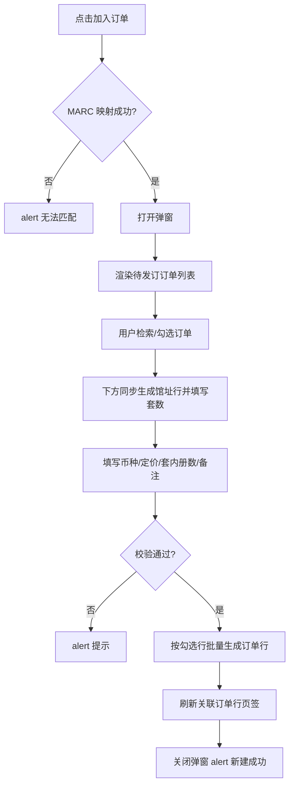

# 书目查询 — 关联订单行 / 加入订单 / 新建订单 — 设计规格

**日期**：2026-06-17（2026-07-06 修订）  
**状态**：原型已实现（Vue SPA）  
**模块**：书目查询（bib-query）/ 关联订单行页签 / 加入订单弹窗 / 新建订单弹窗

---

## 1. 背景与目标

### 1.1 业务痛点

书目查询页「关联订单行」页签中，用户通过**加入订单**将当前书目加入已有待发订订单。现有弹窗使用原生 `<select>` 展示订单号，选项文案仅含订单号，用户在选单时无法对比订户、馆址、供应商、预算等关键信息，容易选错订单。

此外，用户可能将同一书目加入**不同馆址**的多个待发订订单，且各订单需要的**套数不同**；现有表单仅支持单选订单 + 单一套数，无法满足分馆址分配套数的场景。

### 1.2 目标

- 将订单号下拉改为**可检索的待发订订单列表**，列表中展示足够订单信息供用户决策。
- 支持**多选**不同馆址（不同订单）的待发订订单；上方勾选几条订单，下方即生成**等数量的馆址行**（馆址与订单一一对应，每行填写套数）。
- **币种、定价、套内册数、备注**在馆址行下方统一填写，一次提交为每条勾选订单各生成一条订单行。
- **关联订单行页签**列表按统一排序规则展示（见 §3.4）。
- **新建订单弹窗**：供应商随采选方式联动、折扣随供应商默认带出、交换/捐赠时预算非必填。
- 保持现有 MARC 映射过滤（资源类型 + 语种）、中英文币种/定价规则不变。

### 1.3 非目标（本期不做）

- 后端接口联调（仍为页面内 mock 数据，与订单列表示例数据对齐）。
- 列表内高级筛选配置持久化（加入订单检索条件、新建订单表单已有 session 缓存）。
- 全选 / 反选、套数默认值自动填 1 等增强交互（可后续迭代）。
- 捐赠订单来源方填写（见 `2026-07-06-bib-join-order-donation-source-party-design.md`）。

---

## 2. 方案选型

| 方案 | 说明 | 结论 |
|------|------|------|
| A. 下拉 + 详情卡片 | 保留 `<select>`，选中后在下方展示订单摘要 | 信息仍依赖二次查看，不采用 |
| C. 下拉 option 内嵌多字段 | 在 option 文案中拼接订户、馆址等 | 原生下拉展示空间有限，不采用 |
| **B. 可检索订单列表** | 上方表格展示多列订单信息并勾选；下方按选中订单动态生成馆址行填套数 | **采用** |

**套数填写位置**

| 方案 | 说明 | 结论 |
|------|------|------|
| 列表行内填套数 | 套数与订单信息同表 | 列拥挤，与馆址分配心智分离，不采用 |
| **下方馆址行** | 上方只选订单；下方 N 条馆址行（馆址 + 套数）与选中订单一一对应 | **采用** |

**共用字段粒度（币种/定价/套内册数）**

| 方案 | 说明 | 结论 |
|------|------|------|
| A. 全表单共用 | 列表仅填套数；币种/定价/套内册数在下方表单填一次 | **采用** |
| B. 每行独立 | 每条订单单独填币种/定价/套内册数 | 表格过重，不采用 |

**共用字段位置**

| 方案 | 说明 | 结论 |
|------|------|------|
| 列表上方 | 两步向导：先定价再选订单 | 与「先找订单」的操作路径不符，不采用 |
| **列表下方** | 先选订单 → 馆址行分配套数 → 再填共用字段并提交 | **采用** |

---

## 3. 入口与前置条件

### 3.1 入口

书目查询页 → 选中书目 → 单件区 **关联订单行(n)** 页签 → 工具栏 **加入订单**。

### 3.2 前置条件

- 已选中一条书目。
- 书目 MARC 类型可映射出订单**资源类型**与**语种**（与现逻辑一致）；无法映射时提示「无法根据当前书目 MARC 类型匹配订单资源类型与语种」，不打开弹窗。

### 3.3 订单候选范围

列表数据来源于 `PENDING_ORDERS_FOR_BIB`（待发订订单示例数据），打开弹窗时过滤：

- `resourceType` === MARC 映射结果
- `language` === MARC 映射结果

与现 `getJoinOrderCandidates` 过滤规则一致。

### 3.4 关联订单行页签 — 列表排序

关联订单行表格数据在按书目记录号过滤后，按以下规则排序（与订单行列表页共用 `sortOrderLinesByIssueTimeDesc`）：

1. **无发订时间**（`issueTime` 为空）的记录排在**最上方**。
2. 有发订时间的记录按发订时间**倒序**（新 → 旧）。
3. 发订时间相同时，按**订单行号升序**（`orderLineNo` localeCompare）。

发订时间为空时，列表单元格显示「—」。

---

## 4. 弹窗布局

弹窗 ID 保持 `bib-related-order-new-modal`；宽度由 `max-w-lg` 调整为 **`max-w-5xl`**。

自上而下分为 **三个区域**：

```
┌─ 加入订单 ──────────────────────────────────────────────┐
│ 【上】检索 + 订单列表（勾选，不含套数列）                  │
│ ───────────── 灰色分隔线 ─────────────                    │
│ 【中】馆址分配（选中几单显示几行：馆址 + 套数）            │
│ ───────────── 灰色分隔线 ─────────────                    │
│ 【下】币种 / 定价 / 套内册数 / 备注                       │
│ [ 取消 ]  [ 确定 ]                                        │
└─────────────────────────────────────────────────────────┘
```

**区域联动规则**：上方每勾选 1 条订单，中间区域增加 1 行馆址行；取消勾选则移除对应行。馆址文本取自该订单的 `site`，**只读**；套数在该行输入。

### 4.1 检索区

| 控件 | 规则 |
|------|------|
| 订单号 | 文本输入，placeholder「模糊查询」；对订单号做**包含**匹配（不区分大小写） |
| 采选方式 | 下拉，选项：全部 + 系统采选方式枚举（征订目录、捐赠、现采、交存、交换、拍卖） |
| 供应商 | 下拉，选项：全部 + 当前候选订单列表中出现过的供应商名称（动态去重） |
| 检索按钮 | 点击应用上述条件，过滤上方订单列表 |
| 重置 | 清空三个检索条件并恢复全量列表 |

**列表默认排序**：按订单**创建时间**（`createTime`）倒序。

**匹配规则**：检索按钮点击后生效；订单号 trim 后包含匹配；采选方式/供应商为「全部」时不限制该维度。

### 4.2 订单列表（上方区域）

- 容器：`#bib-join-order-list-scroll`，纵向滚动，默认可视高度约 **4～5 行**（`max-h` 约 200～240px）。
- 表格 `min-width` 保证列不换行；容器 **横向滚动**。
- 表头 `sticky top-0`，背景 `bg-gray-50`。
- **不含套数列**；套数仅在下方馆址行填写。

**列定义（从左到右）**

| 列 | 宽度 | 交互 | 说明 |
|----|------|------|------|
| 勾选 | 固定 | checkbox | 可多选；`data-order-id` 绑定订单号 |
| 订单号 | | 只读 | |
| 订户 | | 只读 | |
| 馆址 | | 只读 | 与下方馆址行联动来源 |
| 采选方式 | | 只读 | |
| 供应商 | | 只读 | |
| 预算名称 | min-width ~140px | 只读 | 过长 `truncate`，`title` 展示全文 |
| 折扣 | | 只读 | |
| 发订状态 | | 只读 | 待发订 / 待导入等（`orderStatus` 映射文案） |
| 创建时间 | | 只读 | `createTime`，按此字段倒序排列 |

**行状态**

- 勾选行：背景 `#fef9c3`（与书目列表选中行一致）。
- hover： `hover:bg-gray-50`（未选中行）。

**空状态**

| 场景 | 文案 |
|------|------|
| 过滤后无任何待发订订单 | 列表区居中：「暂无匹配的待发订订单」 |
| 检索无匹配结果 | 列表区居中：「未找到符合条件的订单」 |

### 4.3 馆址分配区（中间区域）

- 容器：`#bib-join-order-site-rows`（样式可参考新建订单弹窗 `#bib-related-create-order-site-rows`）。
- 标题标签：**馆址**（左侧 label，与新建订单弹窗对齐）。
- 未勾选任何订单时：显示占位文案「请先在上方的列表中选择订单」，或留空区域。
- 勾选订单后：按列表展示顺序（`createTime` 倒序）动态渲染馆址行。

**每行结构**

| 字段 | 控件 | 规则 |
|------|------|------|
| 馆址 | 只读文本或 disabled 输入 | 取值 = 对应订单的 `site`，不可修改 |
| 套数 | number input | 必填，正整数 |
| （隐藏） | `data-order-id` | 提交时关联订单号 |

**行数规则**

- 选中 **N** 条订单 → 显示 **N** 行馆址行。
- 取消勾选某订单 → 删除对应馆址行；若该行已填套数一并清空。
- 同一馆址、不同订单号：仍各占一行（不合并），必要时在馆址旁辅助展示订单号（小字灰色）以免混淆。

**示例**

```
馆址 *
  [ 首都华威桥馆 ]  [ 套数: 2 ]    ← 对应 PG001B...001
  [ 东馆         ]  [ 套数: 1 ]    ← 对应 PG001B...006
```

### 4.4 分隔线

订单列表与馆址分配区之间、馆址分配区与共用表单之间，各增加一条灰色分隔线（`border-t border-gray-200`）。

### 4.5 共用表单（下方区域）

移除原「订单号」`<select>` 及表单级「套数」字段。

| 字段 | 必填 | 展示规则 |
|------|------|----------|
| 币种 | 是 | 中英文均显示；中文打开时默认 `CNY`；外文无默认值（含「请选择」空项） |
| 定价 | 是 | 中文填定价；外文填原定价（不单独展示原定价字段） |
| 套内册数 | 是 | 正整数 |
| 备注 | 否 | 多行文本 |

币种/定价逻辑与当前加入订单、新建订单窗口保持一致（参见已实现 `updateBibJoinOrderFormFields`）。

### 4.6 底部按钮

- **取消**：关闭弹窗（`data-modal-close`）。
- **确定**：触发校验与提交。

### 4.7 新建订单弹窗（关联订单行页签入口）

入口：关联订单行页签工具栏 **新建订单**（需已选中书目）。组件 `BibCreateOrderModal`。

#### 4.7.1 表单字段

| 字段 | 必填 | 说明 |
|------|------|------|
| 订户 | 是 | 下拉 |
| 资源类型 | 是 | 下拉；打开时按 MARC 映射预填 |
| 采选方式 | 是 | 下拉 |
| 预算名称 | 条件必填 | 见 §4.7.3 |
| 语种 | 是 | 下拉；打开时按 MARC 映射预填 |
| 供应商 | 是 | 下拉；见 §4.7.2 |
| 折扣 | 否 | 文本；见 §4.7.4 |
| 馆址 | 是 | 多选；每个馆址生成一个订单号 |

#### 4.7.2 供应商与采选方式联动

未选采选方式时，供应商下拉**禁用**，提示「请先选择采选方式」。

切换采选方式后，若当前供应商不在新列表中，自动清空供应商与折扣。

| 采选方式 | 供应商数据来源 |
|----------|----------------|
| 现采 / 征订目录 | 代理商，类型=书商，状态=使用中 |
| 交存 | 出版社管理，状态=使用中 |
| 捐赠 | 个人管理（类型=捐赠）+ 资源商管理（类型=团体捐赠），合并为一个列表 |
| 交换 | 资源商管理，类型=交换，状态=使用中 |
| 拍卖 | 代理商，类型=拍卖行，状态=使用中 |

Mock 主数据见 `supplier-sources.js`（`SUPPLIER_MASTER_RECORDS`）。

#### 4.7.3 预算名称与采选方式联动

| 采选方式 | 预算名称 |
|----------|----------|
| 交换 / 捐赠 | 非必填（隐藏 `*`）、下拉**禁用**、切换时清空已选值 |
| 其他 | 必填、可编辑 |

#### 4.7.4 折扣与供应商联动

- 选择供应商后，折扣字段默认填入该供应商在主数据中配置的 `discount`。
- 用户可手动修改折扣；再次切换供应商时，折扣更新为新供应商默认值。
- 从表单缓存恢复时，保留用户已修改的折扣（不因恢复触发供应商联动覆盖）。
- 捐赠类供应商默认折扣可为空。

#### 4.7.5 表单缓存

关闭弹窗时将表单写入 `bib-order-form-cache`（sessionStorage）；再次打开同一书目查询页时恢复上次输入。

---

## 5. 交互流程



### 5.1 勾选与馆址行联动

- 勾选某订单：在中间区域追加 1 行馆址行，馆址 = 该订单 `site`，套数默认 `1`（可改）。
- 取消勾选：移除该订单对应的馆址行（通过 `orderId` 匹配，而非仅按馆址名匹配）。
- 再次勾选同一订单：重新生成行；套数从 session 缓存恢复（若有）。
- 上方列表勾选变化时，调用 `rebuildSiteRows()` 刷新中间区域（馆址行顺序与列表一致，按 `createTime` 倒序）。

### 5.2 提交校验顺序

1. 至少勾选 **1** 条订单（中间区域至少 1 行馆址行）；否则「请至少选择一条订单」。
2. 每个馆址行的套数为有效正整数；否则「请输入有效的套数」或「请为第 N 行馆址填写有效的套数」。
3. 共用字段按语种校验必填（币种、定价、套内册数）；提示文案与现逻辑一致（请选择/请输入）。
4. 每条馆址行关联的订单仍须存在于 `PENDING_ORDERS_FOR_BIB` 且资源类型、语种与 MARC 映射一致。

### 5.3 提交结果

对**每条馆址行（即每条勾选订单）**生成一条 `BIB_RELATED_ORDER_LINES` 记录：

| 字段 | 来源 |
|------|------|
| `orderId` | 馆址行 `data-order-id` |
| `site` | 馆址行只读馆址（= 订单 `site`） |
| `sets` | 馆址行套数输入 |
| `copiesInSet` | 下方表单共用 |
| `price` | 下方表单定价 |
| `originalPrice` | 中文：空；外文：与定价相同 |
| `currency` | 下方表单 |
| `remark` | 下方表单 |
| 书目字段 | 当前选中书目（与现逻辑一致） |
| `lineStatus` | `待发订` |
| `flowStats` | `${sets}/0/0/0/0` |

多条记录依次 `unshift` 至 `BIB_RELATED_ORDER_LINES`，刷新关联订单行页签，提示「新建成功」。

---

## 6. 数据模型

### 6.1 `PENDING_ORDERS_FOR_BIB` 扩展

每条待发订订单需包含列表展示与提交所需字段：

```javascript
{
  orderId: string,        // 订单号
  subscriber: string,     // 订户
  site: string,           // 馆址
  method: string,         // 采选方式
  resourceType: string,   // 资源类型（纸质书 / 视听资料）
  language: string,       // 语种（中文 / 外文）
  supplier: string,       // 供应商
  budget: string,         // 预算名称
  discount: string,       // 折扣
  orderStatus: string,    // 订单状态（pending / pendingImport 等）
  createTime: string      // 创建时间（加入订单列表排序用）
}
```

示例数据应与订单列表 mock 中 **待发订 / 待导入** 订单保持一致。

### 6.2 供应商主数据（mock）

```javascript
{
  id: string,
  name: string,           // 供应商名称（下拉展示值）
  sourceModule: string,   // 代理商 | 出版社管理 | 个人管理 | 资源商管理
  type: string,           // 书商 | 拍卖行 | 捐赠 | 团体捐赠 | 交换 | ''
  status: string,         // 使用中 | 已停用
  discount: string        // 默认折扣，如 '0.80'；可为空
}
```

函数：`getSupplierOptionsByMethod(method)`、`getSupplierDiscountByName(name)`、`isSupplierValidForMethod(method, name)`。

### 6.3 关联订单行排序

共用函数 `sortOrderLinesByIssueTimeDesc(lines)`（`order-line-sort.js`），书目查询关联订单行页签与订单行列表页均调用。

### 6.4 新建订单写入

关联订单行页签 **新建订单** 提交成功后，写入待发订订单 mock 时需带上 §6.1 全部字段（`createTime` 取当前时间），以便后续加入订单列表可展示完整信息。

### 6.5 移除的 DOM / 字段（原静态 HTML 原型）

- 移除 `#bib-related-order-id-select`（订单号下拉）。
- 移除表单级 `name="sets"`（套数移至中间馆址行）。
- 保留 `bibJoinOrderMapped` 及 MARC 映射逻辑。

---

## 7. 实现触点（Vue SPA 原型）

| 文件 | 职责 |
|------|------|
| `html/src/modules/order/views/BibQueryView.vue` | 书目查询页；关联订单行页签、工具栏、列表渲染 |
| `html/src/modules/order/components/BibJoinOrderModal.vue` | 加入订单弹窗（三区结构、检索、多选、馆址分配） |
| `html/src/modules/order/components/BibCreateOrderModal.vue` | 新建订单弹窗（供应商/预算/折扣联动） |
| `html/src/modules/order/data/bib.js` | 书目 mock、`getRelatedOrderLines`、`pendingOrdersForBib` |
| `html/src/modules/order/data/supplier-sources.js` | 供应商主数据与按采选方式筛选 |
| `html/src/modules/order/data/order-line-sort.js` | 订单行排序 `sortOrderLinesByIssueTimeDesc` |
| `html/src/modules/order/data/bib-order-form-cache.js` | 新建/加入订单表单 session 缓存 |
| `html/src/modules/order/constants.js` | `isBudgetOptionalForMethod`、`BIB_CREATE_ORDER_*` 常量 |
| `html/src/modules/order/data/order-line-filter.js` | 订单行列表页过滤 + 共用排序 |

### 7.1 加入订单弹窗关键逻辑

| 函数/计算属性 | 职责 |
|------|------|
| `displayOrders` | 检索过滤 + 按 `createTime` 倒序 |
| `rebuildSiteRows` | 勾选变化时同步馆址行（按创建时间倒序） |
| `restoreFromCache` / `persistCache` | 加入订单表单缓存 |
| `submit` | 校验并 emit 提交 payload |

### 7.2 新建订单弹窗关键逻辑

| 函数/计算属性 | 职责 |
|------|------|
| `supplierOptions` | 按 `form.method` 过滤供应商 |
| `budgetOptional` | 交换/捐赠时预算非必填且禁用 |
| `syncSupplierWithMethod` | 采选方式变更时清空无效供应商、交换/捐赠时清空预算 |
| `syncDiscountWithSupplier` | 选择供应商时带出默认折扣 |
| `restoreFromCache` | 恢复缓存；校验供应商/预算有效性 |

### 7.3 不变更范围

- 书目列表检索、列设置、实体单件/编目数据查看页签（本期仅关联订单行相关改造）。
- 加入订单之币种/定价语种规则（已实现部分保持）。

---

## 8. 边界与异常

| 场景 | 处理 |
|------|------|
| 仅选 1 条订单 | 合法，等价于原单选行为 |
| 多条订单同馆址不同 orderId | 上方各选各的；中间各 1 行馆址行（馆址名可能相同，靠 orderId 区分） |
| 取消勾选后再勾选 | 馆址行重建，套数需重填 |
| 检索后全部取消勾选 | 中间馆址区清空；提交时「请至少选择一条订单」 |
| 馆址行未填套数 | 提交拦截 |
| 发订时间为空（关联订单行列表） | 单元格显示「—」；排序时排在最上方 |
| 新建订单：未选采选方式 | 供应商下拉禁用 |
| 新建订单：切换采选方式 | 无效供应商/折扣清空；交换/捐赠时预算清空并禁用 |
| 新建订单：选择供应商 | 折扣默认带出，可改 |
| 新建订单后立刻加入 | 新订单出现在加入订单列表中（已扩展字段） |

---

## 9. 验收标准

### 加入订单

- [x] 加入订单弹窗不再使用订单号下拉，改为可检索多列表格。
- [x] 检索区：订单号模糊查询、采选方式下拉、供应商下拉；检索/重置按钮。
- [x] 列表展示：订单号、订户、馆址、采选方式、供应商、预算名称、折扣、发订状态、创建时间。
- [x] 列表按创建时间倒序；上方订单列表不含套数列；支持多选。
- [x] 勾选 N 条订单后，中间区域显示 N 行馆址行；馆址与订单 `site` 一一对应且只读。
- [x] 套数在中间馆址行填写；币种/定价/套内册数/备注在最下方。
- [x] 仍按书目 MARC 映射过滤待发订订单；无法映射时不打开弹窗。
- [x] 无匹配订单、检索无结果时有明确空状态文案。
- [x] 加入订单表单支持 session 缓存恢复。

### 关联订单行列表

- [x] 列表按 §3.4 排序：无发订时间最上 → 发订时间倒序 → 订单行号升序。
- [x] 发订时间为空显示「—」。
- [x] 发/收/换/退/撤订统计栏正常汇总。

### 新建订单

- [x] 供应商选项随采选方式联动（§4.7.2）。
- [x] 选择供应商后折扣默认带出，支持手动修改（§4.7.4）。
- [x] 采选方式=交换或捐赠时，预算名称非必填、隐藏 `*`、下拉禁用（§4.7.3）。
- [x] 切换采选方式时清空不再适用的供应商/折扣/预算。
- [x] 新建订单表单支持 session 缓存恢复。
- [ ] 中英文币种/定价规则与现网一致（加入订单共用字段部分已实现）。

---

## 10. 后续可迭代项

- 加入订单列表「全选 / 反选」。
- 一次提交为每条馆址行批量写入关联订单行（当前为原型 alert）。
- 检索支持预算名称、订户。
- 与订单列表页共用实时数据源（API / 共享 store）。
- 捐赠订单来源方、捐赠模式字段禁用（见关联规格文档）。

---

## 11. 关联文档

- `docs/superpowers/specs/2026-07-06-bib-join-order-donation-source-party-design.md` — 加入订单来源方、捐赠新建订单规则
- `docs/prd.md` — 书目查询、新建订单 PRD 条目
