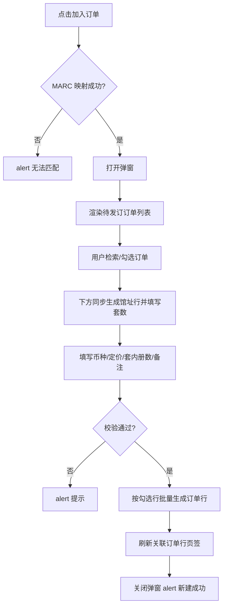

# 书目查询 — 加入订单弹窗改造 — 设计规格

**日期**：2026-06-17  
**状态**：已评审待实现  
**模块**：书目查询（`01_01_18_书目查询.html`）/ 关联订单行页签 / 加入订单弹窗

---

## 1. 背景与目标

### 1.1 业务痛点

书目查询页「关联订单行」页签中，用户通过**加入订单**将当前书目加入已有待发订订单。现有弹窗使用原生 `<select>` 展示订单号，选项文案仅含订单号，用户在选单时无法对比订户、馆址、供应商、预算等关键信息，容易选错订单。

此外，用户可能将同一书目加入**不同馆址**的多个待发订订单，且各订单需要的**套数不同**；现有表单仅支持单选订单 + 单一套数，无法满足分馆址分配套数的场景。

### 1.2 目标

- 将订单号下拉改为**可检索的待发订订单列表**，列表中展示足够订单信息供用户决策。
- 支持**多选**不同馆址（不同订单）的待发订订单；上方勾选几条订单，下方即生成**等数量的馆址行**（馆址与订单一一对应，每行填写套数）。
- **币种、定价、套内册数、备注**在馆址行下方统一填写，一次提交为每条勾选订单各生成一条订单行。
- 保持现有 MARC 映射过滤（资源类型 + 语种）、中英文币种/定价规则不变。

### 1.3 非目标（本期不做）

- 改造**新建订单**弹窗的订单选择（新建订单仍创建新订单，无选单列表）。
- 后端接口联调（仍为页面内 mock 数据，与订单列表示例数据对齐）。
- 列表内按订单号排序/高级筛选配置持久化。
- 全选 / 反选、套数默认值自动填 1 等增强交互（可后续迭代）。

---

## 2. 方案选型

| 方案 | 说明 | 结论 |
|------|------|------|
| A. 下拉 + 详情卡片 | 保留 `<select>`，选中后在下方展示订单摘要 | 信息仍依赖二次查看，不采用 |
| C. 下拉 option 内嵌多字段 | 在 option 文案中拼接订户、馆址等 | 原生下拉展示空间有限，不采用 |
| **B. 可检索订单列表** | 上方表格展示多列订单信息并勾选；下方按选中订单动态生成馆址行填套数 | **采用** |

**套数填写位置**

| 方案 | 说明 | 结论 |
|------|------|------|
| 列表行内填套数 | 套数与订单信息同表 | 列拥挤，与馆址分配心智分离，不采用 |
| **下方馆址行** | 上方只选订单；下方 N 条馆址行（馆址 + 套数）与选中订单一一对应 | **采用** |

**共用字段粒度（币种/定价/套内册数）**

| 方案 | 说明 | 结论 |
|------|------|------|
| A. 全表单共用 | 列表仅填套数；币种/定价/套内册数在下方表单填一次 | **采用** |
| B. 每行独立 | 每条订单单独填币种/定价/套内册数 | 表格过重，不采用 |

**共用字段位置**

| 方案 | 说明 | 结论 |
|------|------|------|
| 列表上方 | 两步向导：先定价再选订单 | 与「先找订单」的操作路径不符，不采用 |
| **列表下方** | 先选订单 → 馆址行分配套数 → 再填共用字段并提交 | **采用** |

---

## 3. 入口与前置条件

### 3.1 入口

书目查询页 → 选中书目 → 单件区 **关联订单行(n)** 页签 → 工具栏 **加入订单**。

### 3.2 前置条件

- 已选中一条书目。
- 书目 MARC 类型可映射出订单**资源类型**与**语种**（与现逻辑一致）；无法映射时提示「无法根据当前书目 MARC 类型匹配订单资源类型与语种」，不打开弹窗。

### 3.3 订单候选范围

列表数据来源于 `PENDING_ORDERS_FOR_BIB`（待发订订单示例数据），打开弹窗时过滤：

- `resourceType` === MARC 映射结果
- `language` === MARC 映射结果

与现 `populateRelatedOrderNewSelect` 过滤规则一致。

---

## 4. 弹窗布局

弹窗 ID 保持 `bib-related-order-new-modal`；宽度由 `max-w-lg` 调整为 **`max-w-5xl`**。

自上而下分为 **三个区域**：

```
┌─ 加入订单 ──────────────────────────────────────────────┐
│ 【上】检索 + 订单列表（勾选，不含套数列）                  │
│ ───────────── 灰色分隔线 ─────────────                    │
│ 【中】馆址分配（选中几单显示几行：馆址 + 套数）            │
│ ───────────── 灰色分隔线 ─────────────                    │
│ 【下】币种 / 定价 / 套内册数 / 备注                       │
│ [ 取消 ]  [ 确定 ]                                        │
└─────────────────────────────────────────────────────────┘
```

**区域联动规则**：上方每勾选 1 条订单，中间区域增加 1 行馆址行；取消勾选则移除对应行。馆址文本取自该订单的 `site`，**只读**；套数在该行输入。

### 4.1 检索区

| 控件 | 规则 |
|------|------|
| 检索输入框 | placeholder：`订单号 / 订户 / 供应商` |
| 检索按钮 | 点击对当前列表做本地模糊过滤 |
| 重置 | 可选：清空关键字并恢复全量列表（与书目查询检索区风格一致时可加「重置」） |

**匹配规则**：关键字 trim 后，对订单号、订户、供应商做**包含**匹配（不区分大小写；中文按字面包含）。空关键字展示全部已过滤订单。

### 4.2 订单列表（上方区域）

- 容器：`#bib-join-order-list-scroll`，纵向滚动，默认可视高度约 **4～5 行**（`max-h` 约 200～240px）。
- 表格 `min-width` 保证列不换行；容器 **横向滚动**。
- 表头 `sticky top-0`，背景 `bg-gray-50`。
- **不含套数列**；套数仅在下方馆址行填写。

**列定义（从左到右）**

| 列 | 宽度 | 交互 | 说明 |
|----|------|------|------|
| 勾选 | 固定 | checkbox | 可多选；`data-order-id` 绑定订单号 |
| 订单号 | | 只读 | |
| 订户 | | 只读 | |
| 馆址 | | 只读 | 与下方馆址行联动来源 |
| 采选方式 | | 只读 | |
| 供应商 | | 只读 | |
| 预算名称 | min-width ~140px | 只读 | 过长 `truncate`，`title` 展示全文 |
| 折扣 | | 只读 | |
| 发订时间 | | 只读 | 空值显示「—」 |

**行状态**

- 勾选行：背景 `#fef9c3`（与书目列表选中行一致）。
- hover： `hover:bg-gray-50`（未选中行）。

**空状态**

| 场景 | 文案 |
|------|------|
| 过滤后无任何待发订订单 | 列表区居中：「暂无匹配的待发订订单」 |
| 检索无匹配结果 | 列表区居中：「未找到符合条件的订单」 |

### 4.3 馆址分配区（中间区域）

- 容器：`#bib-join-order-site-rows`（样式可参考新建订单弹窗 `#bib-related-create-order-site-rows`）。
- 标题标签：**馆址**（左侧 label，与新建订单弹窗对齐）。
- 未勾选任何订单时：显示占位文案「请先在上方的列表中选择订单」，或留空区域。
- 勾选订单后：按**勾选顺序**（或列表自上而下顺序，实现时二选一并保持一致）动态渲染行。

**每行结构**

| 字段 | 控件 | 规则 |
|------|------|------|
| 馆址 | 只读文本或 disabled 输入 | 取值 = 对应订单的 `site`，不可修改 |
| 套数 | number input | 必填，正整数 |
| （隐藏） | `data-order-id` | 提交时关联订单号 |

**行数规则**

- 选中 **N** 条订单 → 显示 **N** 行馆址行。
- 取消勾选某订单 → 删除对应馆址行；若该行已填套数一并清空。
- 同一馆址、不同订单号：仍各占一行（不合并），必要时在馆址旁辅助展示订单号（小字灰色）以免混淆。

**示例**

```
馆址 *
  [ 首都华威桥馆 ]  [ 套数: 2 ]    ← 对应 PG001B...001
  [ 东馆         ]  [ 套数: 1 ]    ← 对应 PG001B...006
```

### 4.4 分隔线

订单列表与馆址分配区之间、馆址分配区与共用表单之间，各增加一条灰色分隔线（`border-t border-gray-200`）。

### 4.5 共用表单（下方区域）

移除原「订单号」`<select>` 及表单级「套数」字段。

| 字段 | 必填 | 展示规则 |
|------|------|----------|
| 币种 | 是 | 中英文均显示；中文打开时默认 `CNY`；外文无默认值（含「请选择」空项） |
| 定价 | 是 | 中文填定价；外文填原定价（不单独展示原定价字段） |
| 套内册数 | 是 | 正整数 |
| 备注 | 否 | 多行文本 |

币种/定价逻辑与当前加入订单、新建订单窗口保持一致（参见已实现 `updateBibJoinOrderFormFields`）。

### 4.6 底部按钮

- **取消**：关闭弹窗（`data-modal-close`）。
- **确定**：`#bib-related-order-new-submit`，触发校验与提交。

---

## 5. 交互流程



### 5.1 勾选与馆址行联动

- 勾选某订单：在中间区域追加 1 行馆址行，馆址 = 该订单 `site`，套数输入框为空。
- 取消勾选：移除该订单对应的馆址行（通过 `orderId` 匹配，而非仅按馆址名匹配）。
- 再次勾选同一订单：重新生成行，不保留上次套数（除非实现层做 session 缓存，本期不做）。
- 上方列表勾选变化时，同步调用 `syncBibJoinOrderSiteRows()` 刷新中间区域。

### 5.2 提交校验顺序

1. 至少勾选 **1** 条订单（中间区域至少 1 行馆址行）；否则「请至少选择一条订单」。
2. 每个馆址行的套数为有效正整数；否则「请输入有效的套数」或「请为第 N 行馆址填写有效的套数」。
3. 共用字段按语种校验必填（币种、定价、套内册数）；提示文案与现逻辑一致（请选择/请输入）。
4. 每条馆址行关联的订单仍须存在于 `PENDING_ORDERS_FOR_BIB` 且资源类型、语种与 MARC 映射一致。

### 5.3 提交结果

对**每条馆址行（即每条勾选订单）**生成一条 `BIB_RELATED_ORDER_LINES` 记录：

| 字段 | 来源 |
|------|------|
| `orderId` | 馆址行 `data-order-id` |
| `site` | 馆址行只读馆址（= 订单 `site`） |
| `sets` | 馆址行套数输入 |
| `copiesInSet` | 下方表单共用 |
| `price` | 下方表单定价 |
| `originalPrice` | 中文：空；外文：与定价相同 |
| `currency` | 下方表单 |
| `remark` | 下方表单 |
| 书目字段 | 当前选中书目（与现逻辑一致） |
| `lineStatus` | `待发订` |
| `flowStats` | `${sets}/0/0/0/0` |

多条记录依次 `unshift` 至 `BIB_RELATED_ORDER_LINES`，刷新关联订单行页签，提示「新建成功」。

---

## 6. 数据模型

### 6.1 `PENDING_ORDERS_FOR_BIB` 扩展

每条待发订订单需包含列表展示与提交所需字段：

```javascript
{
  orderId: string,        // 订单号
  subscriber: string,     // 订户
  site: string,           // 馆址
  method: string,         // 采选方式
  resourceType: string,   // 资源类型（纸质书 / 视听资料）
  language: string,       // 语种（中文 / 外文）
  supplier: string,       // 供应商
  budget: string,         // 预算名称
  discount: string,       // 折扣
  issueTime: string       // 发订时间，未发订为空字符串
}
```

示例数据应与 `01_01_非连续出版物订单-订单列表.html` 中 **待发订（orderStatus: pending）** 订单保持一致，避免跨页信息脱节。

### 6.2 新建订单写入

关联订单行页签 **新建订单** 提交成功后，写入 `PENDING_ORDERS_FOR_BIB` 时需同步带上 §6.1 全部字段（发订时间可为空），以便后续加入订单列表可展示完整信息。

### 6.3 移除的 DOM / 字段

- 移除 `#bib-related-order-id-select`（订单号下拉）。
- 移除表单级 `name="sets"`（套数移至中间馆址行）。
- 保留 `bibJoinOrderMapped` 及 MARC 映射逻辑。

---

## 7. 实现要点（`01_01_18_书目查询.html`）

### 7.1 HTML

- 弹窗内表单结构按 §4 调整。
- 新增：`#bib-join-order-search-form`、`#bib-join-order-list-scroll`、`#bib-join-order-table-body`。
- 新增：`#bib-join-order-site-rows`（中间馆址分配区）。
- 删除订单号 `<select>` 与表单级套数表单项。

### 7.2 JavaScript 函数（建议）

| 函数 | 职责 |
|------|------|
| `renderBibJoinOrderList(orders)` | 渲染上方订单列表（checkbox + 展示列，无套数） |
| `filterBibJoinOrderList(keyword)` | 本地检索过滤 |
| `syncBibJoinOrderSiteRows()` | 根据当前勾选订单同步中间馆址行（按 orderId 增删，取消勾选不保留套数） |
| `createBibJoinOrderSiteRowHtml(order, sets)` | 生成单行：只读馆址 + 套数 + `data-order-id` |
| `readBibJoinOrderSiteRows()` | 读取馆址行 `{ orderId, site, sets }[]` |
| `getSelectedJoinOrders()` | 基于馆址行或勾选状态返回待提交数据 |
| `updateBibJoinOrderListSelection()` | 勾选变化时更新列表高亮并调用 `syncBibJoinOrderSiteRows` |
| `openBibRelatedOrderNewModal()` | 渲染列表并清空馆址行 |
| `handleBibRelatedOrderNewSubmit()` | 按馆址行批量生成订单行 |

可删除或废弃：`populateRelatedOrderNewSelect`（若逻辑合并入 `renderBibJoinOrderList`）。

### 7.3 样式

- 列表滚动、表头 sticky、选中行背景复用书目查询页现有 CSS 变量/类名。
- 弹窗 `max-w-5xl`；小屏下表格横向滚动。

### 7.4 不变更范围

- 新建订单弹窗（`bib-related-create-order-modal`）。
- 关联订单行列表列、发/收/换/退/撤订统计栏。
- 加入订单之币种/定价语种规则（已实现部分保持）。

---

## 8. 边界与异常

| 场景 | 处理 |
|------|------|
| 仅选 1 条订单 | 合法，等价于原单选行为 |
| 多条订单同馆址不同 orderId | 上方各选各的；中间各 1 行馆址行（馆址名可能相同，靠 orderId 区分） |
| 取消勾选后再勾选 | 馆址行重建，套数需重填 |
| 检索后全部取消勾选 | 中间馆址区清空；提交时「请至少选择一条订单」 |
| 馆址行未填套数 | 提交拦截 |
| 发订时间为空 | 上方列表显示「—」 |
| 新建订单后立刻加入 | 新订单出现在列表中（已扩展字段） |

---

## 9. 验收标准

- [ ] 加入订单弹窗不再使用订单号下拉，改为可检索多列表格。
- [ ] 列表展示：订单号、订户、馆址、采选方式、供应商、预算名称、折扣、发订时间。
- [ ] 上方订单列表不含套数列；支持多选与检索。
- [ ] 勾选 N 条订单后，中间区域显示 N 行馆址行；馆址与订单 `site` 一一对应且只读。
- [ ] 套数在中间馆址行填写；币种/定价/套内册数/备注在最下方。
- [ ] 一次提交为每条馆址行（每条勾选订单）生成一条关联订单行。
- [ ] 仍按书目 MARC 映射过滤待发订订单；无法映射时不打开弹窗。
- [ ] 无匹配订单、检索无结果时有明确空状态文案。
- [ ] 中英文币种/定价规则与现网一致。

---

## 10. 后续可迭代项

- 列表「全选 / 反选」。
- 勾选后套数默认填 `1`。
- 检索支持预算名称。
- 与订单列表页共用 `PENDING_ORDERS` 数据源（sessionStorage / 共享 JS 模块）。
