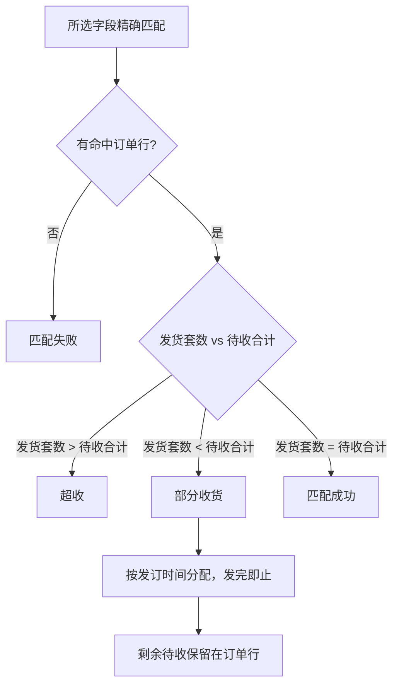
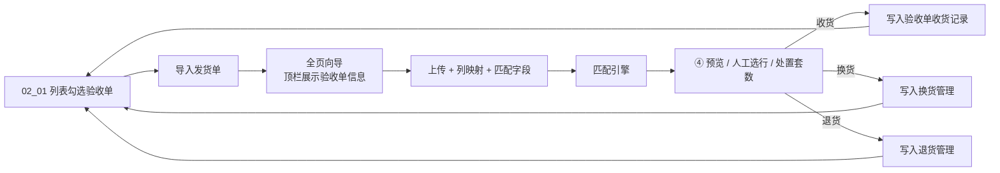

# 电子发货单导入批量验收 — 设计规格

**日期**：2026-06-23  
**状态**：已实现（Vue SPA，`html/src/modules/acceptance/`）；**大批量异步任务续办**见 [2026-07-10-delivery-import-async-task-design.md](./2026-07-10-delivery-import-async-task-design.md)  
**模块**：采访验收 / 验收单管理（02_01）

---

## 1. 背景与目标

采编用户希望通过导入书商电子发货单（Excel），实现订单的**批量验收**，替代在待收货列表中逐条手动收货。

### 1.1 业务痛点

- 书商发货单字段名不统一，需灵活映射。
- 发货单无馆址列，一行「套数」可能对应多个馆址的订单行合计。
- 发货单中的「订单号」为书商侧编号，与系统订单号无映射关系，不能用于匹配。

### 1.2 目标

- 半自动流程：上传 → 列映射 → 选择匹配字段 → 匹配预览 → 确认处理（收货 / 换货 / 退货）。
- 从**验收单管理页**在列表勾选验收单 → 点击「导入发货单」→ 进入全页向导处理。
- 匹配失败、超收场景支持用户**人工选择订单行**后继续处理。
- 预览阶段除**收货**外，支持对匹配行批量**换货、退货**。

### 1.3 非目标（本期不做）

- **导入建单**（导入时自动创建验收单）。
- 书商订单号与系统订单号的映射维护。
- 独立的后台「发货单导入模板配置」管理页（模板在导入向导内另存即可）。
- 发货单暂存表 / 分次草稿验收。

---

## 2. 方案选型

采用**列表选单 + 独立全页向导**（列表勾选验收单 → `导入发货单` 全页向导），向导内共 **5 步**。

| 方案 | 说明 | 结论 |
|------|------|------|
| 弹窗多步向导 | 复用订单导入弹窗模式 | 预览空间不足，不采用 |
| **独立全页向导** | 宽表展示馆址拆分与差异 | **采用** |
| 先入库暂存再验收 | 引入暂存表 | 过重，不采用 |

---

## 3. 入口与验收单关系

### 3.1 入口

**验收单管理页** 操作区新增按钮「导入发货单」。

- 按钮**默认置灰不可点击**。
- **前置条件**：在验收单列表中勾选**恰好一条**状态为「未开始」或「进行中」的验收单，按钮变为可点击。
- 勾选 0 条、多条，或唯一勾选行为「已结束」状态时，按钮保持置灰。
- 点击可点击的按钮后，携带所选验收单直接进入全页导入向导（不再弹出选择验收单窗口）。

### 3.2 本期模式：仅追加到已有验收单

| 模式 | 本期 | 说明 |
|------|------|------|
| 导入建单 | ❌ 不做 | 后续迭代 |
| **追加到已有验收单** | ✅ | 列表勾选目标验收单后进入向导 |

### 3.3 列表勾选规则

| 规则 | 说明 |
|------|------|
| 勾选数量 | 恰好 1 条时方可启用「导入发货单」 |
| 可导入状态 | 未开始、进行中 |
| 不可导入状态 | 已结束（勾选后按钮仍置灰） |
| 进入向导 | 点击按钮后，所选验收单信息写入上下文并跳转全页向导 |

### 3.4 全页向导顶栏（固定展示）

进入 `导入发货单` 后，**页面顶部固定展示**所选验收单基础信息（各步骤均可见，不随步骤切换隐藏）：

| 展示字段 |
|---------|
| 验收单号 |
| 验收单名称 |
| 资源类型 |
| 语种 |
| 发货单号 |
| 供应商 |
| 验收备注 |

- 全部为只读；无值时显示「—」。
- 验收备注过长时单行省略，悬停浮层展示全文（交互同验收单管理列表「查看」备注）。

### 3.5 与现有验收流程的关系

- 导入处理结果写入**所选验收单**（收货 / 换货 / 退货记录分别落库）。
- 收货逻辑与逐条收货「按套」一致；换货、退货规则对齐现有 换货、退货等业务规则。
- 处理成功后，验收单管理、逐条收货、换货管理、退货管理相关列表可刷新查看。

---

## 4. 标准字段池

导入时将书商文件列映射到**系统标准字段**（与订单行书目字段对齐）。字段池随**验收单资源类型 + 语种**动态切换；各场景均含 **发货套数（必填映射）**。

### 4.1 纸质书 · 中文

发货套数*、套内册数、套数、正题名、ISBN、副题名、分卷号、分卷名、分类号、出版社、作者、出版年、定价、版本、丛编、主题词、读者对象、装帧形式、尺寸、正文语种、一般性附注、图书简介、备注、卷数、出版地

### 4.2 纸质书 · 外文

发货套数*、全套册数、套数、ISBN、学科大类、学科细分、中图分类号、中译名、题名、副题名、责任者、丛编、出版社、装帧形式、出版日期、版次、页数、币种、价格、主题词、读者对象、尺寸、语种、简介、精简装ISBN对照、馆藏信息、审读级别、获奖信息、目次信息、分卷号、分卷名、作者简介、书评、备注

### 4.3 视听资料 · 中文

发货套数*、套内件数、套数、ISBN、ISRC、题名、载体、出版社、版本/格式、著者、币种、码洋、彩胶颜色、限量编号、厂牌、系列名称、是否签名、是否老唱片、获奖信息、北京出版社、分类、盘号、老唱片品牌、剧种、年代、备注

### 4.4 视听资料 · 外文

发货套数*、套内件数、套数、ISRC、题名、载体、商品条码、目录号、外文原文题名、出版方、码洋、币种、备注、厂牌

**映射说明**：

- 语种为「中文」时使用中文池；其余语种（英文、西语等）按**外文**池展示。
- 书商文件中无对应标准字段的列可忽略；同名列支持自动映射建议。
- 「发货套数」必须映射，否则阻断进入预览。
- 已映射字段（除发货套数外）均可勾选为第三步匹配字段；默认勾选 ISBN、题名（若已映射）。

---

## 5. 匹配规则

### 5.1 检索范围

在以下条件**全部满足**的订单行中检索：

- 当前登录用户所属订户
- **所选验收单**上下文：资源类型 + 语种 + 采选方式 + 供应商
- 待收套数 > 0
- 订单行状态 ∈ {**已发订**, **处理中**}

### 5.2 匹配字段选择（向导第 ③ 步）

- 用户从**已映射**的字段中勾选用于匹配的字段，至少 1 个。
- 默认勾选：ISBN、正题名/题名（若已映射）。
- 用户所选字段**全部采用精确匹配**（规范化后相等：ISBN 去横线、大小写统一；文本去首尾空格、全半角统一等）。

### 5.3 第 ② 步进入第 ③ 步时的准备（点击「下一步」）

列名映射完成后点击「下一步」时，系统按 §5.1 / §5.2 做以下处理（**不在此步执行订单行匹配**）：

1. 校验「发货套数」已映射，且至少映射 1 个可用于匹配的字段。
2. 校验所选验收单具备资源类型、语种（用于确定 §5.1 检索范围）。
3. 若勾选「保存为模板」，写入映射模板（按供应商 + 资源类型 + 语种分组，支持多命名模板）。
4. 按 §5.2 初始化第 ③ 步默认勾选的匹配字段（ISBN、正题名/题名，若已映射）。

### 5.4 匹配状态判定

所选匹配字段**精确匹配**后，按下列流程确定行级状态（**仅比对所选字段**，未选字段不参与匹配）：

| 状态 | 条件 |
|------|------|
| 匹配失败 | 所选字段精确比对后无命中 |
| 超收 | 发货套数 > 命中订单行待收合计 |
| 部分收货 | 发货套数 < 命中订单行待收合计 |
| 匹配成功 | 发货套数 = 命中订单行待收合计 |

---

## 6. 馆址拆分（自动分配）

### 6.1 规则

- 一行发货记录命中多条订单行（不同馆址）时：
  1. 按订单行**发订时间由远到近**排序
  2. 依次分配，直至发完发货单「发货套数」映射值
- 例：发货 3 套，A 馆待收 2（较早发订）、B 馆待收 2（较晚发订）→ 默认 A=2、B=1；状态为「部分收货」，B 馆剩余 1 套待收保留

### 6.2 套数边界

| 场景 | 处理 |
|------|------|
| 发货套数 > 可分配待收合计 | 标为「超收」；**不阻断提交**；用户可改选订单行或调低套数 |
| 发货套数 < 可分配待收合计 | 标为「部分收货」；按 §6.1 分配，剩余待收保留；**允许提交** |
| 发货套数 = 可分配待收合计 | 标为「匹配成功」 |

### 6.3 预览可编辑

用户在预览页可手工调整各馆址订单行上的处置套数（收货 / 换货 / 退货）。

---

## 7. 人工选择订单行

任意匹配状态的主行均可点击「选择订单行」：

1. 检索范围同 §5.1（所选验收单上下文；已发订/处理中；待收 > 0）
2. 支持按订单行号、正题名、ISBN、馆址等检索
3. 可选一条或多条订单行
4. 选定后按 §6.1 自动分配套数并刷新子表，用户可继续调整处置套数
5. **不重算主行匹配状态**（状态保持进入预览时的自动匹配结果）
6. 超收状态下**不阻断提交**；未选手动行的「匹配失败」记录，在各提交操作中跳过

---

## 8. 交互流程与向导步骤

### 8.1 整体流程

### 8.2 向导步骤（5 步）

| 步骤 | 内容 |
|------|------|
| 顶栏 | 全程固定展示 §3.4 验收单基础信息 |
| ① 上传文件 | xls/xlsx；格式校验；读取首行表头（mock 阶段使用内置样例数据） |
| ② 列名映射 | 文件列 → 标准字段下拉；映射模板下拉**切换即自动应用**；支持勾选「保存为模板」并在点击「下一步」时保存（按供应商+资源类型+语种，支持多命名模板）；可删除已选模板；进入第 ③ 步前执行 §5.3 校验与默认匹配字段初始化 |
| ③ 选择匹配字段 | 从已映射字段勾选；至少 1 个；全部精确匹配 |
| ④ 匹配预览 | 见 §9；匹配过程展示 loading（约 8s）；支持编辑处置套数 |
| ⑤ 确认提交 | 展示收货/换货/退货汇总；确认后写入所选验收单 |

---

## 9. 预览页结构

### 9.1 行级状态

| 状态 | 含义 |
|------|------|
| ✅ 匹配成功 | 已定位订单行，发货套数 = 待收合计，套数已分配 |
| ⚠️ 部分收货 | 已定位订单行，发货套数 < 待收合计，按发订时间分配后发完即止 |
| ❌ 匹配失败 | 无自动命中，可人工选行 |
| ❌ 超收 | 发货套数 > 待收合计，可改选或调低 |

### 9.2 主表列

| 列 | 说明 |
|----|------|
| 展开 | 展开/收起子表 |
| 序号 | |
| 状态 | 匹配成功 / 部分收货 / 匹配失败 / 超收 |
| 已映射展示字段 | 除「发货套数」外的已映射标准字段（如正题名、ISBN 等） |
| 发货套数 | 发货单映射的发货套数 |
| 操作 | 选择订单行、删除 |

### 9.3 展开子表（馆址订单行）

列顺序（从左到右）：

| 列 | 说明 |
|----|------|
| 馆址 | |
| 订单行号 | |
| 已映射字段 | 与主表相同的已映射展示字段，展示订单行侧字段值 |
| 待收套数 | 订单行待收套数 |
| **收货套数** | 可编辑，默认 §6.1 自动分配值 |
| **换货套数** | 可编辑，默认 0 |
| **换货原因** | 下拉，换货原因列表；换货套数 > 0 时必填 |
| **退货套数** | 可编辑，默认 0 |
| **退货原因** | 下拉，退货原因列表；退货套数 > 0 时必填 |

> **后续迭代**：差异字段标红、行级「覆盖订单行」勾选（仅影响收货场景）。

### 9.4 子行套数校验

对每条馆址订单行：

| 规则 | 错误提示 |
|------|---------|
| 收货套数 + 换货套数 + 退货套数 > 待收套数 | 不能大于待收套数 |
| 换货套数 > 0 未选换货原因 | 请选择换货原因 |
| 退货套数 > 0 未选退货原因 | 请选择退货原因 |
| 套数为非数字或 < 0 | 请输入有效套数 |
| 匹配失败且无子行 | 请选择订单行或删除该行 |

对每条发货主行：

| 规则 | 错误提示 |
|------|---------|
| 各子行处置套数合计  > 发货套数 | 处置套数合计不能超过发货套数 |

**不校验（允许通过）**：

- 各子行处置套数合计  < 发货套数——不阻断进入第 ⑤ 步
- 各子行处置套数合计  < 待收套数合计——允许部分收货场景，不阻断进入第 ⑤ 步

### 9.5 预览底部操作

**当前实现（MVP）**：步骤④沿用向导底部「上一步 / 下一步」，步骤⑤展示收货/换货/退货汇总后统一确认提交。

**后续迭代**（独立操作按钮）：

| 按钮 | 行为 |
|------|------|
| **确认收货** | 提交所有子行中「收货套数 > 0」且校验通过的行；失败/超收且未修复的跳过 |
| **换货** | 提交所有子行中「换货套数 > 0」且已填换货原因、校验通过的行；写入换货管理（`02_04`） |
| **退货** | 提交所有子行中「退货套数 > 0」且已填退货原因、校验通过的行；写入退货管理（`02_05`） |
| **下载解析结果** | Excel，末列失败/跳过原因；文件名 `fhjxjg_时间戳` |
| **返回上一步** | 可修改映射或匹配字段 |

说明：

- 同一子行可同时填写收货、换货、退货套数（三者之和不超过待收套数），可先后点击不同按钮分批提交，或一次填写完毕后依次提交。
- 换货 / 退货套数上限规则与现有逐条收货换货、退货一致：**不能大于待收套数**。
- 仅填写了套数但未填原因的换货/退货行，点击对应按钮时阻断并提示。

### 9.6 步骤⑤确认弹窗

根据用户点击的按钮展示对应汇总后二次确认：

| 操作 | 汇总内容 |
|------|---------|
| 确认收货 | 成功行数、收货套数、收货册数、实洋合计 |
| 换货 | 成功行数、换货套数合计 |
| 退货 | 成功行数、退货套数合计 |

确认后写入所选验收单，返回验收单管理或停留成功页。

---

## 10. 错误处理与校验

| 校验项 | 错误提示 |
|--------|---------|
| 无可用验收单 | 暂无未开始或进行中的验收单，请先新建验收单 |
| 未选择验收单 | 请选择验收单 |
| 文件格式非 xls/xlsx | 请上传 xls/xlsx 格式文件 |
| 未映射发货套数 | 请映射「发货套数」字段 |
| 未映射任何可匹配字段 | 请至少映射一个可用于匹配的字段 |
| 匹配字段均未勾选 | 请至少选择一个匹配字段 |
| 匹配失败且无子行 | 请选择订单行或删除该行 |
| 子行处置套数超待收 | 不能大于待收套数 |
| 处置套数合计超发货套数 | 处置套数合计不能超过发货套数 |
| 套数为非数字或小于 0 | 请输入有效套数 |
| 换货/退货未填原因 | 请选择换货原因 / 请选择退货原因 |

### 失败原因枚举（导出用）

- 匹配失败
- 超收
- 套数未分配完
- 换货/退货原因未填
- 用户跳过

---

## 11. 数据流

**匹配引擎输入**：解析后的发货行 + 匹配字段 + 所选验收单检索范围（§5.1）  
**输出**：每行状态 + 馆址拆分方案（§6.1）

---

## 12. 页面清单

| 页面/组件 | 路径 / 说明 |
|-----------|-------------|
| 验收单管理 | `AcceptanceManageView.vue` — 「导入发货单」按钮（默认置灰；列表勾选一条可导入验收单后启用） |
| 导入发货单向导 | `DeliveryImportView.vue` — 全页 5 步向导；顶部固定展示验收单基础信息 |
| 选择订单行弹窗 | `DeliveryImportPickOrderLineModal.vue` — 预览内弹窗，检索并多选订单行 |
| 业务逻辑 | `data/delivery-import.js` — 字段池、匹配引擎、馆址拆分、校验、映射模板 |
| 上下文传递 | `stores/acceptance.js` — 列表勾选验收单写入 localStorage 后进入向导 |

交互参考现有订单导入向导（步骤条、加载态）；换货/退货原因下拉对齐原因参数模块。

---

## 13. 测试要点

1. 未勾选或勾选多条：按钮置灰
2. 勾选一条已结束：按钮置灰
3. 勾选一条未开始/进行中：按钮可点击，进入向导
4. 全页向导顶栏：各步骤均展示验收单号、名称、资源类型、语种、发货单号、供应商、验收备注
5. 单馆址单行：自动匹配并收货
6. 多馆址：按发订时间由远到近拆分，预览可改
7. 部分收货：发货套数 < 待收合计，状态独立展示
8. 匹配成功：发货套数 = 待收合计
9. 超收：标红展示，**不阻断提交**；可人工选行后继续
10. 匹配失败：人工选行后子表更新；**主行状态不变**
11. 人工选行后：按发订时间重新分配，不重算主行状态
12. 收货 + 换货 + 退货同一子行：三者之和 ≤ 待收套数；主行各子行处置合计 ≤ 发货套数
13. 换货：套数>0 须选原因
14. 退货：套数>0 须选原因
15. 列映射模板：切换即应用；勾选保存并在下一步时写入；同供应商+类型+语种可存多个命名模板
16. 第 ② 步下一步：校验映射并初始化默认匹配字段

---

## 14. 决策记录

| 决策 | 选择 | 理由 |
|------|------|------|
| 流程模式 | 半自动 | 预览确认降低误收风险 |
| 馆址信息 | 发货单无馆址，系统拆分 | 符合书商文件实际 |
| 拆分策略 | 发订时间由远到近 | 业务方指定 |
| 书商订单号 | 不参与匹配 | 无两侧映射 |
| 字段映射 | 导入时临时映射 + 可存模板 | 灵活适配多书商 |
| 匹配方式 | 用户自选字段 + 精确匹配 | 业务方指定 |
| 失败/超收 | 支持人工选行 | 提高可操作性 |
| 入口 | **验收单管理（02_01）** | 业务方指定（2026-06-23 修订） |
| 验收单选择 | **列表勾选一条**（未开始/进行中）后启用按钮 | 业务方指定 |
| 向导顶栏 | **固定展示**验收单号、名称、资源类型、语种、发货单号、供应商、验收备注 | 业务方指定 |
| 建单模式 | **本期仅追加到已有验收单** | 后续迭代导入建单 |
| 预览处置 | **收货 + 换货 + 退货** | 发货异常场景一站式处理 |
| 换货/退货 | 须填套数与原因，规则对齐现有验收 | 与原因参数一致 |
| 超收提交 | **不阻断** | 2026-06-23 实现修订：允许超收、部分收货状态进入确认提交 |
| 人工选行 | 重分配套数，**不重算主行状态** | 2026-06-23 实现修订 |
| 预览主表 | 不含已分配套数、差异摘要列 | 2026-06-23 实现修订 |
| 预览子表 | 含已映射字段列，列顺序见 §9.3 | 2026-06-23 实现修订 |
| 映射模板 | 多命名模板；切换即应用；复选框+下一步保存 | 2026-06-23 实现修订 |
