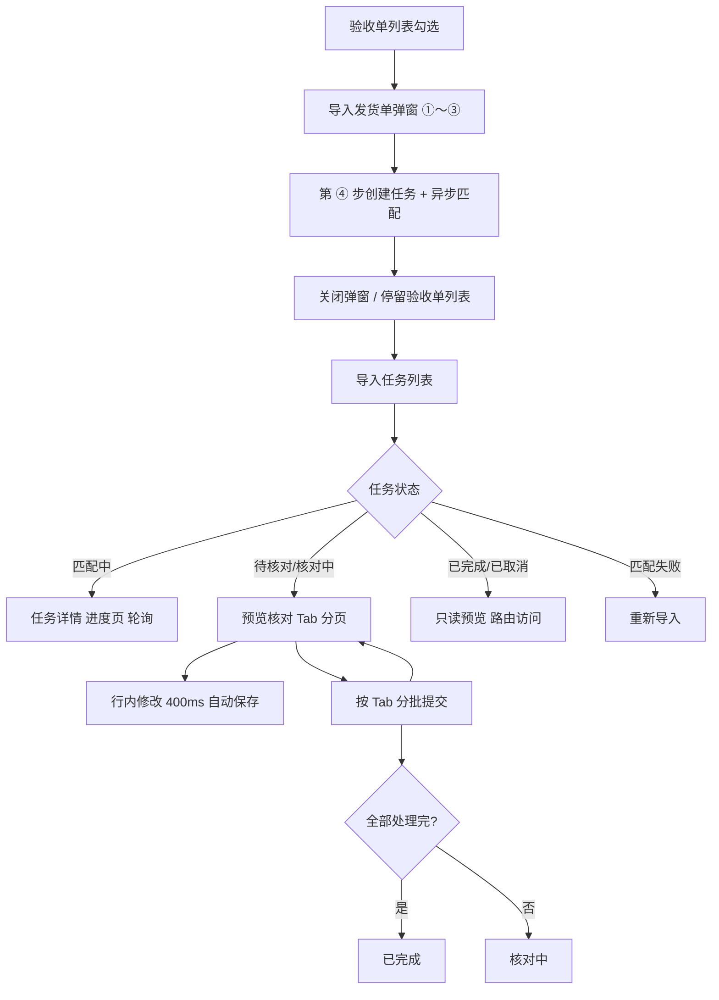

# 导入发货单 — 异步匹配与任务续办

**日期**：2026-07-10  
**状态**：已实现（原型对齐）  
**模块**：采访验收 / 验收单管理 
**关联规格**：[2026-06-23-delivery-note-import-acceptance-design.md](./2026-06-23-delivery-note-import-acceptance-design.md)（字段池、匹配规则、预览列结构、处置校验等沿用；本文档修订**流程架构**与**大批量**场景）

**原型修订摘要（2026-07-10）**：

- 创建向导为 **弹窗 4 步**（①～③ 配置 + ④ 创建任务），不展示验收单顶栏信息。
- 任务详情预览：**400ms 防抖自动保存**；去掉手动保存草稿、离开提醒、底栏取消/返回。
- 提交按钮位于 **Tab 下方、列表左上方**；Tab 顺序含「超收」在「匹配失败」之前。
- 任务列表操作列 **按状态区分**（核对 / 取消 / 重新导入）。
- 任务编号规则：`T + yyyymmdd + 001～999`。

---

## 1. 背景与问题

### 1.1 现状局限

当前实现为 **5 步同步向导**：第 ③ 步进入第 ④ 步时在页内等待匹配（原型约 8s）。在真实场景中：

- 发货单常达 **500～5000 行**，匹配可能耗时 **数分钟**，用户不应被锁定在页面。
- 预览核对（展开子表、改套数、处理失败/超收）往往 **无法一次完成**，需要跨会话续办。

原 spec §1.3 将「发货单暂存表 / 分次草稿验收」列为非目标；**本迭代明确纳入**异步任务与草稿续办能力。

### 1.2 目标

- **创建与核对分离**：「导入发货单」仅完成上传与配置并创建任务；核对与提交在「导入任务」中续办。
- **异步匹配**：第 ④ 步创建任务后后台匹配，用户关闭弹窗停留验收单列表。
- **任务续办**：独立「导入任务」全局入口，查看任务状态并进入进度/预览。
- **大批量可用**：预览分页、子行按需加载；草稿 **400ms 防抖自动保存**（无离开提醒弹窗）。
- **分批提交**：按匹配状态 Tab 分批写入验收单；各任务独立完结（已完成 / 已取消）。

### 1.3 非目标（本迭代）

- 导入建单、书商订单号映射、独立映射模板管理页（仍沿用原 spec）。
- 导入任务列表上的各状态行数统计列。

---

## 2. 方案选型

| 方案 | 说明 | 结论 |
|------|------|------|
| **A. 任务中心 + 双页面** | 创建弹窗（4 步）+ 任务列表 + 任务详情（进度/预览） | **采用** |
| B. 单页多模式 | 现有向导加 `mode` 切换 | 职责过重，不采用 |
| C. 纯后端队列 + 极薄前端 | 全部状态服务端 | 原型阶段过重，不采用 |

---

## 3. 入口与流程

### 3.1 双入口

| 入口 | 位置 | 行为 |
|------|------|------|
| **导入发货单** | 验收单管理页操作区 | 勾选 1 条可导入验收单 → **创建弹窗（①～④ 步）** → 第 ④ 步创建任务并异步匹配 → 关闭弹窗（停留验收单列表） |
| **导入任务** | 采访验收模块级菜单（全局） | 展示当前用户 **全部验收单** 的导入任务；点击进入进度或预览核对 |

### 3.2 创建前置条件

与现有一致：

- 验收单列表勾选 **恰好 1 条**，状态为 **未开始** 或 **进行中**。
- 任务 **绑定** 所选验收单。
- **同一验收单可并存多条导入任务**（例如不同发货单文件、不同上传时间）；创建时 **不做**「每验收单仅 1 条进行中任务」限制。

### 3.3 多任务并存

- 同一验收单可同时存在多条任务（含多条「匹配中 / 待核对 / 核对中」）。
- 各任务 **独立** 推进：各自匹配、草稿、分批提交、取消或完成，互不影响。
- 「导入发货单」在勾选可导入验收单后 **始终进入创建向导**（不因该验收单已有任务而拦截或弹窗引导）。
- 用户通过 **导入任务列表** 按验收单号筛选，区分并进入具体任务。

### 3.4 任务完成与取消

| 终态 | 条件 | 后续 |
|------|------|------|
| **已完成** | 全部可处理发货行均已提交（含跨 Tab 多批提交） | 任务只读；**不影响**同验收单其他任务 |
| **已取消** | 用户主动取消任务 | 任务只读；**不影响**同验收单其他任务 |
| **匹配失败** | 引擎异常（文件损坏、解析失败等） | 可 **取消** 后重新导入 |

### 3.5 验收单状态联动

- 导入 **提交成功** 后，若验收单为 **未开始**，变为 **进行中**（沿用现有规则）。
- 本迭代 **不在** 验收单列表行展示导入任务状态标签（状态仅在 **导入任务列表** 展示）。

---

## 4. 流程图

---

## 5. 创建向导（弹窗 ①～④ 步）

原 5 步全页向导改为 **验收单管理页内弹窗**（`DeliveryImportCreateModal.vue`），固定高度约 `560px`，**不展示**验收单基础信息顶栏（上下文由列表勾选带入）。步骤内容沿用原 spec §4、§5、§8.2 的 ①～③ 步，并增加第 ④ 步创建结果：

| 步骤 | 内容 |
|------|------|
| ① 上传文件 | xls/xlsx；格式校验；读取首行表头（mock 阶段使用内置样例数据） |
| ② 列名映射 | 标准字段映射；模板切换/保存（按供应商+资源类型+语种） |
| ③ 选择匹配字段 | 至少 1 个；默认 ISBN、正题名/题名（若已映射） |
| ④ 创建任务 | 展示创建进度 / 成功 / 失败结果（**不用** `alert` 弹成功提示） |

**底栏按钮规则**：

| 步骤 | 按钮（右对齐） |
|------|----------------|
| ① | 取消、下一步 |
| ②③ | 上一步、下一步（**无「取消」**） |
| ④ 创建中 | 无操作按钮 |
| ④ 成功 | 关闭（关闭时触发 `created` 事件） |
| ④ 失败 | 关闭、重试 |

**第 ③ 步「下一步」**：

1. 校验匹配字段（至少 1 项）。
2. 进入第 ④ 步并 **自动发起**创建任务（loading → 结果）。
3. 创建成功后展示文案：「导入任务已创建，后台正在匹配订单行。您可在「导入任务」列表中查看进度。」
4. 用户点击「关闭」后关闭弹窗；**不自动跳转**任务列表。

**创建失败**：

- 接口异常或 mock 演示：上传文件名含 **「创建失败」** 时模拟失败。
- 第 ④ 步展示失败文案，可「重试」或「关闭」。

**创建成功后台行为**：

1. 生成任务编号（§6.4）。
2. 持久化文件列、列映射、匹配字段、解析行快照。
3. 触发异步匹配作业。
4. 任务状态 → **匹配中**。

---

## 6. 导入任务列表

### 6.1 列表字段

| 列 | 说明 |
|----|------|
| 任务编号 | 见 §6.4 |
| 验收单号 | |
| 验收单名称 | |
| 文件名 | 上传的发货单 |
| 上传时间 | |
| 行数 | 解析后的发货行总数 |
| 状态 | 见 §7 |
| 进度 | **仅「匹配中」** 展示，如 `已匹配 1200/5000` 或百分比 |
| 操作 | 见 §6.3（按状态区分，非统一「进入」） |

列表每 **3s** 自动刷新（匹配进度更新）。

### 6.2 检索（建议）

- 默认：当前用户的任务，按上传时间倒序。
- 筛选：验收单号、状态、文件名关键词。
- 同一验收单号下可能列出 **多条任务**，以任务编号、上传时间、文件名区分。

### 6.3 操作列（按状态）

| 任务状态 | 操作 | 行为 |
|----------|------|------|
| **匹配中** | 取消 | 确认后标记 **已取消** |
| **待核对** / **核对中** | 核对、取消 | 「核对」→ 任务详情预览页；「取消」同左 |
| **匹配失败** | 重新导入 | 打开 **创建弹窗**（带入原验收单上下文），创建新任务 |
| **已完成** / **已取消** | — | 列表无入口；详情页路由可 **只读** 查看预览 |

### 6.4 任务编号规则

格式：**`T` + `yyyymmdd` + 三位序列号（001～999）**

- 示例：`T20260710901`
- 按 **自然日** 递增；当日超过 999 条则创建失败。
- mock 示例任务可使用固定后缀 `901`～`906` 便于演示各状态。

---

## 7. 任务状态

| 状态 | 含义 | 可执行操作 |
|------|------|------------|
| **匹配中** | 后台匹配进行中 | 查看进度；取消 |
| **待核对** | 匹配完成，尚未提交任何处置 | 预览核对；行内修改自动保存；分批提交；取消 |
| **核对中** | 已有批次提交，仍有待处理行 | 同上 |
| **已完成** | 全部可处理行已提交 | 只读查看 |
| **已取消** | 用户取消 | 只读查看 |
| **匹配失败** | 引擎异常 | 查看失败原因；取消 |

**状态流转**：

- 创建 → **匹配中**
- 匹配成功 → **待核对**
- 引擎异常 → **匹配失败**
- 任一批次提交成功且仍有待处理行 → **核对中**
- 全部可处理行提交完毕 → **已完成**
- 用户取消 → **已取消**

---

## 8. 任务详情 — 匹配进度页

**适用状态**：匹配中（匹配失败展示错误信息；无单独取消按钮，取消在 **任务列表** 发起）。

| 元素 | 说明 |
|------|------|
| 面包屑 | 「导入任务 / 任务详情」（**无**页内「返回列表」按钮） |
| 信息区 | 第一行：验收单号、名称、资源类型、语种、发货单号、供应商；第二行：任务编号、文件名、上传时间、状态 |
| 进度 | 已处理行数 / 总行数、进度条、百分比；文案提示可关闭页面稍后续看 |
| 刷新 | 前端轮询 `GET /tasks/{id}`（原型 **3s** 间隔） |
| 完成 | 状态变为「待核对」后同页切换为预览核对区，或用户从列表点「核对」进入 |

用户可 **关闭页面**，稍后从导入任务列表再次进入（待核对/核对中通过「核对」进入）。

---

## 9. 任务详情 — 预览核对页

匹配规则、馆址拆分、处置列结构、校验规则 **沿用** 原 spec §5、§6、§9（含：全状态可人工选行、选行不重算主行状态、发货套数命名、处置合计不超过发货套数等）。

### 9.1 布局

> **预览区结构（2026-07-10 修订）**：上下主从 + 订单行卡片，详见 [2026-07-10-delivery-import-preview-master-detail-design.md](./2026-07-10-delivery-import-preview-master-detail-design.md)。本节保留 Tab、提交、自动保存等流程规则；**行内展开子表** 由该文档替代。

- **面包屑**：「导入任务 / 任务详情」。
- **信息区**：验收单 + 任务信息（两行）；若已自动保存草稿，展示 **草稿保存时间** `draftSavedAt`。
- **状态 Tab**（`order-tab` 下划线样式，参考订单管理）顺序：
  **全部** / **匹配成功** / **部分收货** / **超收** / **匹配失败** / **已提交**
- **提交按钮**：位于 Tab **下方**、上区列表 **左上方**；**已提交 Tab 不展示**。
- **上区（60%）**：发货主行列表；客户端分页（原型每页 **50** 行）；列含勾选、序号、状态、已映射字段、发货套数、**子行数**、操作（**仅删除**）；**无**行内展开。
- **下区（40%）**：当前选中发货行的馆址订单行 **卡片列表**；顶栏 **添加订单行 / 删除订单行**（卡片勾选后批量删）；**不展示**发货行摘要。
- **卡片**：16 列订单信息（同 §7.1 弹窗）+ 右侧 **单列** 处置表单（待收/收/换/退/原因）。
- **底栏**：上区分页；**无**「保存草稿」「取消任务」「返回列表」。

**只读模式**（`已完成` / `已取消`，或 **已提交 Tab** / 已提交行）：

- 上区无主表勾选列；下区无添加/删除按钮、卡片无勾选；处置区 **纯文本**。

### 9.2 人工干预（全状态通用，非只读时）

**所有未提交匹配状态**均支持：

| 操作 | 说明 |
|------|------|
| **添加订单行** | 打开选行弹窗（原 spec §7.1）；**追加**子行并去重；按 §6.1 重分配；**不重算主行匹配状态** |
| **删除订单行** | 下区卡片勾选 → 顶栏批量删除；其余子行处置值保留 |
| **修改套数** | 卡片处置区编辑；校验：≤ 待收套数、主行处置合计 ≤ 发货套数 |
| **删除发货行** | 上区操作列删除整条发货主行 |

「匹配失败 / 超收」与其他 Tab **使用相同操作入口**，不隐藏按钮。

### 9.3 草稿保存

| 机制 | 行为 |
|------|------|
| **自动保存** | 卡片处置套数、换货/退货原因、子行增删等变更后 **400ms 防抖** 写入草稿（`saveTaskDraft`）；**无**「保存草稿」按钮 |
| **提交前落盘** | 点击「提交」前 **立即 flush** 待写入的防抖保存 |
| **无离开提醒** | 离开页面 **不弹** 未保存确认框 |
| **保存反馈** | 信息区展示最近 `draftSavedAt`（原型无 toast） |

**加载**：进入预览页时加载 **最近一次已保存草稿**；无草稿则使用匹配引擎默认分配值。

### 9.4 分批提交（按状态 Tab）

- 用户在某一 Tab 下核对并填写处置后，**勾选需提交的发货行**，点击 Tab 下方 **「提交」**。
- 提交范围：当前 Tab 内 **校验通过** 且 **未提交** 的行（`submitStatus=pending`）。
- **提交按钮**：默认置灰；至少勾选 1 条未提交行时高亮；**已提交 Tab 亦显示** 置灰按钮（各 Tab 样式统一）。
- **全部 Tab** 含已提交数据；其他状态 Tab 不含已提交行。
- 提交成功后勾选行 `submitStatus=submitted`，上区状态列显示 **已提交**。
- **原子提交**：详见 [2026-07-10-delivery-import-order-line-conflict-design.md](./2026-07-10-delivery-import-order-line-conflict-design.md) — 提交时查 **实时订单行待收**；任一行冲突则 **整批不提交**。
- 已提交行移至 **「已提交」Tab**，只读，不可再改。
- 首次提交后任务状态：**待核对 → 核对中**。
- 全部可处理行提交完毕 → **已完成**。

各 Tab 提交逻辑一致（含匹配成功、部分收货、匹配失败、超收 — 均需满足快照校验 + 实时冲突校验后方可提交）。

### 9.5 取消任务

- **仅在任务列表** 操作列发起（详情页 **无**「取消任务」按钮）。
- 确认文案说明：取消后本次匹配结果与未提交草稿不再生效。
- 状态 → **已取消**；对应验收单可新建导入任务。

---

## 10. 数据模型（概要）

### 10.1 DeliveryImportTask

| 字段 | 说明 |
|------|------|
| taskId | 主键 |
| acceptanceId | 绑定验收单 |
| fileName | 原始文件名 |
| fileStorageKey | 文件存储键 |
| status | §7 状态枚举 |
| totalRows | 发货行总数 |
| matchedRows | 已匹配行数（进度用） |
| progress | 0～100 或 null |
| mappingConfig | 列映射快照 JSON |
| matchFields | 匹配字段快照 JSON |
| matchJobId | 异步作业 ID |
| failReason | 匹配失败原因 |
| createdBy | 创建人 |
| createdAt / updatedAt | |
| completedAt / cancelledAt | |

### 10.2 DeliveryImportTaskLine

| 字段 | 说明 |
|------|------|
| lineId | 主键 |
| taskId | |
| rowIndex | 发货行序号 |
| matchStatus | success / partial / fail / over |
| shipFieldValues | 发货字段值 JSON |
| childrenDraft | 子行草稿 JSON（选行、套数、原因） |
| submitStatus | pending / submitted / skipped |
| submittedAt | |

### 10.3 草稿存储

- 任务级草稿：`DeliveryImportTask.draftRevision` + `draftPayload`（可选，或与 line 级合并）。
- 推荐：**行级 `childrenDraft`**；前端 **400ms 防抖** 批量 PATCH；提交前 flush。

---

## 11. API（概要）

| 方法 | 路径 | 说明 |
|------|------|------|
| POST | `/delivery-import/tasks` | 创建任务（文件 + ①～③ 配置） |
| POST | `/delivery-import/tasks/{id}/match` | 触发异步匹配 |
| GET | `/delivery-import/tasks` | 当前用户任务列表（分页、筛选） |
| GET | `/delivery-import/tasks/{id}` | 任务详情与进度 |
| GET | `/delivery-import/tasks/{id}/lines` | 预览行分页（`tab`, `page`, `pageSize`） |
| GET | `/delivery-import/tasks/{id}/lines/{lineId}/children` | 展开子行 |
| PATCH | `/delivery-import/tasks/{id}/draft` | 保存草稿（前端 **400ms 防抖** 自动调用；提交前 flush） |
| POST | `/delivery-import/tasks/{id}/submit` | 分批提交（body: `tab` 或 `lineIds`）；**原子** + 实时待收冲突校验，见 [order-line-conflict-design](./2026-07-10-delivery-import-order-line-conflict-design.md) |
| POST | `/delivery-import/tasks/{id}/cancel` | 取消任务 |

**创建校验**：验收单存在且状态为「未开始 / 进行中」；**不校验**该验收单是否已有其他导入任务。

---

## 12. 页面清单

| 页面/组件 | 说明 |
|-----------|------|
| 验收单管理 | 「导入发货单」打开 **创建弹窗**（不拦截已有任务） |
| `DeliveryImportCreateModal` | 弹窗创建向导 ①～④ 步；固定高度；无验收单顶栏 |
| `DeliveryImportTaskListView` | 模块级 **导入任务** 列表；操作列按状态区分 |
| `DeliveryImportTaskDetailView` | 任务详情：进度 / 预览核对（上下主从 + 卡片，见 preview-master-detail spec） |
| `DeliveryImportPickOrderLineModal` | 复用；全状态可用；列表 16 列与检索字段见原 spec §7.1 |
| `data/delivery-import-tasks.js` | 任务 CRUD、异步匹配模拟、草稿、提交 |
| `data/delivery-import.js` | `DELIVERY_IMPORT_CREATE_STEPS`、`getPreviewMappedColumns` 等 |

> 旧全页向导 `DeliveryImportView.vue` 保留于代码库；路由重定向至任务列表，**不再作为主流程**。

---

## 13. 与原 spec 的关系

| 原 spec 章节 | 本迭代 |
|--------------|--------|
| §4 标准字段池 | **不变** |
| §5 匹配规则 | **不变**（异步执行） |
| §6 馆址拆分 | **不变** |
| §7 人工选行 | **扩展为全状态可用**；列表列与检索见 **§7.1** |
| §8 5 步向导 | **拆为**：创建弹窗 4 步 + 任务详情 |
| §9 预览结构 | **保留列与校验**；预览区改为 **上下主从 + 列表**（见 preview-master-detail spec）；提交增加 **实时冲突校验** |
| 订单行并发 | [2026-07-10-delivery-import-order-line-conflict-design.md](./2026-07-10-delivery-import-order-line-conflict-design.md) |
| §1.3 非目标「暂存/草稿」 | **撤销**，由本文档覆盖 |

---

## 14. 测试要点

1. 5000 行文件：第 ③ 步点「下一步」→ 第 ④ 步创建 → 关闭弹窗；任务为「匹配中」。
2. 创建弹窗：① 有取消；②③ 无取消；④ 成功/失败页内展示（非 alert）；文件名含「创建失败」可测失败重试。
3. 任务编号符合 `Tyyyymmdd001` 规则。
4. 匹配中关闭浏览器，稍后从导入任务 **续看进度**（待核对后点「核对」）。
5. 匹配完成 → 「待核对」→ 「核对」进入预览，分页正常（50 行/页）。
6. Tab 顺序：全部 / 匹配成功 / 部分收货 / **超收** / 匹配失败 / 已提交。
7. 提交按钮在 Tab 下、列表左上方；已提交 Tab 只读且无提交按钮。
8. 各 Tab（含失败/超收）均可 **选行、改套数** 后提交；改套数 **400ms 自动保存**，无离开提醒。
9. 选择订单行弹窗：展示原 spec §7.1 所列 16 列；资源标识、订单号等格式化正确。
10. 预览主表列按任务 `mappingConfig` + `fileColumns` 顺序展示。
11. 任务列表操作：匹配中→取消；待核对/核对中→核对+取消；匹配失败→重新导入；已完成/已取消→—。
12. 分批提交：待核对 → 核对中 → 已完成。
13. **同一验收单连续创建多条任务**，导入任务列表均可查看、独立进入。
14. **取消** / **已完成** 仅影响当前任务，不阻塞同验收单新建其他任务。
15. 提交时他人已收走待收：整批阻断并返回冲突明细（见 order-line-conflict spec）。
16. 未开始验收单首次提交成功后 → **进行中**。

---

## 15. 决策记录

| 决策 | 选择 | 理由 |
|------|------|------|
| 架构 | 任务中心 + 创建/详情分离 | 大批量与续办清晰 |
| 匹配 | 异步后台 | 500～5000 行数分钟级 |
| 创建后导航 | 回验收单列表 | 用户选 C |
| 续办入口 | 模块级导入任务列表 | 用户选 A |
| 每验收单任务数 | **允许多条并存** | 用户修订：取消单验收单唯一任务限制 |
| 终态 | 已完成 / 已取消 | 用户命名修订 |
| 进行中态 | 核对中 | 原「部分提交」更名 |
| 草稿 | **400ms 防抖自动保存**；无离开提醒 | 2026-07-10 原型修订 |
| 创建 UI | 弹窗 4 步；无验收单顶栏；④ 步内嵌创建结果 | 2026-07-10 原型修订 |
| 任务详情 UI | Tab 下提交；无底栏保存/取消/返回；已提交只读 | 2026-07-10 原型修订 |
| 列表操作 | 按状态：核对/取消/重新导入 | 2026-07-10 原型修订 |
| 任务编号 | `T + yyyymmdd + 001～999` | 2026-07-10 原型修订 |
| 人工干预 | 全匹配状态（非只读时） | 用户明确要求 |
| 列表字段 | 不含状态行数统计 | 用户明确要求 |
