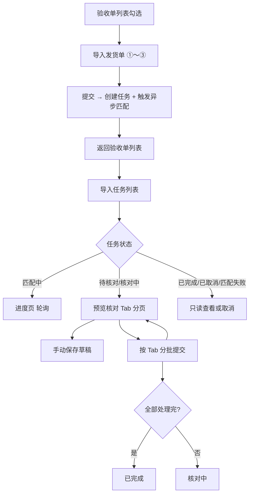

# 导入发货单 — 异步匹配与任务续办

**日期**：2026-07-10  
**状态**：已评审待实现  
**模块**：采访验收 / 验收单管理（02_01）  
**关联规格**：[2026-06-23-delivery-note-import-acceptance-design.md](./2026-06-23-delivery-note-import-acceptance-design.md)（字段池、匹配规则、预览列结构、处置校验等沿用；本文档修订**流程架构**与**大批量**场景）

---

## 1. 背景与问题

### 1.1 现状局限

当前实现为 **5 步同步向导**：第 ③ 步进入第 ④ 步时在页内等待匹配（原型约 8s）。在真实场景中：

- 发货单常达 **500～5000 行**，匹配可能耗时 **数分钟**，用户不应被锁定在页面。
- 预览核对（展开子表、改套数、处理失败/超收）往往 **无法一次完成**，需要跨会话续办。

原 spec §1.3 将「发货单暂存表 / 分次草稿验收」列为非目标；**本迭代明确纳入**异步任务与草稿续办能力。

### 1.2 目标

- **创建与核对分离**：「导入发货单」仅完成上传与配置并创建任务；核对与提交在「导入任务」中续办。
- **异步匹配**：第 ③ 步提交后后台匹配，用户立即返回验收单列表。
- **任务续办**：独立「导入任务」全局入口，查看任务状态并进入进度/预览。
- **大批量可用**：预览分页、子行按需加载；草稿手动保存 + 离开提醒。
- **分批提交**：按匹配状态 Tab 分批写入验收单；全部处理完或用户取消任务后，方可对同一验收单新建导入。

### 1.3 非目标（本迭代）

- 导入建单、书商订单号映射、独立映射模板管理页（仍沿用原 spec）。
- 同一验收单 **多条并行**进行中任务（仍为 **1 条**）。
- 导入任务列表上的各状态行数统计列。

---

## 2. 方案选型

| 方案 | 说明 | 结论 |
|------|------|------|
| **A. 任务中心 + 双页面** | 创建向导（3 步）+ 任务列表 + 任务详情（进度/预览） | **采用** |
| B. 单页多模式 | 现有向导加 `mode` 切换 | 职责过重，不采用 |
| C. 纯后端队列 + 极薄前端 | 全部状态服务端 | 原型阶段过重，不采用 |

---

## 3. 入口与流程

### 3.1 双入口

| 入口 | 位置 | 行为 |
|------|------|------|
| **导入发货单** | 验收单管理页操作区 | 勾选 1 条可导入验收单 → **创建向导（①～③ 步）** → 提交后创建任务并异步匹配 → **返回验收单列表** |
| **导入任务** | 采访验收模块级菜单（全局） | 展示当前用户 **全部验收单** 的导入任务；点击进入进度或预览核对 |

### 3.2 创建前置条件

与现有一致：

- 验收单列表勾选 **恰好 1 条**，状态为 **未开始** 或 **进行中**。
- 任务 **绑定** 所选验收单。

### 3.3 进行中任务冲突

- 同一验收单同时仅允许 **1 条** 处于「匹配中 / 待核对 / 核对中」的任务。
- 若已有进行中任务，用户仍可点击「导入发货单」，弹出 **引导弹窗**：「该验收单有进行中的导入任务，请前往导入任务继续处理」，提供跳转 **导入任务列表**（并按该验收单号筛选，可选实现）。
- 后端创建任务时 **二次校验**，防止并发创建。

### 3.4 任务完成与取消

| 终态 | 条件 | 后续 |
|------|------|------|
| **已完成** | 全部可处理发货行均已提交（含跨 Tab 多批提交） | 可对该验收单 **新建** 导入任务 |
| **已取消** | 用户主动取消任务 | 可对该验收单 **新建** 导入任务 |
| **匹配失败** | 引擎异常（文件损坏、解析失败等） | 可 **取消** 后重新导入 |

### 3.5 验收单状态联动

- 导入 **提交成功** 后，若验收单为 **未开始**，变为 **进行中**（沿用现有规则）。
- 本迭代 **不在** 验收单列表行展示导入任务状态标签（状态仅在 **导入任务列表** 展示）。

---

## 4. 流程图

---

## 5. 创建向导（①～③ 步）

由原 5 步向导 **拆分为创建阶段**，步骤内容沿用原 spec §4、§5、§8.2 的 ①～③ 步：

| 步骤 | 内容 |
|------|------|
| ① 上传文件 | xls/xlsx；格式校验；文件持久化至任务 |
| ② 列名映射 | 标准字段映射；模板切换/保存（按供应商+资源类型+语种） |
| ③ 选择匹配字段 | 至少 1 个；默认 ISBN、正题名/题名（若已映射） |

**第 ③ 步「提交」**：

1. 校验映射与匹配字段。
2. 调用 `POST /tasks` 创建任务（含文件与配置快照）。
3. 调用 `POST /tasks/{id}/match` 触发异步匹配。
4. **导航回验收单管理列表**（不进入预览）。

顶栏仍展示 §3.4 验收单基础信息（只读）。

---

## 6. 导入任务列表

### 6.1 列表字段

| 列 | 说明 |
|----|------|
| 任务编号 | 系统生成 |
| 验收单号 | |
| 验收单名称 | |
| 文件名 | 上传的发货单 |
| 上传时间 | |
| 行数 | 解析后的发货行总数 |
| 状态 | 见 §7 |
| 进度 | **仅「匹配中」** 展示，如 `已匹配 1200/5000` 或百分比 |
| 操作 | 进入、取消（进行中任务） |

### 6.2 检索（建议）

- 默认：当前用户的任务，按上传时间倒序。
- 筛选：验收单号、状态、上传时间范围、文件名关键词。

### 6.3 操作

| 操作 | 条件 | 行为 |
|------|------|------|
| **进入** | 任意非已取消 | 匹配中 → 进度页；待核对/核对中 → 预览核对页；已完成 → 只读详情 |
| **取消** | 匹配中 / 待核对 / 核对中 / 匹配失败 | 确认后标记 **已取消** |

---

## 7. 任务状态

| 状态 | 含义 | 可执行操作 |
|------|------|------------|
| **匹配中** | 后台匹配进行中 | 查看进度；取消 |
| **待核对** | 匹配完成，尚未提交任何处置 | 预览核对；保存草稿；分批提交；取消 |
| **核对中** | 已有批次提交，仍有待处理行 | 同上 |
| **已完成** | 全部可处理行已提交 | 只读查看 |
| **已取消** | 用户取消 | 只读查看 |
| **匹配失败** | 引擎异常 | 查看失败原因；取消 |

**状态流转**：

- 创建 → **匹配中**
- 匹配成功 → **待核对**
- 引擎异常 → **匹配失败**
- 任一批次提交成功且仍有待处理行 → **核对中**
- 全部可处理行提交完毕 → **已完成**
- 用户取消 → **已取消**

---

## 8. 任务详情 — 匹配进度页

**适用状态**：匹配中（匹配失败展示错误信息与取消按钮）。

| 元素 | 说明 |
|------|------|
| 顶栏 | 验收单信息 + 任务信息（文件名、上传时间、状态） |
| 进度 | 已处理行数 / 总行数、进度条、可选预估剩余时间 |
| 刷新 | 前端轮询 `GET /tasks/{id}`（建议 2～5s 间隔） |
| 完成 | 自动跳转预览核对页，或列表状态变为「待核对」后用户自行进入 |

用户可 **关闭页面**，稍后从导入任务列表再次进入。

---

## 9. 任务详情 — 预览核对页

匹配规则、馆址拆分、处置列结构、校验规则 **沿用** 原 spec §5、§6、§9（含：全状态可人工选行、选行不重算主行状态、发货套数命名、处置合计不超过发货套数等）。

### 9.1 布局

- **顶栏**：验收单信息 + 任务信息。
- **状态 Tab**：全部 / 匹配成功 / 部分收货 / 匹配失败 / 超收 / **已提交**（只读）。
- **主表**：服务端 **分页**（建议每页 50～100 行），Tab 切换带过滤条件。
- **子表**：展开时 **按需加载** 馆址订单行（避免一次加载 5000×N 子行）。
- **底栏操作**：保存草稿、按当前 Tab 提交、取消任务、返回列表。

### 9.2 人工干预（全状态通用）

**所有匹配状态**均支持：

| 操作 | 说明 |
|------|------|
| **选择订单行** | 检索范围同原 spec §5.1；选定后按 §6.1 重新分配；**不重算主行匹配状态** |
| **修改套数** | 子表收货/换货/退货套数可编辑；校验：≤ 待收套数、≤ 分配额度、主行处置合计 ≤ 发货套数 |

「匹配失败 / 超收」与其他 Tab **使用相同操作入口**，不隐藏按钮。

### 9.3 草稿保存

| 机制 | 行为 |
|------|------|
| **手动保存** | 「保存草稿」按钮 → `PATCH /tasks/{id}/draft` → 提示「已保存」 |
| **离开提醒** | 存在未保存修改时，离开页面/返回列表 → 弹窗：**保存并离开 / 不保存离开 / 取消** |
| **不自动保存** | 不做 debounce 后台写入 |

**未保存修改（`draftDirty`）**：自上次保存起，处置套数、选行结果、换货/退货原因等发生变更。

**加载**：进入预览页时加载 **最近一次已保存草稿**；无草稿则使用匹配引擎默认分配值。

### 9.4 分批提交（按状态 Tab）

- 用户在某一 Tab 下核对并填写处置后，点击 **「提交当前 Tab」**（或等价按钮）。
- 提交范围：当前 Tab 内 **校验通过** 且 **未提交** 的行。
- 已提交行移至 **「已提交」Tab**，只读，不可再改。
- 首次提交后任务状态：**待核对 → 核对中**。
- 全部可处理行提交完毕 → **已完成**。

各 Tab 提交逻辑一致（含匹配成功、部分收货、匹配失败、超收 — 均需满足校验后方可提交）。

### 9.5 取消任务

- 预览页 / 任务列表均可发起。
- 确认文案说明：取消后本次匹配结果与未提交草稿不再生效。
- 状态 → **已取消**；对应验收单可新建导入任务。

---

## 10. 数据模型（概要）

### 10.1 DeliveryImportTask

| 字段 | 说明 |
|------|------|
| taskId | 主键 |
| acceptanceId | 绑定验收单 |
| fileName | 原始文件名 |
| fileStorageKey | 文件存储键 |
| status | §7 状态枚举 |
| totalRows | 发货行总数 |
| matchedRows | 已匹配行数（进度用） |
| progress | 0～100 或 null |
| mappingConfig | 列映射快照 JSON |
| matchFields | 匹配字段快照 JSON |
| matchJobId | 异步作业 ID |
| failReason | 匹配失败原因 |
| createdBy | 创建人 |
| createdAt / updatedAt | |
| completedAt / cancelledAt | |

### 10.2 DeliveryImportTaskLine

| 字段 | 说明 |
|------|------|
| lineId | 主键 |
| taskId | |
| rowIndex | 发货行序号 |
| matchStatus | success / partial / fail / over |
| shipFieldValues | 发货字段值 JSON |
| childrenDraft | 子行草稿 JSON（选行、套数、原因） |
| submitStatus | pending / submitted / skipped |
| submittedAt | |

### 10.3 草稿存储

- 任务级草稿：`DeliveryImportTask.draftRevision` + `draftPayload`（可选，或与 line 级合并）。
- 推荐：**行级 `childrenDraft`** + 前端 dirty 标记；手动保存批量 PATCH。

---

## 11. API（概要）

| 方法 | 路径 | 说明 |
|------|------|------|
| POST | `/delivery-import/tasks` | 创建任务（文件 + ①～③ 配置） |
| POST | `/delivery-import/tasks/{id}/match` | 触发异步匹配 |
| GET | `/delivery-import/tasks` | 当前用户任务列表（分页、筛选） |
| GET | `/delivery-import/tasks/{id}` | 任务详情与进度 |
| GET | `/delivery-import/tasks/{id}/lines` | 预览行分页（`tab`, `page`, `pageSize`） |
| GET | `/delivery-import/tasks/{id}/lines/{lineId}/children` | 展开子行 |
| PATCH | `/delivery-import/tasks/{id}/draft` | **手动**保存草稿 |
| POST | `/delivery-import/tasks/{id}/submit` | 分批提交（body: `tab` 或 `lineIds`） |
| POST | `/delivery-import/tasks/{id}/cancel` | 取消任务 |

**创建校验**：`acceptanceId` 无其他「匹配中 / 待核对 / 核对中」任务。

---

## 12. 页面清单

| 页面/组件 | 说明 |
|-----------|------|
| 验收单管理 | 「导入发货单」改为进入 **创建向导**；冲突时弹窗引导 |
| `DeliveryImportCreateView` | 创建向导 ①～③ 步 |
| `DeliveryImportTaskListView` | 模块级 **导入任务** 列表 |
| `DeliveryImportTaskDetailView` | 任务详情：进度 / 预览核对（Tab + 分页） |
| `DeliveryImportPickOrderLineModal` | 复用，全状态可用 |

---

## 13. 与原 spec 的关系

| 原 spec 章节 | 本迭代 |
|--------------|--------|
| §4 标准字段池 | **不变** |
| §5 匹配规则 | **不变**（异步执行） |
| §6 馆址拆分 | **不变** |
| §7 人工选行 | **扩展为全状态可用** |
| §8 5 步向导 | **拆为**：创建 3 步 + 任务详情 |
| §9 预览结构 | **保留列与校验**；增加分页、Tab 提交、草稿 |
| §1.3 非目标「暂存/草稿」 | **撤销**，由本文档覆盖 |

---

## 14. 测试要点

1. 5000 行文件：第 ③ 步提交后 **立即回列表**，任务为「匹配中」。
2. 匹配中关闭浏览器，稍后从导入任务 **续看进度**。
3. 匹配完成 → 「待核对」→ 进入预览，分页正常。
4. 各 Tab（含失败/超收）均可 **选行、改套数** 后提交。
5. **手动保存草稿** + 离开提醒（有/无未保存修改）。
6. 分批提交：待核对 → 核对中 → 已完成。
7. 进行中任务存在时，点「导入发货单」→ **引导弹窗**。
8. 同一验收单 **不能** 创建第二条进行中任务。
9. **取消** 任务后可新建；**已完成** 后可新建。
10. 未开始验收单首次提交成功后 → **进行中**。

---

## 15. 决策记录

| 决策 | 选择 | 理由 |
|------|------|------|
| 架构 | 任务中心 + 创建/详情分离 | 大批量与续办清晰 |
| 匹配 | 异步后台 | 500～5000 行数分钟级 |
| 创建后导航 | 回验收单列表 | 用户选 C |
| 续办入口 | 模块级导入任务列表 | 用户选 A |
| 任务并发 | 每验收单 1 条进行中 | 避免冲突 |
| 冲突交互 | 弹窗引导 | 用户选 B |
| 终态 | 已完成 / 已取消 | 用户命名修订 |
| 进行中态 | 核对中 | 原「部分提交」更名 |
| 草稿 | 手动保存 + 离开提醒 | 用户明确要求 |
| 人工干预 | 全匹配状态 | 用户明确要求 |
| 列表字段 | 不含状态行数统计 | 用户明确要求 |
